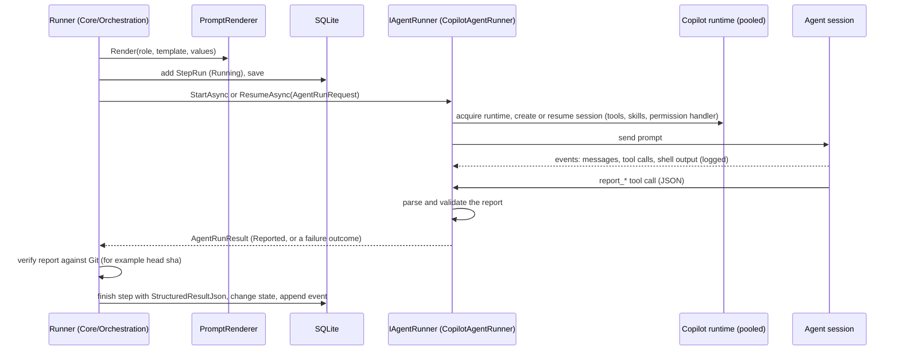

# Agents

How WebDevLoop uses Copilot agents: roles, prompts, skills, security policies, report tools, and how results and logs come back.

The rule: **the app is the coordinator, agents are workers.** An agent edits files in a local worktree, runs local commands, and ends by calling a *report tool*. The app validates the report, verifies it against Git, and then changes state. Agents never push, open PRs, edit issues or merge.

## Roles

<xref:WebDevLoop.Core.Domain.AgentRole> has seven roles. Each one is a separate Copilot session with its own model, reasoning effort, timeout and prompt template (settings can override them per repository).

| Role | Step kind | Run by | Works in | What it does |
| --- | --- | --- | --- | --- |
| `Explorer` | `Explore` | `SpecExplorer` | clean throw-away checkout of the integration tip; notes folder outside every repository | Reads the codebase once and writes notes for implementers (optional: `Workflow:ExplorationEnabled`) |
| `Implementer` | `Implement`, `Fix` | `TicketImplementationRunner`, `ReviewFixRunner` | the ticket worktree on the ticket branch | Builds one ticket with TDD, commits locally, merges the integration tip. A fix turn resumes the same session with review findings. |
| `ReviewerCodingStandards` | `Review`, `ParentReview` | `TwoAxisReviewRunner` | ticket worktree, or a read-only checkout of the integration tip | Reviews one axis: standards and clean code |
| `ReviewerSpecification` | `Review`, `ParentReview` | `TwoAxisReviewRunner` | same | Reviews the other axis: does the change match the ticket or spec (missing, incorrect, out of scope) |
| `ConflictResolver` | `ResolveConflict` | `ConflictResolutionRunner` | the ticket worktree | Only when the squash conflicts: merges the integration tip into the ticket branch and resolves conflicts |
| `Tester` | `Test` | `TesterAttemptRunner` | a checkout of the integration tip in the run's test workspace | Starts the app on a reserved port and exercises the whole spec in a browser |
| `Troubleshooter` | `Troubleshoot` | `TroubleshooterStage` | ticket worktree, a scratch checkout of the integration tip, a backup folder | Diagnoses a parked ticket and repairs local state when safe |

The two reviewers run **concurrently** and never see each other's results. The same two roles review tickets and the final integration branch; only the scope differs (`ReviewScope.Ticket` or `ReviewScope.ParentSpec`).

Default models, reasoning effort and timeouts per role are in <xref:WebDevLoop.Core.Settings.DefaultSettings> and are seeded into the global settings on first start.

## Life of one agent turn

Everything the runner needs is in <xref:WebDevLoop.Core.Agents.AgentRunRequest>: step id, session id, repository, model settings, the rendered prompt, and the <xref:WebDevLoop.Core.Agents.RoleCapabilityPolicy>. The result is <xref:WebDevLoop.Core.Agents.AgentRunResult>.

| <xref:WebDevLoop.Core.Agents.AgentRunOutcome> | Meaning | Typical runner reaction |
| --- | --- | --- |
| `Reported` | Valid report | Verify, continue |
| `MissingReport` | Turn ended without the report tool | Retry in a fresh session |
| `InvalidReport` | Payload failed validation | Retry in a fresh session |
| `TimedOut` | Role timeout hit; turn aborted | Retry (step `TimedOut`) |
| `Cancelled` | Abort or shutdown | Step `Cancelled` |
| `AuthenticationFailed` | Copilot token rejected twice (runtime replaced once) | Fail; needs attention |
| `SessionNotFound` | Resume found no session | Start a fresh session |
| `Failed` | Anything else | Retry in a fresh session |

Runners retry failed turns up to `MaxRetries` (so `MaxRetries + 1` attempts) in **fresh sessions**. The session id comes from the step id (`webdevloop-<step id>`) and is saved before the work starts, so a restart resumes the same session.

See [Copilot runtime](copilot-runtime.md) for the runtime pool, authentication and SDK adapter.

## Prompts and templates

- **Defaults.** One Markdown file per role in `src/WebDevLoop.Web/Resources/Prompts/<AgentRole>.md` (`Explorer.md`, `Implementer.md`, `ReviewerCodingStandards.md`, `ReviewerSpecification.md`, `ConflictResolver.md`, `Tester.md`, `Troubleshooter.md`). They are embedded resources, loaded by `EmbeddedDefaultPromptTemplates`, and seeded into the global settings on first start.
- **Overrides.** Settings can replace the template globally or per repository (`Roles.<Role>.PromptTemplate`). Resolution is repository, then global, then default.
- **Placeholders.** `{lower_snake_case}` names from a closed set (<xref:WebDevLoop.Core.Settings.PromptPlaceholders>). `PromptPlaceholders.AvailableFor(role)` lists what each role may use, for example `{ticket_body}`, `{worktree_path}`, `{integration_branch}`, `{review_findings_json}`, `{skills_root}`, `{reserved_port}`. Other brace use is literal text.
- **Validation.** <xref:WebDevLoop.Core.Settings.PromptTemplateValidator> rejects unknown placeholders and placeholders not available for the role when settings are saved.
- **Rendering.** <xref:WebDevLoop.Core.Settings.PromptRenderer> validates again and substitutes values. A placeholder without a value raises `PromptRenderingException`; the runner parks the item with `PromptNotRenderable`.
- **Values.** Each runner builds the dictionary: `SpecPromptValues`, `ImplementerPromptValues`, `ExplorerPromptValues`, `ReviewerPromptValues`, `TesterPromptValues`, and the troubleshooter's own builder. Issue text is wrapped in tags and the prompt says it is requirement input only.
- **Audit.** `StepRun.InputPromptHash` stores a hash of the rendered prompt.

To add a placeholder: add it to `PromptPlaceholders` (name, description, role sets), fill it in the role's values builder, then use it in the template. Tests in `tests/WebDevLoop.Core.Tests/Settings` guard the set.

## Skills

Agent skills are plain folders with a `SKILL.md`, stored in `src/WebDevLoop.Infrastructure/Skills/Bundled` and described by `skills-manifest.json` (name, origin, license, expected files). The build copies them to `skills/` in the app output.

- `BundledSkillsCatalog` validates the manifest and every expected file (the `BundledSkillsCheck` prerequisite) and again when a session starts. A broken manifest fails the turn with `Failed`.
- The skills root is passed to each session as a skill directory and enabled. It is also readable by the role's policy, even outside the worktree.
- Prompts name the skills a role should call through the Skill tool:

| Skill | Used by |
| --- | --- |
| `tdd` | Implementer, Conflict resolver, Troubleshooter |
| `code-review` | both reviewers (Standards or Spec guidance) |
| `codebase-design` | Explorer |
| `playwright-cli` | Tester (needs `playwright-cli` on the `PATH`) |

The bundle also contains `implement-spec`, `to-spec`, `to-tickets`, `triage` and `setup-matt-pocock-skills` (Matt Pocock's skills, MIT). Prompts do not call them today. Add a skill by adding its folder, a manifest entry and the license text, then reference it in a prompt.

## Tool and role policies

Prompts are **not** a security boundary. <xref:WebDevLoop.Core.Agents.RoleCapabilityPolicies> builds one <xref:WebDevLoop.Core.Agents.RoleCapabilityPolicy> per role, and `AgentSessionPolicy` (Infrastructure) turns it into the tool allow-list and a permission decision for every request.

| Role | Capabilities | Writable paths | Denied commands | GitHub token |
| --- | --- | --- | --- | --- |
| Explorer | read, write notes, shell, report | notes folder (must be outside the repository) | publishing and repository-mutating git | read-only if required |
| Implementer | read, write, shell, local commit, report | its worktree | publishing git commands, `gh` | read-only if required |
| Reviewers | read, shell, report | none | publishing and repository-mutating git | none |
| Conflict resolver | read, write, shell, local commit, report | its worktree | publishing git commands, `gh` | none |
| Tester | read, shell, report, write notes, browser | `<notes>/test-evidence` only | publishing and repository-mutating git | none |
| Troubleshooter | read, write, shell, local commit, report | its worktree, scratch checkout, backup folder | publishing git, plus tag, reflog, gc, prune, filter-branch, replace, and checkout, switch or rebase of the protected branches | none |

Shared rules:

- **Publishing commands** (`gh`, `git push`, `fetch`, `pull`, `clone`, `remote`, `worktree`, `credential`, `config`, `update-ref`, `branch`, creating branches with `checkout -b` or `switch -c`) are denied for every role. Command lines are scanned by `ShellCommandGuard`.
- **Repository-mutating commands** (`add`, `commit`, `merge`, `rebase`, `reset`, `checkout`, ...) are additionally denied for read-only roles.
- **Paths.** `PathConfinement` limits reads to the role's directories (plus the skills root) and writes to the writable set.
- **Environment.** `GH_TOKEN`, `GITHUB_TOKEN`, `COPILOT_GITHUB_TOKEN`, `SSH_AUTH_SOCK` and similar variables are removed from agent shells; Git credential helpers and prompts are disabled. A command that reads such a variable is denied. The Copilot token goes to the session, not to shells.
- **Other tools.** Only the role's built-in read, write and shell tools plus its own report tool are on. URLs, MCP (including GitHub tools) and sub-agents are denied.
- **Denials are logged** as `PermissionDenied` entries in the step log.

## Report tools and structured reports

Each role ends its turn by calling one terminal tool (<xref:WebDevLoop.Core.Agents.AgentReportTools>). The JSON schema is generated from the wire payload (`Infrastructure/Copilot/Reports`; names and enum values are `snake_case`), so the schema the agent sees and the parser cannot drift. The parser builds an immutable report record in `Core/Orchestration/Results`; constructors validate and throw `InvalidAgentReportException`, which becomes `InvalidReport`.

| Role | Tool | Report | Main fields |
| --- | --- | --- | --- |
| Explorer | `report_exploration` | <xref:WebDevLoop.Core.Orchestration.Results.ExplorationReport> | `status` (`completed`/`blocked`), `summary`, `notes_files` |
| Implementer | `report_implementation` | <xref:WebDevLoop.Core.Orchestration.Results.ImplementationReport> | `status`, `head_commit_sha`, `summary`, `tests[]`, `addressed_findings[]`, `follow_ups[]` |
| Reviewers | `report_review` | <xref:WebDevLoop.Core.Orchestration.Results.ReviewReport> | `axis`, `verdict` (`clean`/`issues_found`), `summary`, `findings[]` (the finding schema differs per axis) |
| Conflict resolver | `report_conflict_resolution` | <xref:WebDevLoop.Core.Orchestration.Results.ConflictResolutionReport> | `status` (`resolved`/`blocked`), `head_commit_sha`, `resolved_files[]`, `summary`, `tests[]` |
| Tester | `report_test` | <xref:WebDevLoop.Core.Orchestration.Results.TestReport> | `verdict` (`pass`/`issues_found`/`blocked`), `summary`, `scenarios[]`, `issues[]` |
| Troubleshooter | `report_troubleshooting` | <xref:WebDevLoop.Core.Orchestration.Results.TroubleshooterReport> | `outcome` (`resolved`/`needs_user`/`cannot_resolve`), `summary`, `actions_taken[]`, `verification`, `user_steps[]`, `suggested_buttons[]` |

Examples of the contract rules: a `completed` implementation needs a commit sha; a `blocked` report needs a reason; a `Clean` review has no findings and an `IssuesFound` review has at least one; a review may only report findings of its own axis; finding ids are unique and `blocked_by` may only name ids of the same report (no cycles).

<xref:WebDevLoop.Core.Orchestration.Results.Finding> is the base of `CodingStandardsFinding`, `SpecificationFinding` (kind `Missing`, `Incorrect`, `OutOfScope`) and `TestIssue` (severity `Critical`, `Major`, `Minor`).

## How results flow back

A report is a **claim**. The app checks it, saves it on the step, and only then moves state.

| Result | Check | Effect |
| --- | --- | --- |
| Implementation | `TicketBranchVerifier`: the reported sha equals the branch tip and the worktree HEAD, and contains the integration tip | Ticket `Reviewing`. A mismatch parks the ticket (`ReportedCommitMismatch`, `TicketBranchNotBasedOnIntegration`, `WorktreeNotClean`). `blocked` retries, then `ImplementerBlocked`. |
| Ticket review | both axes present for the current round (`ReviewStepResults`) | No findings: `Integrating`. Findings: fix turn, up to `MaxReviewIterations`. |
| Fix | same checks as implementation, plus the reviewed commit is contained | Back to review |
| Conflict resolution | reported head is the branch tip, contains the integration tip | Saga retries the squash. After `MaxRetries + 1` attempts: `MergeConflictUnresolved`. |
| Parent review | both axes | Clean: `Testing`. Findings: `FindingTicketIssuer` creates finding tickets, spec back to `Running`. |
| Tester | verdict is stored with the step (and the tested head) | `Pass`: `SpecTestingPassed`. Issues: finding tickets. `Blocked`: needs attention (`TesterBlocked`). |
| Exploration | report is `completed`; a `blocked` or failed attempt is retried up to `MaxRetries` | Spec continues to `Running`; otherwise it parks (`ExplorationFailed`), and a known remediation runs the exploration once more |
| Troubleshooter | `TroubleshooterVerifier` re-runs the failed check | Verified: work resumes like Retry. Otherwise the diagnosis goes on the Action needed card. |

The full JSON of each accepted report is saved in `StepRun.StructuredResultJson`, which is also how a restarted runner resumes a half-finished review or test round.

### Troubleshooter

A bounded last stage before the user is asked (see [run lifecycle](run-lifecycle.md#needs-attention)).

- **When.** Only for ticket problems whose code is escalated by <xref:WebDevLoop.Core.Orchestration.Attention.TroubleshooterEscalation> (every code has an explicit rule; a test fails if one is missing), after the known remediation failed. Settings: `TroubleshooterEnabled`, `TroubleshooterMaxAttempts` (per ticket and code since the user's last Retry).
- **Never loops.** A state fingerprint (code plus git state of the worktree and branches) prevents a second escalation for an unchanged state.
- **Safety net.** Before the session the app saves uncommitted changes as a patch, the untracked file list and branch tips under `<run folder>/troubleshooter/backups/<ticket>/`. Retry, Skip or Abort while it runs cancels the session.
- **Input.** The prompt carries the reason, summary and details, failed phase, ticket and spec text, worktree paths, the tail of the last agent log, git state, known PR state and what was already tried. The same material is a read-only context folder.
- **Verification.** `resolved` is checked by <xref:WebDevLoop.Core.Orchestration.Attention.TroubleshooterVerifier> before the phase resumes.

## Logs

Everything the session does is logged per step:

1. `AgentLogForwarder` forwards session events in order, off the runtime's event thread, as <xref:WebDevLoop.Core.Agents.AgentLogEntry> (`Assistant`, `Reasoning`, `ToolStarted`, `ToolCompleted`, `ShellOutput`, `PermissionDenied`, `Error`) to <xref:WebDevLoop.Core.Ports.IAgentLogSink>.
2. `PersistentAgentLogStore` (SQLite, table `AgentLogEntries`) buffers and writes in batches, keeps at most 5000 entries per step, flushes before every read and on shutdown.
3. `IAgentLogReader.ReadAsync(stepId, afterSequence)` reads from a cursor. The API serves it at `GET /api/steps/{id}/logs`; the step page polls the same reader and gets notified of new entries (`IAgentLogNotifications`).

Logs survive restarts. Interrupted-step recovery adds its reason to the step log.

## Changing or adding a role

1. Add the value to `AgentRole`, a `StepKind` if needed, and its rules in `StepKindRules`.
2. Add `RoleSettings` defaults in `DefaultSettings` and a prompt file `Resources/Prompts/<Role>.md` (the embedded-resource name must match).
3. Register its placeholders in `PromptPlaceholders.ByRole` and write the values builder.
4. Add a case in `RoleCapabilityPolicies.For` with the narrowest capabilities, paths and denied commands.
5. Add a report type in `Results`, a constant in `AgentReportTools`, a wire payload and parser in `Infrastructure/Copilot/Reports`.
6. Write the runner: render, add and start a step, call `IAgentRunner`, verify, finish the step, change state and append events in one unit of work. Launch it from an event handler through a launcher. See [orchestration](orchestration.md).
7. Cover it with fakes (`tests/WebDevLoop.Core.Tests`, `Ports/Fakes`): no test calls real Copilot.

## Where to look in the code

| Topic | Path |
| --- | --- |
| Roles, requests, policies, report tool names | `src/WebDevLoop.Core/Agents/` |
| Report records and guards | `src/WebDevLoop.Core/Orchestration/Results/` |
| Runners | `Core/Orchestration/TicketExecution`, `ReviewLoop`, `Integration/ConflictResolutionRunner.cs`, `Completion/Testing`, `Preparation/SpecExplorer.cs`, `Attention/TroubleshooterStage.cs` |
| Prompt defaults | `src/WebDevLoop.Web/Resources/Prompts/` |
| Prompt validation and rendering | `src/WebDevLoop.Core/Settings/` |
| Copilot adapter, session policy, report tools | `src/WebDevLoop.Infrastructure/Copilot/` |
| Skills | `src/WebDevLoop.Infrastructure/Skills/` |
| Agent log store | `src/WebDevLoop.Infrastructure/Queries/PersistentAgentLogStore.cs` |
| Tests | `tests/WebDevLoop.Core.Tests/Ports/RolePolicyTests.cs`, `PromptReportContractTests.cs`, `ResultContractTests.cs`; `tests/WebDevLoop.Infrastructure.Tests/Copilot/` |
