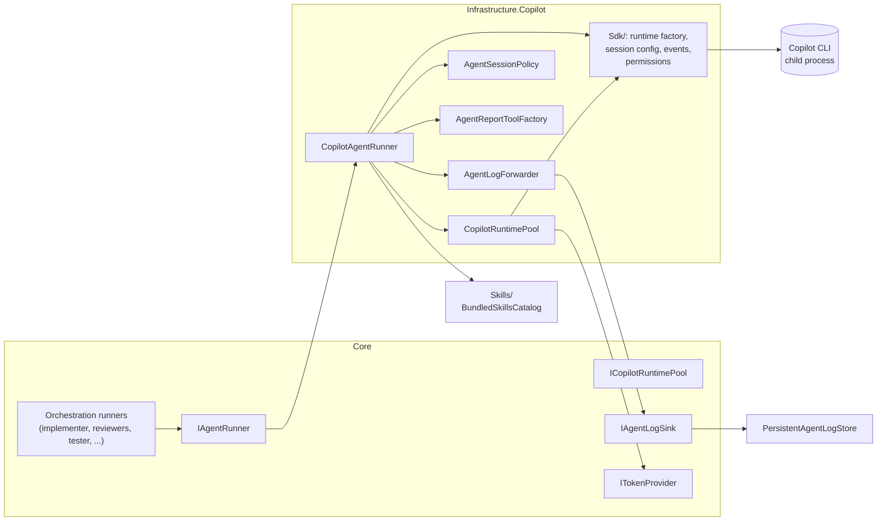
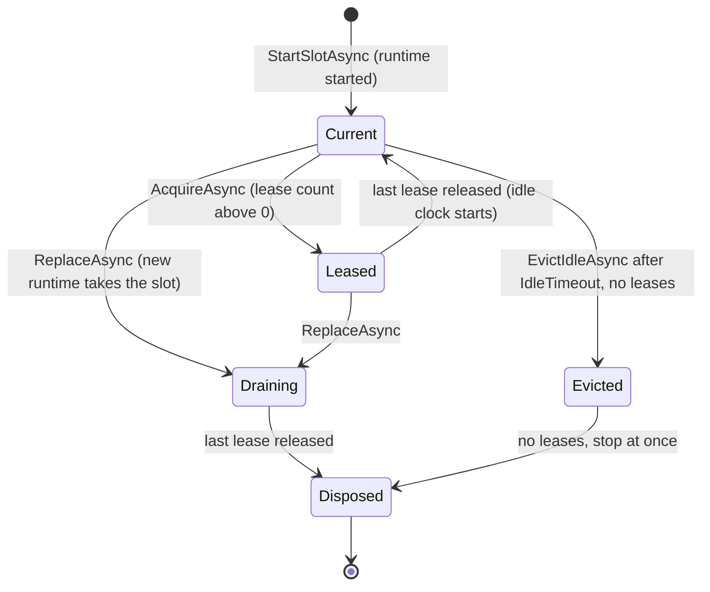
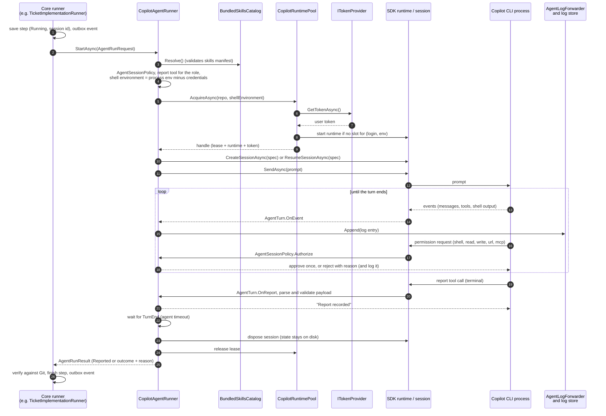

# Copilot runtime

How WebDevLoop runs GitHub Copilot agents: the runtime pool, sessions, tool and permission policies, bundled skills, report tools, log streaming, and how Core's agent ports are fulfilled.

Code is in `src/WebDevLoop.Infrastructure/Copilot/` (runner, pool, policy), `Copilot/Sdk/` (the only place that touches the SDK types), `Copilot/Reports/` (report tools) and `Skills/`. The agent *contracts* (requests, roles, policies) are in `src/WebDevLoop.Core/Agents/`. See [Agents](agents.md) for the roles and prompts.

## Overview

| Term | Meaning |
| --- | --- |
| Runtime | One Copilot CLI child process (stdio) wrapped by an SDK `CopilotClient`. |
| Pool | <xref:WebDevLoop.Core.Ports.ICopilotRuntimePool> implementation. Starts, leases, evicts and replaces runtimes. |
| Session | One conversation inside a runtime. The app picks its id (`AgentSessionId`) and stores it in the step row before the agent starts. |
| Turn | One prompt and the agent's work until it calls its report tool, fails, or times out. |
| Report tool | A terminal custom tool (`report_implementation`, ...). The report is the agent's only way to hand back a result. |
| Policy | <xref:WebDevLoop.Core.Agents.RoleCapabilityPolicy>: tools, paths, denied commands and scrubbed variables of a role. |

## How Core's ports are fulfilled

Everything is built by <xref:WebDevLoop.Infrastructure.Copilot.CopilotAgentServices> (`Copilot/CopilotAgentServices.cs`), a singleton created lazily in `AddCopilot` (`Web/DependencyInjection/InfrastructureServiceCollectionExtensions.cs`). It exists only after startup settings are resolved, because the Copilot home comes from them.

| Core port | Implementation | Notes |
| --- | --- | --- |
| <xref:WebDevLoop.Core.Ports.IAgentRunner> | `CopilotAgentRunner` | `StartAsync` (new session), `ResumeAsync` (existing session), `AbortAsync` |
| <xref:WebDevLoop.Core.Ports.ICopilotRuntimePool> | `CopilotRuntimePool` | `AcquireAsync(identity)` (recovery), `ReplaceAsync`, `RefreshExpiringAsync`, `EvictIdleAsync` |
| <xref:WebDevLoop.Core.Ports.IAgentLogSink> | `PersistentAgentLogStore` (see [Persistence and events](persistence-and-events.md#agent-log-persistence)) | Passed to the runner |
| <xref:WebDevLoop.Core.Ports.ITokenProvider> | `GitHubUserSession` (see [Git and GitHub](git-and-github.md#github-app-user-sign-in)) | The signed-in user's token |

Disposing `CopilotAgentServices` (container shutdown) stops every runtime.

A Core runner builds one <xref:WebDevLoop.Core.Agents.AgentRunRequest>:

| Field | Source |
| --- | --- |
| `StepRunId`, `SessionId` | The step row (the session id is generated and saved before the call) |
| `Repository` | The repository the work is for (named in auth errors) |
| `Settings` | <xref:WebDevLoop.Core.Agents.AgentModelSettings>: model, reasoning effort, timeout (from the effective settings of the role) |
| `Prompt` | The prompt template rendered by Core (placeholders such as `{skills_root}` already filled) |
| `Policy` | `RoleCapabilityPolicies.For(role, new AgentWorkspace(workingDirectory, notesDirectory))` |

The result is an <xref:WebDevLoop.Core.Agents.AgentRunResult>: either a parsed `AgentReport` or one of the non-reported <xref:WebDevLoop.Core.Agents.AgentRunOutcome> values (`MissingReport`, `InvalidReport`, `TimedOut`, `Cancelled`, `AuthenticationFailed`, `SessionNotFound`, `Failed`). Core then verifies the report against Git (it never trusts it) and finishes the step.

## Runtime lifecycle

### Starting a runtime

`SdkCopilotRuntimeFactory` starts one SDK `CopilotClient` per launch (`Copilot/Sdk/SdkClientOptionsFactory.cs`):

| Option | Value |
| --- | --- |
| Connection | stdio to a child process; CLI = `WebDevLoop:Copilot:CliPath` if set, else the CLI bundled with the SDK package |
| `BaseDirectory` (Copilot home) | Global setting `CopilotBaseDirectory`, default `<DataDirectory>/copilot`. **Shared by all runtimes**, so persisted sessions resume on a replacement runtime |
| `Environment` | The agent shell environment (see below) without `COPILOT_GITHUB_TOKEN` |
| `UseLoggedInUser` | `false`: stored or logged-in CLI credentials are never used |

### Pool keys, leases and eviction

`CopilotRuntimePool` (`Copilot/CopilotRuntimePool.cs`) keeps one runtime per **(user login, fingerprint of the shell environment)**. The fingerprint is a SHA-256 over the sorted variables. Most roles share one runtime; each tester run has its own, because its environment contains the reserved port and app URL.

- **Lease.** A session holds a <xref:WebDevLoop.Core.Agents.CopilotRuntimeLease> while it runs. Disposing the lease records the idle time.
- **Idle eviction.** `CopilotRuntimeMaintenanceWorker` calls `EvictIdleAsync` every `Workflow:RuntimeMaintenanceInterval` (1 min). A runtime without leases for `WebDevLoop:Copilot:IdleTimeout` (10 min) is stopped and restarted on demand. Leases are only handed out under the pool's gate, so an idle slot cannot gain a session while it is being removed.
- **Replace.** After an authentication error, `ReplaceAsync` starts a new runtime for the same slot and drains the old one (it stops when its last session ends).
- **Token refresh.** Runtimes never hold a GitHub token. Sessions receive the user's token, so a refreshed token needs no new runtime. `RefreshExpiringAsync` is therefore a no-op in this pool; the maintenance worker still calls it (the port keeps the option open).
- **Recovery.** `AgentStepRecoveryService` also calls `EvictIdleAsync` and `RefreshExpiringAsync` in every recovery cycle (runtime maintenance). `AcquireAsync(identity)` leases an existing runtime without starting one.
- **Shutdown.** `DisposeAsync` stops all runtimes, including draining ones.

## Authentication

- The pool asks `ITokenProvider.GetTokenAsync` on every `AcquireAsync`. No token (not signed in, sign-in ended) throws `CopilotAuthenticationException`, which becomes `AuthenticationFailed` with the reason.
- The session gets the token in its config. If the token has an expiry, the session gets a **callback** (`GitHubTokenProvider`) that asks the token provider again, so long sessions survive refreshes. A token without expiry is passed statically.
- An SDK error that looks like an authentication failure (401, "unauthorized", "bad credentials", ...: `SdkFailures`) is mapped to `CopilotAuthenticationException`.
- The runner **retries once**: the pool replaces the runtime and the same persisted session is resumed. A second failure returns `AuthenticationFailed`.

## One agent run

Step by step in `CopilotAgentRunner.RunAsync` (`Copilot/CopilotAgentRunner.cs`):

1. Start an `AgentLogForwarder` for the step.
2. `skills.Resolve()`: validates the skills manifest and files. A broken manifest returns `Failed`.
3. Build `AgentSessionPolicy` (tool allow-list and permission decisions) and the role's report tool.
4. Build the shell environment: process environment minus the role's scrubbed variables, plus the role's overrides (credential lockdown, tester variables).
5. Acquire a runtime handle (lease).
6. Create the session (`sessionExists=false`) or resume it (`true`; throws `CopilotSessionNotFoundException` if no persisted session has the id, which becomes `SessionNotFound`, and Core starts a fresh session).
7. Send the prompt and wait for `AgentTurn.Completion` up to `AgentModelSettings.Timeout`.
8. Map the turn end, release the lease, dispose the session. Always.

### How a turn ends (`AgentTurn`)

| Trigger | `TurnEnd` | `AgentRunOutcome` |
| --- | --- | --- |
| Valid report call | `Reported` | `Reported` |
| Report call fails validation | `Rejected` | `InvalidReport` |
| Session goes idle without a report | `Missing` | `MissingReport` |
| Session error event | `Errored` | `Failed` (or auth retry) |
| Timeout elapsed | - (`TimeoutException`) | `TimedOut`, session aborted |
| Caller cancelled | - | `Cancelled`, session aborted |

The first event that completes the turn wins. `AbortAsync(sessionId)` aborts the in-flight turn of an active session (idempotent for unknown ones). Core calls it when a run is aborted (`ActiveWorkStopper`), when recovery finishes an interrupted step, and when a tester attempt ends.

## Tools and policies

Prompts are never trusted for authorization. The SDK session is configured so that **only** what the role's policy grants is available.

Session config (`Copilot/Sdk/SdkSessionConfigFactory.cs`):

| Setting | Value |
| --- | --- |
| Working directory | The role's workspace (ticket worktree, checkout, ...) |
| Model, reasoning effort | From `AgentModelSettings` |
| Available tools | Built-in tools chosen from the role's capabilities, plus the role's report tool |
| Excluded tools | All MCP tools (`mcp:*`) |
| Skills | `EnableSkills = true`, `SkillDirectories = [<skills root>]` |
| Permission handler | `AgentSessionPolicy.Authorize` (approve once or reject with a reason) |
| Events | `SdkEvents.Map` (messages, reasoning, tool start/complete, shell output, errors, idle) |
| Resume | `AllowTranscriptRecovery = true`; same directory, tools, handlers, credentials re-registered |

Built-in tool groups (`Copilot/CopilotBuiltInTools.cs`):

| Group | Tools | Granted when the role may... |
| --- | --- | --- |
| Always | `skill` | always |
| Read | `view`, `grep`, `glob` | read files |
| Write | `create`, `edit`, `apply_patch` | write files or notes |
| Shell | `bash`, `read_bash`, `write_bash`, `stop_bash`, `list_bash` and the PowerShell equivalents | run shell commands |

Web, sub-agents, ask-user and MCP stay off.

Permission rules (`Copilot/AgentSessionPolicy.cs`):

| Request | Decision |
| --- | --- |
| Shell | Needs `RunShellCommands`. Denied if the command matches a denied command (`gh`, `git push`, ...) or reads a scrubbed credential variable |
| Read | Needs `ReadFiles` and a path under a readable root (or the skills root) |
| Write | Needs write capability and a path under a writable root |
| Report tool of the role | Approved |
| Any other custom tool | Denied |
| URL | Denied ("Network access is not available to agents") |
| MCP | Denied (WebDevLoop does every GitHub operation) |
| Other | Denied |

Each denial is written to the agent log as `PermissionDenied`.

Roles (`Core/Agents/RoleCapabilityPolicies.cs`, <xref:WebDevLoop.Core.Agents.RoleCapabilityPolicies>):

| Role | Can write | Shell | Denied git/gh | Report tool |
| --- | --- | --- | --- | --- |
| Explorer | Notes directory only (outside the repository) | yes | All repository mutations and publishing | `report_exploration` |
| Implementer | Its worktree | yes, local commits allowed | Publishing (`gh`, push, fetch, clone, remote, worktree, branch creation, ...) | `report_implementation` |
| ReviewerCodingStandards, ReviewerSpecification | nothing | yes (read-only) | All repository mutations and publishing | `report_review` |
| ConflictResolver | Its worktree | yes, local commits allowed | Publishing | `report_conflict_resolution` |
| Tester | Evidence directory (`<notes>/test-evidence`) | yes (drives the app with `playwright-cli`) | All repository mutations and publishing | `report_test` |
| Troubleshooter | Its work directories | yes, local commits allowed | Publishing plus history rewriting, and checkout/switch/rebase of protected branches | `report_troubleshooting` |

All roles share the scrubbed credential variables (`GH_TOKEN`, `GITHUB_TOKEN`, `COPILOT_GITHUB_TOKEN`, `GIT_ASKPASS`, `SSH_AUTH_SOCK`, ...) and a credential lockdown (`GIT_TERMINAL_PROMPT=0`, empty `credential.helper`). The `UseBrowser` capability is a policy flag; the tester uses the browser through the bundled `playwright-cli` skill in the shell.

To change what a role may do, edit `RoleCapabilityPolicies` (and add a test in `tests/WebDevLoop.Core.Tests`). The runner needs no change unless you add a new tool group.

## Report tools

`AgentReportToolFactory` (`Copilot/Reports/`) builds the report tool of a role:

- The JSON schema is **generated from the payload record** (`ReportPayloads.cs`), so the schema the agent sees and the parser cannot drift apart. Property names are snake_case; unknown properties are rejected.
- `ToDomain()` creates the Core report (<xref:WebDevLoop.Core.Agents.AgentReportTools> names the tools). Domain constructors throw `InvalidAgentReportException` for contract violations, which becomes `InvalidReport`.
- The two reviewers share the tool name `report_review` but each accepts only its own `axis` (the schema enum is narrowed, and a wrong axis is rejected).
- The SDK sees the tool through `SdkReportFunction`: terminal (it ends the turn) and permission-free.

Adding or changing a report: edit the payload record and the Core report type together, update the prompt template, and add a parse test.

## Skills

Agent skills are plain files that agents load with the `skill` tool.

| Aspect | Detail |
| --- | --- |
| Source | `src/WebDevLoop.Infrastructure/Skills/Bundled/` (mattpocock/skills and `playwright-cli`) with `skills-manifest.json` and license texts in `LICENSES/` |
| Shipped as | Files copied to `skills/` in the build and publish output (`CopyToOutputDirectory`, `CopyToPublishDirectory` in the csproj). They are **not** embedded resources |
| Manifest | Lists each skill's `name`, `path`, `origin`, `license`, `licenseFile` and expected `files` (must include `SKILL.md`) |
| Catalog | <xref:WebDevLoop.Infrastructure.Skills.BundledSkillsCatalog>: `Validate()` (startup prerequisite *Bundled skills*) and `Resolve()` (per run; throws `SkillManifestException` on problems) |
| Root | <xref:WebDevLoop.Infrastructure.Skills.BundledSkillsOptions>`.Root`, default `<app base>/skills` |
| Use | The root is the session's skill directory, readable by agents, and available to prompts as `{skills_root}` |

The prompt templates are different: they are **embedded resources** (`src/WebDevLoop.Web/Resources/Prompts/*.md`, one per role), loaded by `EmbeddedDefaultPromptTemplates`. They are copied into the global settings on first start and then edited in the app. See [Agents](agents.md).

To add or update a skill: put it under `Skills/Bundled/`, list it in `skills-manifest.json` with its origin and license, and add the license text if it is new. The `BundledSkillsCheck` and the Infrastructure skill tests catch missing files.

## The CLI path

| Situation | What to do |
| --- | --- |
| Published build | `dotnet publish` makes the SDK package copy its pinned CLI to `runtimes/<rid>/native/copilot`. Nothing to configure |
| `dotnet run` / dev build | Builds do not download the CLI (`CopilotSkipCliDownload` defaults to `true` unless publishing). Set `WebDevLoop:Copilot:CliPath` to an installed `copilot`, or build with `-p:CopilotSkipCliDownload=false` |
| Which one is used | A configured `CliPath` always wins and is never replaced by the bundled one (the pool and `CopilotRuntimeCheck` follow the same rule) |

The *Copilot runtime* prerequisite checks that the file exists and runs `--version`.

## Logs streaming

- The SDK session raises events. `SdkEvents.Map` keeps assistant messages, reasoning, tool start/complete, shell output, errors and idle. `AgentTurn.OnEvent` turns them into <xref:WebDevLoop.Core.Agents.AgentLogEntry> values of an <xref:WebDevLoop.Core.Agents.AgentLogKind> (`Assistant`, `Reasoning`, `ToolStarted`, `ToolCompleted`, `ShellOutput`, `PermissionDenied`, `Error`).
- `AgentLogForwarder` writes them to an unbounded channel and a single pump forwards them in order to `IAgentLogSink`, off the SDK's event thread. A failing sink is ignored: logs are best effort.
- `PersistentAgentLogStore` batches the writes to SQLite and notifies the UI. See [Persistence and events](persistence-and-events.md#agent-log-persistence).
- The UI reads pages through `IAgentLogReader` (`GET /api/steps/{id}/logs`, the step page tail).

## Configuration

| Key | Default | Meaning |
| --- | --- | --- |
| `WebDevLoop:Copilot:CliPath` | empty (bundled) | CLI to launch |
| `WebDevLoop:Copilot:IdleTimeout` | `00:10:00` | Idle runtime eviction |
| `WebDevLoop:Workflow:RuntimeMaintenanceInterval` | `00:01:00` | How often the maintenance worker runs |
| Global setting `CopilotBaseDirectory` | `<DataDirectory>/copilot` | Copilot home; startup-scoped, global only |
| Per-role settings (Settings page) | - | Model, reasoning effort, timeout, prompt template |

See [Startup and prerequisites](startup-and-prerequisites.md) for all options.

## Where to look in the code

| What | Path |
| --- | --- |
| Runner, session spec, turn handling | `src/WebDevLoop.Infrastructure/Copilot/CopilotAgentRunner.cs`, `AgentTurn.cs`, `AgentLogForwarder.cs` |
| Pool | `src/WebDevLoop.Infrastructure/Copilot/CopilotRuntimePool.cs`, `CopilotAgentServices.cs`, `CopilotRuntimeOptions.cs` |
| Tool and permission policy | `src/WebDevLoop.Infrastructure/Copilot/AgentSessionPolicy.cs`, `CopilotBuiltInTools.cs`, `src/WebDevLoop.Core/Agents/` |
| SDK adapter (all SDK types) | `src/WebDevLoop.Infrastructure/Copilot/Sdk/`, internal contracts in `Copilot/Runtime/` |
| Report tools | `src/WebDevLoop.Infrastructure/Copilot/Reports/` |
| Skills | `src/WebDevLoop.Infrastructure/Skills/` |
| Prompts | `src/WebDevLoop.Web/Resources/Prompts/` |
| Wiring and worker | `Web/DependencyInjection/InfrastructureServiceCollectionExtensions.cs`, `Web/Background/Workers.cs` |
| Tests | `tests/WebDevLoop.Infrastructure.Tests/Copilot`, `.../Skills` |
