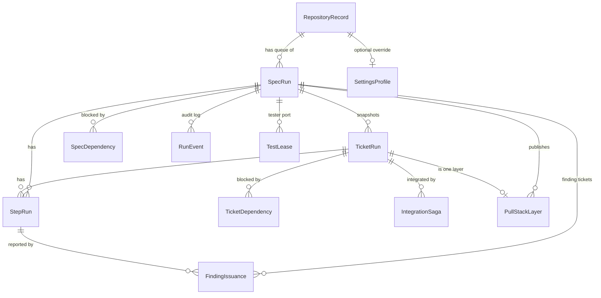

# Domain model

The entities, value objects and rules in `WebDevLoop.Core/Domain`: what is stored, how things relate, and which invariants hold.

The domain is plain C# with no I/O. Aggregates change state only through methods (private setters), so status rules live in one place. Persistence maps them in `src/WebDevLoop.Infrastructure/Persistence/Configurations`.

## Overview

`OutboxMessage` stands alone: it is the durable event queue (see [persistence and events](persistence-and-events.md)). The global `SettingsProfile` has no repository.

## Aggregates and entities

Types marked **CAS** derive from <xref:WebDevLoop.Core.Domain.VersionedEntity>: the `Version` is the compare-and-swap token (see [invariants](#invariants)).

| Type | CAS | Purpose | Key members |
| --- | --- | --- | --- |
| <xref:WebDevLoop.Core.Domain.RepositoryRecord> | yes | A registered GitHub repository and its local clone | `Owner`, `Name`, `DefaultBaseBranch`, `CloneUrl`, `LocalPath`, `IsEnabled` |
| <xref:WebDevLoop.Core.Domain.SpecRun> | yes | One run for one spec (parent) issue; also the queue entry | `Status`, `QueuePosition`, `IntegrationBranch`, `IntegrationBaseSha`, `IntegrationTipSha`, `MaxActiveSpecsSlot`, `DependencyModeUsed`, `ReviewCycle`, `TestCycle`, `Attention`, `NeedsAttentionFrom` |
| <xref:WebDevLoop.Core.Domain.TicketRun> | yes | One run for one ticket (sub-issue) of a spec run | `Status`, `Attempt`, `ReviewIteration`, `BranchName`, `WorktreePath`, `LastImplementedSha`, `IntegratedCommitSha`, `PullRequestNumber`, `StackPosition`, `Attention` |
| <xref:WebDevLoop.Core.Domain.StepRun> | yes | One agent session (or app step) of a spec or ticket | `Kind`, `AgentRole`, `Status`, `Attempt`, `CopilotSessionId`, `Model`, `TimeoutAt`, `StructuredResultJson`, `Attention` |
| <xref:WebDevLoop.Core.Domain.IntegrationSaga> | yes | Checkpointed squash, push, PR and stack link of one ticket | `Checkpoint`, `ExpectedPriorIntegrationSha`, `SquashCommitSha`, `StackBranchName`, `ExternalIdempotencyKey`, `ConsecutiveFaults` |
| <xref:WebDevLoop.Core.Domain.PullStackLayer> | no | One draft PR of the spec's stack | `Position` (from 1), `BranchName`, `CommitSha`, `PullRequestNumber`, `BaseBranch`, `IsDraft`, `VerifiedDiffSha` |
| <xref:WebDevLoop.Core.Domain.TicketDependency> | no | Edge in the ticket DAG: *blocked* waits for *blocking* | `BlockedTicketRunId`, `BlockingTicketRunId`, `Source` |
| <xref:WebDevLoop.Core.Domain.SpecDependency> | no | Spec blocked by another spec run or by an external issue | `BlockedSpecRunId`, `BlockingSpecRunId` or `ExternalBlockingIssue`, `ModeAtStart` |
| <xref:WebDevLoop.Core.Domain.SettingsProfile> | yes | Global or per-repository settings; every value nullable | see [settings](#settings-profile) |
| <xref:WebDevLoop.Core.Domain.TestLease> | yes | Reserved port and process of a tester run | `Port`, `WorkspacePath`, `ProcessId`, `ExpiresAt`, `ReleasedAt` |
| <xref:WebDevLoop.Core.Domain.FindingIssuance> | no | Record that a finding became (or will become) a ticket issue | `Axis`, `Fingerprint`, `IssueNumber`, `Status` (`Planned`, `Created`) |
| <xref:WebDevLoop.Core.Domain.RunEvent> | no | Audit log line shown on the run page | `Type`, `PayloadJson`, `OccurredAt` |
| <xref:WebDevLoop.Core.Domain.OutboxMessage> | no | Durable event waiting for dispatch | `Type`, `PayloadJson`, `DispatchedAt`, `DeadLetteredAt`, `Attempts` |

### How the pieces connect

- A `SpecRun` owns its tickets. `SpecRun.Queue(...)` creates it `Queued`; `TicketRun.Create(...)` creates a ticket (status `Blocked`, the enum default) during preparation.
- Tickets form a DAG through `TicketDependency`. Edges come from GitHub (`DependencySource.GitHub`) or from finding tickets the app created (`DependencySource.CreatedFinding`).
- A `StepRun` always belongs to a spec run. `TicketRunId` is null for spec-level steps (exploration, parent review, tests).
- Each ticket gets one `IntegrationSaga` per integration attempt. At most one saga per ticket is incomplete at a time.
- A finished saga leaves one `PullStackLayer`. Layers of a spec are numbered 1..n bottom to top.
- `RunEvent` rows are written by the outbox from progress events and by control/attention journals.

## Statuses and enums

The state machines are in [run lifecycle](run-lifecycle.md). The enums:

| Enum | Values |
| --- | --- |
| <xref:WebDevLoop.Core.Domain.SpecRunStatus> | `Queued`, `WaitingForDependency`, `Preparing`, `Running`, `ParentReviewing`, `Testing`, `ReadyForReview`, `AwaitingMerge`, `Completed`, `NeedsAttention`, `Aborted` |
| <xref:WebDevLoop.Core.Domain.TicketRunStatus> | `Blocked`, `Ready`, `Implementing`, `Reviewing`, `FixingReviewFindings`, `Integrating`, `Integrated`, `NeedsAttention`, `Skipped`, `Aborted` |
| <xref:WebDevLoop.Core.Domain.StepStatus> | `Pending`, `Running`, `Succeeded`, `Failed`, `TimedOut`, `Cancelled`, `NeedsAttention` |
| <xref:WebDevLoop.Core.Domain.StepKind> | `Explore`, `Implement`, `Review`, `Fix`, `ResolveConflict`, `ParentReview`, `Test`, `Troubleshoot` |
| <xref:WebDevLoop.Core.Domain.AgentRole> | `Explorer`, `Implementer`, `ReviewerCodingStandards`, `ReviewerSpecification`, `ConflictResolver`, `Tester`, `Troubleshooter` |
| <xref:WebDevLoop.Core.Domain.IntegrationSagaCheckpoint> | `Started`, `SquashCommitCreated`, `IntegrationRefUpdated`, `IntegrationPushed`, `StackBranchPushed`, `PrCreated`, `StackLinked`, `DiffVerified`, `IssueTransitioned`, `Completed` |
| <xref:WebDevLoop.Core.Domain.SpecDependencyMode> | `WaitForMerge`, `StackOnTop` |
| <xref:WebDevLoop.Core.Domain.FindingAxis> | `CodingStandards`, `Specification`, `Testing` |

Rules live next to the enums: <xref:WebDevLoop.Core.Domain.SpecRunStatusRules>, <xref:WebDevLoop.Core.Domain.TicketRunStatusRules>, <xref:WebDevLoop.Core.Domain.StepStatusRules>, <xref:WebDevLoop.Core.Domain.StepKindRules>. Each has `CanTransitionTo`, `IsTerminal`, and helpers such as `IsActive`, `SatisfiesDependents`, `OccupiesImplementerSlot`.

## Identifiers and value objects

All are `readonly record struct`s that validate in the constructor, so an invalid value cannot exist.

| Type | Format and rules |
| --- | --- |
| <xref:WebDevLoop.Core.Domain.RunId>, <xref:WebDevLoop.Core.Domain.TicketRunId>, <xref:WebDevLoop.Core.Domain.StepRunId> | Letters, digits, `-`, `_`, `.`; no `..`. They become branch segments. `GuidIdGenerator` makes `r`/`t`/`s` + 12 hex digits. |
| <xref:WebDevLoop.Core.Agents.AgentSessionId> | Copilot session id. Derived from the step id (`webdevloop-<step id>`), so a recovered step resumes the same session. |
| <xref:WebDevLoop.Core.Domain.BranchName> | Not blank, no empty segments, no `..`, no whitespace. |
| <xref:WebDevLoop.Core.Domain.CommitSha> | 40 or 64 hex digits, stored lower case. |
| <xref:WebDevLoop.Core.Domain.IssueRef> | `owner/repo#number` plus optional GitHub node id and database id. Number must be positive. |
| <xref:WebDevLoop.Core.Domain.GitHubRepoRef> | `owner/name`. |
| <xref:WebDevLoop.Core.Domain.PullRequestNumber> | Positive integer. |
| <xref:WebDevLoop.Core.Domain.FindingFingerprint> | Trimmed, whitespace collapsed, lower case; identity of a finding. |
| <xref:WebDevLoop.Core.Domain.TestPortRange> | `Start`..`End` within 1..65535 (the range for tester ports). |
| `DependencyEdge<T>` | `(Blocked, Blocking)` pair used by <xref:WebDevLoop.Core.Domain.DependencyGraph>. |

### Run-scoped names

<xref:WebDevLoop.Core.Domain.RunScopedNaming> builds every branch name from run and ticket ids:

| Branch | Name |
| --- | --- |
| Integration | `webdevloop/<run>/integration` |
| Ticket | `webdevloop/<run>/ticket/<ticket>` |
| Stack layer | `stack/<run>/<ticket>` (immutable ref of one PR layer) |

## Attention

`NeedsAttention` is a status on specs, tickets and steps. It always carries an <xref:WebDevLoop.Core.Domain.AttentionReason>: the constructor rejects a reason without summary, "why it matters", a known code, or at least one action. `MarkNeedsAttention` is the only way into the status, so the type system forbids a free-form failure string.

| Part | Meaning |
| --- | --- |
| `Code` (<xref:WebDevLoop.Core.Domain.AttentionCode>) | One code per situation, grouped as preparation, implementation, review, integration, recovery, parent review/testing/merge, and general. Stored by name: never rename or reuse a member. |
| `Summary`, `WhyItMatters`, `Details` | Plain-language text and the technical wording (also stored as `FailureReason`). |
| `Cause` (`WebDevLoop`, `You`, `Decision`) | Who has to act. |
| `AutoFix`, `TriedSoFar`, `Diagnosis` | What the app tried (known remediation, troubleshooter). |
| `UserSteps`, `Actions` | Numbered steps and the buttons (`Retry`, `Skip`, `SkipWithDependents`, `Abort`) with their consequence. |

Wording for every code lives in one factory class, <xref:WebDevLoop.Core.Domain.AttentionReasons>. A guard test fails when work is parked with a free-form string or a code has no factory. The reason is stored as JSON next to the run, ticket or step.

`SpecRun` and `TicketRun` also store `NeedsAttentionFrom`, the status they were in when parked. A retry uses it to resume the failed phase (see [run lifecycle](run-lifecycle.md#needs-attention)).

## Settings profile

<xref:WebDevLoop.Core.Domain.SettingsProfile> is one row per scope: the global profile (`RepositoryId` null) and at most one per repository. Every value is nullable. <xref:WebDevLoop.Core.Settings.SettingsResolver> resolves **repository override, then global, then embedded defaults** into <xref:WebDevLoop.Core.Settings.EffectiveSettings> (every value present).

| Setting | Meaning |
| --- | --- |
| `WorkspaceRootDirectory`, `CopilotBaseDirectory` | Global-only, read at startup (a change needs a restart). |
| `BaseBranch` | Trunk the run starts from. |
| `MaxActiveSpecsPerRepo` | Active-spec slots per repository. |
| `SpecDependencyMode` | `WaitForMerge` or `StackOnTop`. |
| `MaxConcurrentImplementersGlobal`, `MaxConcurrentImplementersPerRepo` | Implementer capacity. |
| `MaxReviewIterations`, `MaxRetries`, `ParentReviewCycleLimit`, `TesterCycleLimit` | Loop bounds. |
| `TroubleshooterEnabled`, `TroubleshooterMaxAttempts` | Troubleshooter switch and bound. |
| `TesterRunInstructions`, `TestPortRange` | How the tester starts the app and which ports it may use. |
| `Roles` | Per `AgentRole`: <xref:WebDevLoop.Core.Domain.RoleSettingsOverride> (model, reasoning effort, prompt template, timeout). |

Defaults are in <xref:WebDevLoop.Core.Settings.DefaultSettings>. Prompt templates are validated by `PromptTemplateValidator`. See [agents](agents.md#prompts-and-templates).

## Invariants

| Invariant | Enforced by |
| --- | --- |
| Status changes follow the transition tables; terminal states are final | `TransitionTo` throws <xref:WebDevLoop.Core.Domain.InvalidStatusTransitionException>. Any non-terminal status may go to `Aborted` or `NeedsAttention`. |
| `NeedsAttention` needs a structured reason | `MarkNeedsAttention(reason)`; `StepRun.Finish` refuses `NeedsAttention`. |
| Leaving a status clears `FailureReason`, `Attention`, `NeedsAttentionFrom` | `TransitionTo` of `SpecRun` and `TicketRun`. |
| A spec holds an active slot only while it is active | `TransitionTo` clears `MaxActiveSpecsSlot` when the new status is not active. Unique index on (repository, slot) for active specs. |
| A ticket has at most one active implement or fix step | Filtered unique index on `StepRuns` (ticket, active, kind implement/fix). |
| An app-owned step (no agent role) is unique per spec and kind while active | Filtered unique index `UX_StepRuns_ActiveAppOwnedKindPerRun`. Today every step has an agent role, so this is a guard for future app-owned steps. Review and tester steps get deterministic ids instead, so a duplicate runner collides on the primary key. |
| A saga never moves backwards | `AdvanceTo` throws on a lower checkpoint; the same checkpoint is a no-op. `RetargetTo` only works before `IntegrationRefUpdated`. |
| At most one incomplete saga per ticket | Filtered unique index on `IntegrationSagas`. |
| The ticket DAG has no cycle and no self edge | <xref:WebDevLoop.Core.Domain.DependencyGraph> (`EnsureCanAdd`, `EnsureAcyclic`), `TicketDependency.Create`, `SpecDependency` factories throw <xref:WebDevLoop.Core.Domain.DependencyCycleException>. |
| Layer positions are unique per spec and start at 1 | `PullStackLayer.Create`; unique index (spec, position). New layers are draft. |
| One finding becomes one ticket | Unique index on (spec, fingerprint) of `FindingIssuances`; `RecordCreated` is idempotent. |
| One active test lease per spec and per port | Filtered unique indexes on `TestLeases`. |
| Concurrent writers cannot overwrite each other | Each save updates `WHERE Version = n` and sets `n + 1`; a mismatch or a unique-index violation is `SaveOutcome.ConcurrencyConflict`. |
| Ticket `Attempt` and `ReviewIteration` identify a review round | `TransitionTo(Implementing)` increments `Attempt` and resets `ReviewIteration`; `FixingReviewFindings` increments `ReviewIteration`; a retry into `Reviewing` starts a new attempt. |
| Spec cycle counters count phases entered | `ReviewCycle` increments on entering `ParentReviewing`, `TestCycle` on entering `Testing`. |

## Where to look in the code

| Topic | Path |
| --- | --- |
| Aggregates and rules | `src/WebDevLoop.Core/Domain/` |
| Attention reasons and codes | `src/WebDevLoop.Core/Domain/Attention/` |
| Settings resolution | `src/WebDevLoop.Core/Settings/` |
| Mapping to tables, indexes | `src/WebDevLoop.Infrastructure/Persistence/Configurations/`, `FilteredIndexSql.cs` |
| Compare-and-swap save | `src/WebDevLoop.Infrastructure/Persistence/EfUnitOfWork.cs` |
| Domain tests | `tests/WebDevLoop.Core.Tests/Domain/` |
