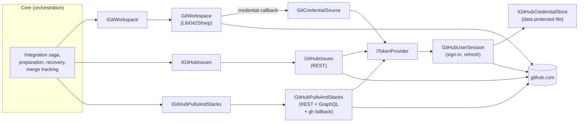
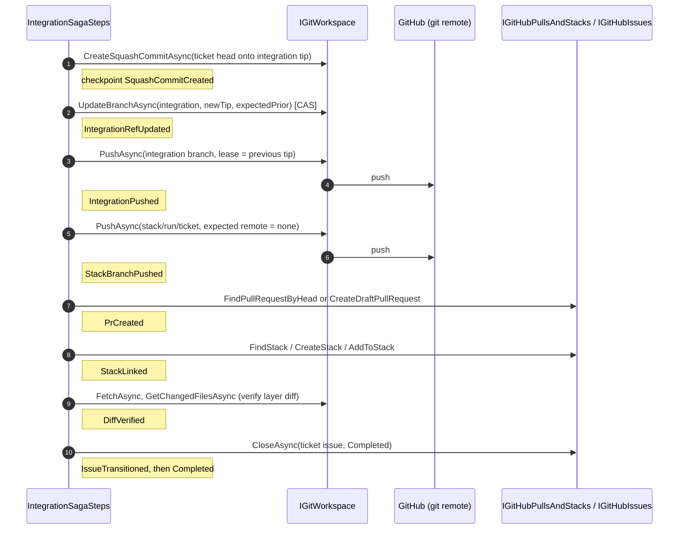
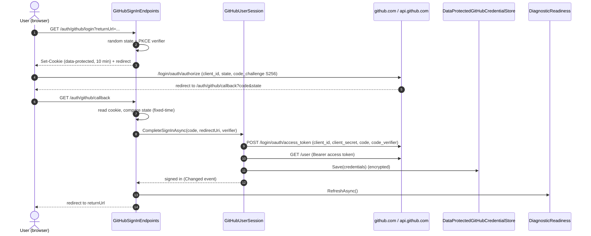
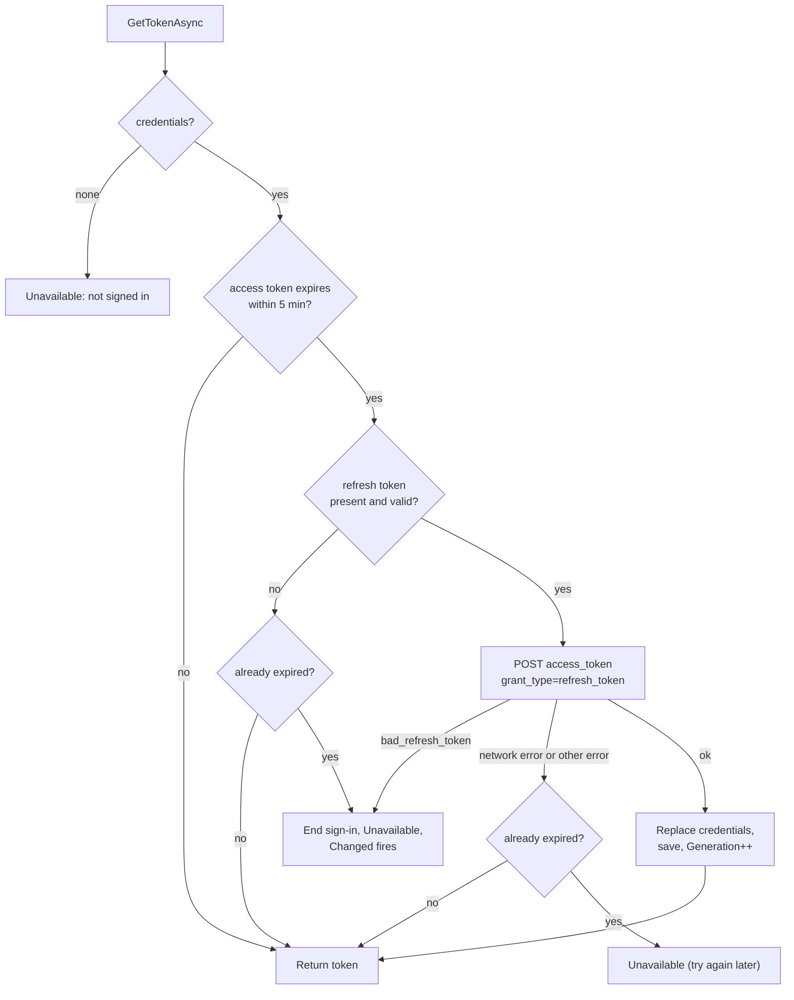

# Git and GitHub

How WebDevLoop works with local Git clones and worktrees, with the GitHub API (issues, pull requests, stacks), and how the signed-in GitHub user's token is obtained, stored and refreshed.

Agents never push, open PRs or touch issues. The app does all of it, through the ports on this page.

## Overview

| Concern | Core port | Adapter (`src/WebDevLoop.Infrastructure`) |
| --- | --- | --- |
| Clone, fetch, push, refs, worktrees, merges | <xref:WebDevLoop.Core.Ports.IGitWorkspace> | `Git/` — <xref:WebDevLoop.Infrastructure.Git.GitWorkspace> (LibGit2Sharp) |
| Issues, sub-issues, dependencies, comments | <xref:WebDevLoop.Core.Ports.IGitHubIssues> | `GitHub/Issues/` — <xref:WebDevLoop.Infrastructure.GitHub.Issues.GitHubIssues> (REST) |
| Pull requests, stacks, merge status | <xref:WebDevLoop.Core.Ports.IGitHubPullsAndStacks> | `GitHub/Pulls/`, `GitHub/Stacks/` — <xref:WebDevLoop.Infrastructure.GitHub.Pulls.GitHubPullsAndStacks> (REST, GraphQL, `gh` fallback) |
| The user's GitHub token | <xref:WebDevLoop.Core.Ports.ITokenProvider> | `GitHub/Auth/` — <xref:WebDevLoop.Infrastructure.GitHub.Auth.GitHubUserSession> |
| Git credentials for HTTPS | `IGitCredentialSource` (Infrastructure) | <xref:WebDevLoop.Infrastructure.GitHub.Auth.GitCredentialSource> |



All adapters ask `ITokenProvider.GetTokenAsync` **per operation**. They never keep a token. Nothing is polled by webhook: the app polls (see [Polling](#polling)).

## Git workspace

### Why LibGit2Sharp, and the CLI

`GitWorkspace` implements every Git operation in-process with LibGit2Sharp: clone, fetch, push, linked worktrees, in-memory merges, compare-and-swap ref updates.

There is **no `git` CLI fallback in the adapter**. The `git` CLI is still required because *agents* run local `git` (status, diff, commit) in their shells. It is checked at startup by `GitCliCheck` (see [Startup and prerequisites](startup-and-prerequisites.md)). `WebDevLoop:Tools:GitExecutable` only selects the executable for that check.

The `gh` CLI is a different story: it is a real, optional fallback for stacks (see [Stacks](#stacks-rest-first-gh-stack-fallback)).

### Directory layout

Everything lives under the **workspace root**: `<DataDirectory>/workspaces` by default (global setting `WorkspaceRootDirectory`, fixed at startup).

```text
<workspace root>/
├── repos/<owner>/<name>/          # the clone (RepositoryCloneLayout)
└── runs/<run-id>/                 # app-owned, per spec run (RunWorkspaceLayout)
    ├── tickets/<ticket-id>/       # one worktree per ticket (TicketWorktreeLayout)
    ├── explore/                   # explorer checkout
    ├── parent-review/             # parent review checkout
    ├── test/                      # tester checkout
    ├── notes/                     # exploration notes, tester evidence (not a checkout)
    ├── worktree-backups/<ticket-id>/
    └── troubleshooter/{integration,backups,context}/
```

- `RepositoryCloneLayout.PathFor` accepts only safe owner/name segments (letters, digits, `-`, `_`, `.`; never `.` or `..`).
- Worktrees are **siblings of** the clone, never inside it. Agents get their own directory and cannot touch the clone.
- The integration branch has no worktree. The saga builds the squash commit in memory in the clone (`CreateSquashCommitAsync`).
- Code: `Core/Orchestration/Preparation/RepositoryCloneLayout.cs`, `RunWorkspaceLayout.cs`, `Core/Orchestration/TicketExecution/TicketWorktreeLayout.cs`.

### Path confinement

<xref:WebDevLoop.Infrastructure.Git.WorkspacePathGuard> (`Git/WorkspacePathGuard.cs`) normalizes every clone and worktree path and requires it to be strictly under the workspace root. Otherwise it throws <xref:WebDevLoop.Infrastructure.Git.WorkspacePathOutsideRootException>. The check is lexical (the root is app-owned, so no symlinks are expected in it).

- Every `GitWorkspace` method confines its path first.
- The root is pinned at startup (`StartupSettings`, `StartupPinnedSettingsProvider`). Changing the setting needs a restart; existing clones are **not** moved. A clone outside the root makes its tickets need attention (the startup log warns about each).
- Agents are confined separately, by role policy: <xref:WebDevLoop.Core.Agents.PathConfinement>. See [Copilot runtime](copilot-runtime.md).

### Locks

`RepositoryLocks` keeps one `SemaphoreSlim` per clone path. All mutating and reading operations on a clone run under it, on a thread-pool thread. This makes read-compare-write ref updates atomic for the one WebDevLoop process that owns the workspace. `MergeIntoWorktreeAsync` locks by worktree path instead.

### Branch naming

Names embed the run id, so repeated runs for one issue never move each other's refs (`Core/Domain/RunScopedNaming.cs`, <xref:WebDevLoop.Core.Domain.RunScopedNaming>).

| Branch | Name | Purpose |
| --- | --- | --- |
| Integration | `webdevloop/<run-id>/integration` | Squash-merged tickets; pushed |
| Ticket | `webdevloop/<run-id>/ticket/<ticket-id>` | The implementer's worktree branch; local only |
| Stack layer | `stack/<run-id>/<ticket-id>` | Head of one stacked PR; pushed once, immutable |
| Explorer / parent review / tester / troubleshooter | `webdevloop/<run-id>/explore`, `/parent-review`, `/test`, `/troubleshoot` | Scratch branches of those checkouts |

### What `IGitWorkspace` offers

| Group | Methods | Notes |
| --- | --- | --- |
| Clone and sync | `EnsureClonedAsync`, `FetchAsync` | Clones when missing, else fixes the `origin` URL and fetches (with prune). A non-empty non-repository directory is an error. |
| Refs | `GetBranchTipAsync`, `IsAncestorAsync`, `MergeBaseAsync`, `GetChangedFilesAsync`, `GetRecentCommitsAsync` | `GitRefScope.Local` = `refs/heads/*`; `Remote` = `refs/remotes/origin/*` as of the last fetch |
| Compare-and-swap | `UpdateBranchAsync` | Moves a local branch only if it is at the expected tip (`null` = must not exist). Returns a <xref:WebDevLoop.Core.Ports.RefUpdateResult> (`Updated`, `AlreadyAtTarget`, `ExpectedPriorMismatch`) |
| Worktrees | `PrepareWorktreeAsync`, `InspectWorktreeAsync`, `GetWorktreeChangesAsync`, `CleanWorktreeAsync`, `CleanupWorktreeAsync` | See below |
| Merges | `MergeIntoWorktreeAsync`, `CreateSquashCommitAsync` | Squash is in memory: no ref moves, no working tree. Conflicts return the conflicting paths. |
| Push | `PushAsync` | Lease semantics; never forced. Returns `Pushed`, `AlreadyUpToDate` or `Rejected` |

Worktree details (`Git/GitWorktrees.cs`):

- The worktree *name* is `wdl-` + the first 16 hex chars of SHA-256 of its path (branch names contain slashes, which libgit2 rejects as names).
- `PrepareWorktreeAsync` is idempotent: an existing worktree is reset to the start point on the branch; otherwise the branch is pointed at the start commit and the worktree is added.
- `CleanWorktreeAsync` is `reset --hard` plus `clean -fdx`, confined to that worktree. Nested repositories and anything outside it are left alone. Callers back up tracked changes first (`WorktreeRemediator`).
- `CleanupWorktreeAsync` removes only clean, unlocked worktrees. A dirty or locked worktree is retained with a warning. Branches and remote refs are never deleted.

Pushing (`Git/GitRemoteSync.cs`):

1. List the remote refs and read the remote tip of the target branch.
2. Equal to the commit: `AlreadyUpToDate` (safe replay).
3. Different from `RefPush.ExpectedRemoteTip`, or not an ancestor of the commit: `Rejected`, nothing pushed.
4. Otherwise push `<sha>:refs/heads/<branch>`. A non-fast-forward or a rejected status also gives `Rejected`.
5. Update the local `refs/remotes/origin/<branch>` so later reads see the push.

Commits made by the app use the committer `WebDevLoop <webdevloop@users.noreply.github.com>` (<xref:WebDevLoop.Infrastructure.Git.GitWorkspaceOptions>).

### Credentials for Git

`LibGit2Credentials.CreateHandler` turns a callback into a LibGit2Sharp handler. Each authentication challenge calls <xref:WebDevLoop.Infrastructure.GitHub.Auth.GitCredentialSource>, which gets the current user token and returns the pair `x-access-token` / `<token>`. No token available throws `GitCredentialUnavailableException` with the reason (not signed in, sign-in ended).

## GitHub adapter

### Transport

| Item | Value |
| --- | --- |
| Shared connection | `GitHubApiConnection` (one pooled `HttpClient`, connections recycled every 5 minutes), base address from `WebDevLoop:GitHub:ApiBaseUrl` |
| Headers | `Authorization: Bearer <fresh token>`, `Accept: application/vnd.github+json`, `X-GitHub-Api-Version: 2026-03-10`, `User-Agent: WebDevLoop` |
| GraphQL | `WebDevLoop:GitHub:GraphQlUrl`; only for `markPullRequestReadyForReview`. HTTP 200 with an `errors` array counts as a failure |
| Pagination | `per_page=100`, follows `Link: rel="next"`, but **only to the configured API host** (a token is never sent elsewhere) |
| Retries | None in the adapters. Callers (sagas, recovery) retry on later passes |

Errors are mapped to exceptions. There are two exception types, one per adapter:

| Adapter | Exception | Transient rule |
| --- | --- | --- |
| Issues (`GitHubRestClient`) | <xref:WebDevLoop.Infrastructure.GitHub.Issues.GitHubApiException> with a <xref:WebDevLoop.Infrastructure.GitHub.Issues.GitHubApiErrorKind> | `Transient` kind (see below) |
| Pull requests and stacks (`GitHubApiClient`) | <xref:WebDevLoop.Infrastructure.GitHub.Pulls.GitHubApiException> (status code only) | `IsTransient`: 5xx, 429, 408. It implements Core's <xref:WebDevLoop.Core.Orchestration.Integration.ITransientFault> |

`GitHubApiErrorKind` values for issues:

| Kind | When |
| --- | --- |
| `Transient` | Network failure, timeout, 5xx, 408/429, or 403 that is rate limiting |
| `Unauthorized` | 401, or no token available |
| `Forbidden` | Other 403 |
| `NotFound` | 404 |
| `Conflict` | 409 |
| `Invalid` | Everything else |

Orchestration code uses the transient flag to decide between "try again later" and "needs attention" (`Core/Orchestration/Integration/TransientFaults.cs`). A missing token in the PR adapter throws `GitHubTokenUnavailableException`.

### Issues, sub-issues and dependencies

`GitHubIssues` (`GitHub/Issues/GitHubIssues.cs`, REST). Relations always use the issue's **database id**, never its number.

| Method | REST endpoint(s) | Notes |
| --- | --- | --- |
| `GetIssueAsync` | `GET repos/{o}/{r}/issues/{n}` + `.../dependencies/blocked_by` | Snapshot with `BlockedBy` |
| `GetSpecGraphAsync` | `GET .../issues/{n}` + `.../sub_issues` + blocked-by of each | Builds the ticket DAG. Only edges between tickets of this spec in the same repo count. A cycle throws (`DependencyGraph.EnsureAcyclic`) |
| `FindFindingIssueAsync` | `GET .../sub_issues` | Finds by hidden fingerprint marker in the body |
| `CreateFindingIssueAsync` | `POST .../issues`, `POST .../sub_issues` | Idempotent: reuses an existing sub-issue; links an orphan carrying the fingerprint; only a new finding creates an issue |
| `AddSubIssueAsync` | `POST .../sub_issues` `{sub_issue_id, replace_parent:false}` | Idempotent |
| `AddBlockedByAsync` | `POST .../dependencies/blocked_by` `{issue_id}` | Idempotent |
| `CommentAsync`, `ListCommentsAsync` | `.../comments` | The app checks its own markers before commenting again |
| `CloseAsync` | `PATCH .../issues/{n}` | No-op when already closed; reason `completed` or `not_planned` |

Idempotency trick: GitHub answers a duplicate relation with 422. The adapter reads the relation list and treats it as success only if the relation really exists.

Hidden markers make recovery possible:

- <xref:WebDevLoop.Infrastructure.GitHub.Issues.FindingFingerprintMarker>: `<!-- webdevloop:fingerprint:sha256:<hash> -->` in finding issue bodies.
- <xref:WebDevLoop.Infrastructure.GitHub.Pulls.PullRequestMarker>: `<!-- webdevloop:run=<run> ticket=<ticket> -->` appended to every PR body.

### Pull requests

`GitHubPullsAndStacks` delegates to `PullRequestsClient` (`GitHub/Pulls/PullRequestsClient.cs`).

| Method | Behavior |
| --- | --- |
| `FindPullRequestByHeadAsync` | `GET pulls?head=<owner>:<branch>&state=all`; exact head match; prefers an open PR |
| `CreateDraftPullRequestAsync` | Reconciles first: reuses a PR with this head if the marker matches (rejects one with another marker). Otherwise `POST pulls` with `draft:true`. On 422, looks again for a racing creator |
| `UpdatePullRequestBaseAsync` | `PATCH pulls/{n}` `{base}` (re-targets a layer) |
| `MarkReadyForReviewAsync` | Reads the PR; if still a draft, GraphQL `markPullRequestReadyForReview` |
| `GetPullRequestAsync` | `GET pulls/{n}` |

Never two PRs for one head branch.

### Stacks: REST first, `gh stack` fallback

PR stacks link the layer PRs (bottom to top). `StacksClient` (`GitHub/Stacks/StacksClient.cs`):

| Method | REST | On failure |
| --- | --- | --- |
| `FindStackAsync` | `GET stacks?pull_request=N` | 404 = no stack (null) |
| `CreateStackAsync` | `POST stacks` `{pull_requests:[...]}` (needs 2+ PRs) | 422: accept if the existing stack is the same list. 404: fall back |
| `AddToStackAsync` | `POST stacks/{n}/add` | 404: fall back. 409/422: accept only if the PR is already the top layer |

Fallback: when the stack REST endpoints answer 404, `GhStackLinker` runs `gh stack link <numbers...>` through <xref:WebDevLoop.Infrastructure.GitHub.Stacks.ProcessGhCommandRunner>. The token is passed in the environment (`GH_TOKEN`, with `GH_REPO`, `GH_PROMPT_DISABLED=1`, `NO_COLOR=1`), never as an argument. Error output has the token masked. After linking, the adapter looks the stack up again.

`WebDevLoop:GitHub:GhStackMode` (<xref:WebDevLoop.Infrastructure.Prerequisites.GhStackMode>) only changes the *prerequisite*: `RestWithOptionalFallback` shows a warning if `gh stack` is missing; `FallbackRequired` makes it a failure. The runtime fallback itself is the same in both modes.

### Merge status

`StackMergeTracker` derives <xref:WebDevLoop.Core.Ports.StackMergeStatus> from the layer PRs:

| Result | Condition |
| --- | --- |
| `ClosedUnmerged` | Any layer PR is closed without merge |
| `Open` | Any layer is open |
| `Merged` | All merged **and** trunk contains the top layer (checked with `compare/{commit}...{trunk}`, using the merge commit, so squash merges work) |
| `Open` | All merged but trunk does not contain the top layer yet (caller keeps polling) |

### How the integration saga uses Git and GitHub

The best end-to-end example of both ports. Each step is persisted as a checkpoint (<xref:WebDevLoop.Core.Domain.IntegrationSagaCheckpoint>), so a crash resumes from the last one. Code: `Core/Orchestration/Integration/IntegrationSagaSteps.cs`.



PR bases form a chain (`PullRequestBasePlanner`): the first layer targets trunk (or the blocking spec's top layer in `StackOnTop` mode); every later layer targets the previous layer's stack branch.

### Polling

There are no webhooks. GitHub state is read on timers:

| Poll | Interval | What |
| --- | --- | --- |
| `MergeTrackingWorker` | `Workflow:MergeTrackingInterval` (1 min) | Ready stacks: merged, closed, or awaiting trunk |
| `RecoveryWorker` | `Workflow:RecoveryInterval` (2 min) | External-state reconciliation: refs, worktrees, sagas, PRs/stacks, issues, finding fingerprints |

See [Orchestration](orchestration.md) for the reconcilers and [Startup and prerequisites](startup-and-prerequisites.md) for the workers.

## GitHub App user sign-in

The [WebDevLoop GitHub App](https://github.com/apps/webdevloop) is public. Its callback URL is `https://localhost:7233/auth/github/callback`, matching the `https` launch profile. Users can install it on their accounts or organizations and select repositories.

Publication does not change the authentication implementation: local instances still need the chosen App's `AppClientId` and `AppClientSecret`. Installation alone does not provide those values. Keep the secret in user secrets or environment variables, never in source or public documentation. Set `WebDevLoop:GitHub:AppSlug` to `webdevloop` for the public App's installation link. Users without its credentials, or needing other callback URLs, can use their own App; see [Getting started](../user-guide/getting-started.md#choose-a-github-app).

WebDevLoop acts as the signed-in **user**, through a GitHub App's user access token (web application flow with PKCE). There is no private key and no installation token. One token is used for the API, Git over HTTPS, and Copilot sessions. What it can reach = the App's permissions ∩ the user's own access ∩ the repositories the App is installed on.

| Piece | Where |
| --- | --- |
| Session and token logic | <xref:WebDevLoop.Infrastructure.GitHub.Auth.GitHubUserSession> (`Infrastructure/GitHub/Auth/GitHubUserSession.cs`) implements `ITokenProvider` and `IGitHubSignInState` |
| Browser endpoints | <xref:WebDevLoop.Web.GitHubAuth.GitHubSignInEndpoints>: `/auth/github/login`, `/auth/github/callback` |
| Token store | <xref:WebDevLoop.Web.GitHubAuth.DataProtectedGitHubCredentialStore> implements `IGitHubCredentialStore` |
| Installations / repositories the App reaches | <xref:WebDevLoop.Infrastructure.GitHub.Auth.GitHubAppAccess> (`user/installations`, `user/installations/{id}/repositories`) for the GitHub page |
| Options | <xref:WebDevLoop.Infrastructure.GitHub.Auth.GitHubAuthOptions> (client id and secret, URLs, `ExpirySkew` = 5 min) |
| Readiness sync | <xref:WebDevLoop.Web.GitHubAuth.GitHubSignInReadinessSync> re-runs the prerequisites on every sign-in change |

### Sign-in flow



Details:

- The cookie `WebDevLoop.GitHubSignIn` (HttpOnly, `Lax`, path `/auth/github`, 10 minutes) holds state, PKCE verifier and return URL. It is encrypted with data protection (time-limited protector). `returnUrl` must be a local path.
- The callback URL sent to GitHub is built from the current request (`scheme://host/auth/github/callback`) and must match a callback URL of the GitHub App.
- For the public App, sign in from `https://localhost:7233`. The HTTP profile and `127.0.0.1` produce different callback URLs.
- A callback with `setup_action` and no pending sign-in (GitHub returning after an install) just redirects to the GitHub page.
- Failures redirect to the GitHub page with an `error` message.
- Sign-out: `SignOutAsync` forgets the credentials, deletes the file, and revokes the token on GitHub (best effort). `Changed` fires.
- The token endpoint answers HTTP 200 with an `error` field when it rejects a request; the code handles that.

### Token lifetime and refresh

`GitHubUserSession.GetTokenAsync` is called for every operation. It holds a semaphore, because **GitHub refresh tokens are single-use**: refreshes must never run concurrently.



- A refresh is never cancelled by the caller (only by its own 30 s timeout), because once GitHub accepts it, only the new pair is valid.
- Memory is updated before the store. If persisting fails, the sign-in stays valid until restart (logged).
- `GitHubAccessToken.Generation` increases on every new pair, so consumers (for example the Copilot runtime key) can tell that a token was replaced.
- With "Expire user authorization tokens" on, access tokens live 8 hours and refresh tokens 6 months, renewed on each refresh.

### Token storage

`DataProtectedGitHubCredentialStore` (`Web/GitHubAuth/`):

| Item | Value |
| --- | --- |
| File | `<DataDirectory>/github-credentials.dat`: the credentials as JSON, encrypted with ASP.NET Core data protection (purpose `WebDevLoop.GitHubUserCredentials.v1`) |
| Keys | `<DataDirectory>/keys/` (persisted data-protection keys, application name `WebDevLoop`) |
| Permissions | On Linux/macOS the file (mode 600) and key directory (700) are readable by the user only. The keys are **not** encrypted at rest |
| Write | Temp file, then atomic move |
| Unreadable file | Lost keys or corrupt file: `Load()` returns `null` and logs a warning; the user signs in again |
| Secrets in logs | `GitHubUserCredentials.ToString()` and `GitHubAccessToken.ToString()` never show tokens |

Registration: `AddGitHubCredentialProtection` in `Web/GitHubAuth/GitHubAuthServiceCollectionExtensions.cs`, called from `AddWebDevLoopInfrastructure` (`Web/DependencyInjection/InfrastructureServiceCollectionExtensions.cs`).

### Security notes

- The client secret comes from configuration (user secrets or environment); never commit it.
- Agent shells never see the token: policies scrub credential variables, and the Copilot runtime receives the token per session (see [Copilot runtime](copilot-runtime.md)).
- The `gh` fallback receives the token through its environment only.
- `GitHubRestClient` refuses to follow pagination links to another host.

## Where to look in the code

| What | Path |
| --- | --- |
| Git adapter | `src/WebDevLoop.Infrastructure/Git/` (`GitWorkspace`, `GitRemoteSync`, `GitWorktrees`, `GitMerges`, `GitRefs`, `WorkspacePathGuard`, `RepositoryLocks`) |
| Git ports and DTOs | `src/WebDevLoop.Core/Ports/IGitWorkspace.cs` and neighbors |
| Directory layouts, branch names | `src/WebDevLoop.Core/Orchestration/Preparation/`, `Core/Orchestration/TicketExecution/TicketWorktreeLayout.cs`, `Core/Domain/RunScopedNaming.cs` |
| Issues | `src/WebDevLoop.Infrastructure/GitHub/Issues/` |
| Pull requests and stacks | `src/WebDevLoop.Infrastructure/GitHub/Pulls/`, `GitHub/Stacks/` |
| Sign-in and token | `src/WebDevLoop.Infrastructure/GitHub/Auth/`, `src/WebDevLoop.Web/GitHubAuth/` |
| Wiring | `src/WebDevLoop.Web/DependencyInjection/InfrastructureServiceCollectionExtensions.cs` |
| Tests | `tests/WebDevLoop.Infrastructure.Tests/Git`, `.../GitHub` |
