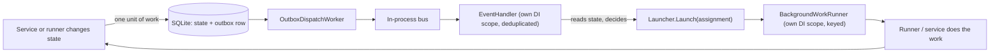
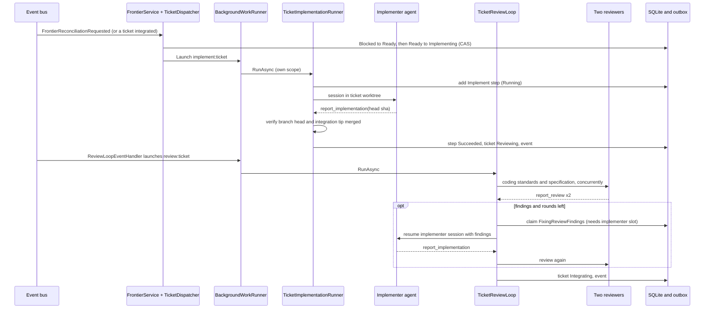
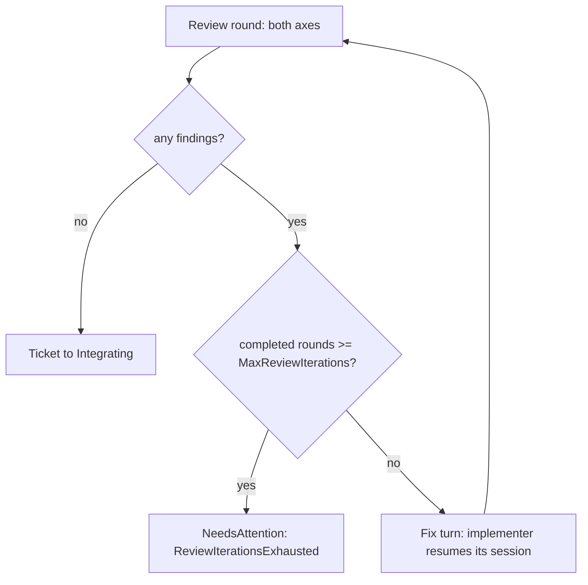
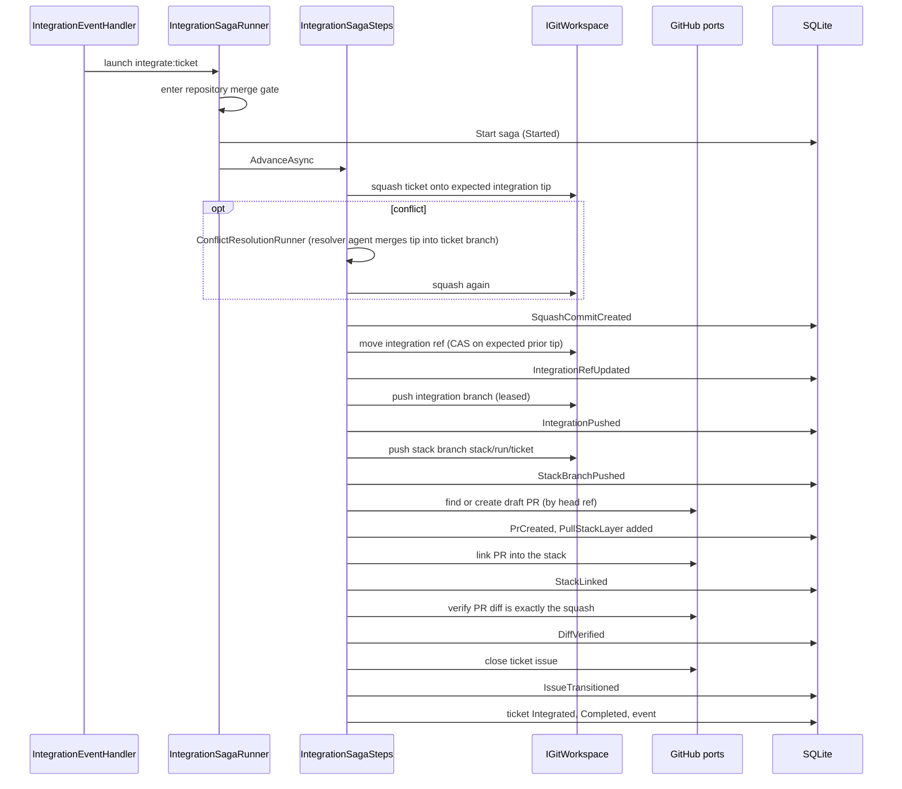
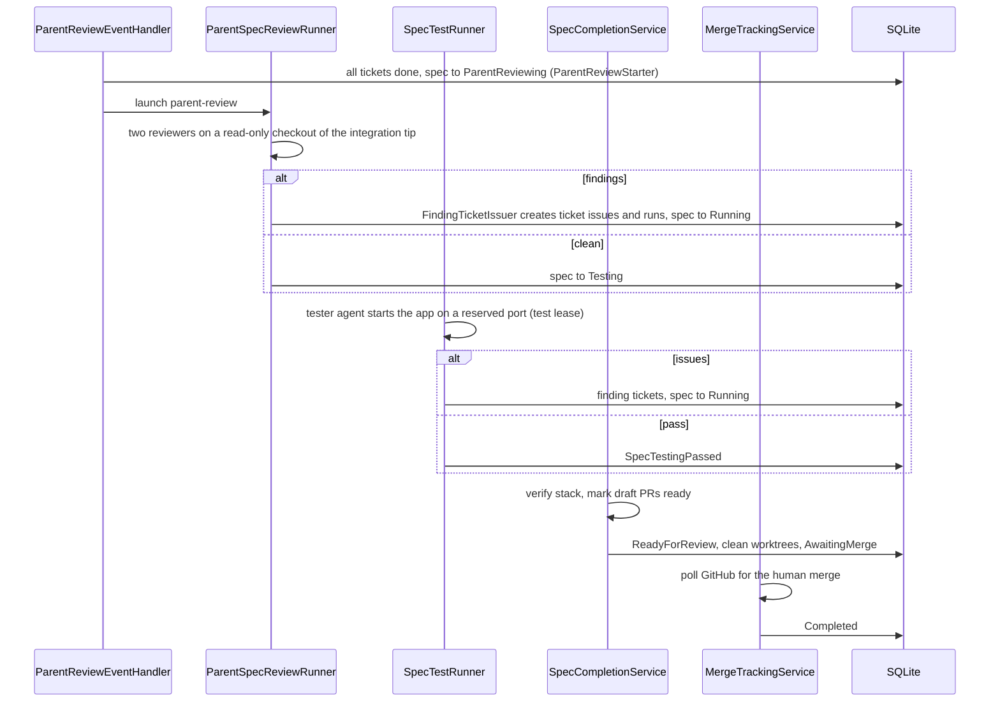
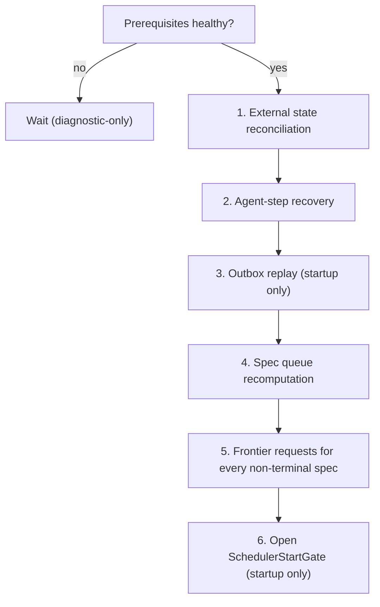

# Orchestration

How the coordinator works: events, handlers, launchers, runners, the integration saga, review loops, completion, recovery, locking and idempotency.

There is **no single workflow loop**. Core has small event handlers that react to status events and launch background work. Web hosts the workers that deliver events, run launches and recover state. State always lives in the database; events are only a trigger.

## The pattern

1. A runner changes an aggregate and calls `IOutbox.Append(event)`. `IUnitOfWork.SaveChangesAsync` writes both in one transaction (compare-and-swap on versions).
2. `OutboxDispatchWorker` (`Web/Background/Workers.cs`) reads pending rows, publishes them on <xref:WebDevLoop.Core.Events.IRunEventBus> and marks them dispatched. Delivery is at least once.
3. `WorkflowEventSubscriptions` subscribes every handler at host start, before startup recovery replays the outbox. Each delivery runs in a new DI scope and is deduplicated per handler by message id (<xref:WebDevLoop.Core.Events.DeduplicatingEventHandler>, last 1024 ids).
4. A handler re-reads persisted state and, if there is work, calls a launcher interface (`IImplementationLauncher`, ...). The implementation, `BackgroundWorkflowLaunchers`, hands it to `BackgroundWorkRunner` with a key such as `implement:<ticket>`.
5. `BackgroundWorkRunner` runs the work in a fresh DI scope. A second launch with a running key is coalesced: it runs once after the first finishes (latest wins). Shutdown cancels and awaits all work.

Handlers and runners are written so that a duplicate, late or missing event is harmless. If a launch is lost, the periodic `FrontierReconciliationRequested` event makes handlers look again.

## Events

All derive from <xref:WebDevLoop.Core.Events.WorkflowEvent>.

| Event | Raised by | Handled by |
| --- | --- | --- |
| `SpecRunQueued` | `SpecQueueService` | `SpecQueueEventHandler` |
| <xref:WebDevLoop.Core.Events.SpecRunStatusChanged> | every spec transition | queue, preparation, frontier, parent review, testing, completion, attention handlers |
| <xref:WebDevLoop.Core.Events.TicketRunStatusChanged> | every ticket transition | frontier, review loop, integration, parent review, attention handlers |
| <xref:WebDevLoop.Core.Events.StepRunStatusChanged> | step start and finish | run event log, live UI |
| <xref:WebDevLoop.Core.Events.SagaCheckpointAdvanced> | integration saga | run event log, live UI |
| <xref:WebDevLoop.Core.Events.FrontierReconciliationRequested> | preparation, ticket graph reconciliation, every recovery cycle | preparation, frontier, review loop, integration, attention handlers |
| `SpecTestingPassed` | `SpecTestRunner` | `CompletionEventHandler` |
| `SpecCompletionReported`, `SpecWorktreesCleanedUp`, `SpecStackAwaitingTrunk`, `RunControlApplied` | completion, merge tracking, control | live UI only |

`EfOutbox.Append` also writes progress events to the run event log (`WorkflowRunEvents.TryCreate`) in the same transaction.

## Handlers and what they launch

| Handler | Trigger | Action |
| --- | --- | --- |
| `SpecQueueEventHandler` | spec queued; spec left active slot or reached a state dependents wait for | `SpecQueueScheduler.ScheduleRepositoryAsync` |
| `PreparationEventHandler` | spec enters `Preparing`; idle `Preparing` spec on reconciliation | launch `SpecPreparationService` |
| `FrontierEventHandler` | spec enters `Running`; reconciliation; ticket integrated, skipped or retried; implementer slot freed | `FrontierService.ReconcileAsync` or `ReconcileAllRunningAsync` |
| `ReviewLoopEventHandler` | ticket enters `Reviewing` from `Implementing` or `NeedsAttention`; slot freed (fix waiting); reconciliation of idle `Reviewing` tickets | launch `TicketReviewLoop` |
| `IntegrationEventHandler` | ticket enters `Integrating`; another ticket integrated; reconciliation | launch `IntegrationSagaRunner` |
| `ParentReviewEventHandler` | ticket integrated, skipped or aborted; spec enters `Running`; spec enters `ParentReviewing` | `ParentReviewStarter`, launch `ParentSpecReviewRunner` |
| `TestingEventHandler` | spec enters `Testing` | launch `SpecTestRunner` |
| `CompletionEventHandler` | `SpecTestingPassed`; spec `Aborted` | launch `SpecCompletionService` |
| `AttentionTriageEventHandler` | spec or ticket enters `NeedsAttention`; reconciliation | launch `AttentionTriageService` |

Implementation tickets are launched by `TicketDispatcher` (called from `FrontierService`), not by a handler.

## Workflow steps in the code

Comments in Core refer to numbered workflow steps.

| Step | What | Class |
| --- | --- | --- |
| 1 | Snapshot sub-issues and edges | `SpecSnapshotter` |
| 2 | Explore (optional) | `SpecExplorer` |
| 3 | Choose integration base, create integration branch | `SpecPreparationService` |
| 4 | Implement one ticket | `TicketImplementationRunner` |
| 5 | Review (two axes) | `TicketReviewLoop`, `TwoAxisReviewRunner` |
| 6 | Fix review findings | `ReviewFixRunner` |
| 7 | Integrate (squash, push, PR layer) | `IntegrationSagaRunner`, `IntegrationSagaSteps` |
| 8 | Recompute frontier | `FrontierService`, `TicketFrontier` |
| 9 | Parent review | `ParentReviewStarter`, `ParentSpecReviewRunner` |
| 10 | Finding tickets from review | `FindingTicketIssuer` |
| 11 | Test | `SpecTestRunner`, `TesterAttemptRunner` |
| 12 | Finding tickets from tester | `FindingTicketIssuer` |
| 13 | Verify stack, mark ready | `SpecCompletionService`, `StackVerifier` |
| 14 | Track the human merge | `MergeTrackingService` |

## Happy path of one ticket

From "ready" to "ready to integrate".

Notes:

- A failed agent turn is retried in a **fresh session** up to `MaxRetries`. The ticket keeps its slot while it stays `Implementing`.
- The implementer's `head_commit_sha` is only a claim. `TicketBranchVerifier` checks the worktree, the branch tip and that the integration tip is merged in.
- Review rounds are persisted with the review steps, so the loop resumes where it stopped. The fix turn must wait for a free implementer slot (`AwaitingImplementerCapacity`); the handler relaunches the loop when a slot frees.
- The loop ends in `Integrating` (both axes clean), in `NeedsAttention` after `MaxReviewIterations` rounds (`ReviewIterationsExhausted`), or on a failed review or fix.

### Review and fix cycle

## Integration saga

The saga (<xref:WebDevLoop.Core.Domain.IntegrationSaga>, run by <xref:WebDevLoop.Core.Orchestration.Integration.IntegrationSagaRunner> and `IntegrationSagaSteps`) turns a reviewed ticket branch into one integration commit and one PR layer. Every external effect is followed by a persisted checkpoint, and every step can be replayed.

Rules:

- **Serialized per repository.** `RepositoryIntegrationGate` is a process-wide lock, so every squash builds on the previous one and PR layers form a linear chain in integration order. Completion and abort use the same gate.
- **Earlier layers first.** Before starting, the runner finishes any earlier saga of the same spec that moved the integration ref but has not published its layer. Otherwise the ticket waits (`WaitingForEarlierLayer`) and is launched again when that layer is done.
- **Replay-safe.** Compare-and-swap ref updates against the expected prior tip, leased pushes, PR lookup by exact head ref (and a marker in the PR body), stack membership lookup, issue state check. A checkpoint never moves backwards.
- **Retarget.** If the integration tip moved before `IntegrationRefUpdated`, the saga restarts from `Started` on the new tip (`RetargetTo`).
- **Stops when the world changes.** Before every step the committed ticket and spec status are read again; an aborted spec gets no further pushes or PRs.
- **Faults.** An unexpected error is recorded on the saga and the ticket stays `Integrating`; reconciliation resumes it. More than `MaxRetries` faults in a row without progress park the ticket (`IntegrationTemporaryFailure` or `IntegrationFailed`).
- **Needs attention** (examples): moved or rejected integration branch, existing stack branch, PR not open, failed diff verification, no changes in the ticket (`TicketHasNoChanges`), unresolved conflict.
- **PR base.** `PullRequestBasePlanner`: the layer below in the same spec; for the first layer of a stack-on-top spec the blocking spec's top stack branch; otherwise trunk.
- The first layer on trunk is an ordinary PR; GitHub needs two PRs to form a stack, so the second layer creates the stack.

## Parent review, tester and completion

- **Starter.** `ParentReviewStarter` moves a `Running` spec to `ParentReviewing` once every ticket is terminal. A spec with no tickets never starts (`NoTickets`).
- **Parent review.** `TwoAxisReviewRunner` is reused with scope `ParentSpec`, diffed against the integration base. Findings go through `FindingTicketIssuer`: sub-issues of the spec plus ticket runs, with blocking edges from the findings' `blocked_by`. The issuer records a `FindingIssuance` before creating the issue and finds an existing issue by fingerprint after a crash, so no ticket is created twice.
- **Tester.** `SpecTestRunner` and `TesterAttemptRunner`. The app reserves a port from `TestPortRange` and a `TestLease`, checks out the integration tip into a run-scoped test workspace, runs the tester, watches the port, and always kills leftover processes and releases the lease. The verdict is stored with the step, so a restart does not test the same tip twice. `pass`, `issues_found`, `blocked`.
- **Completion.** `SpecCompletionService` acts on persisted state only. With a passing verdict for the current cycle and a matching tip it verifies the stack (`StackVerifier`), marks every draft PR ready, moves to `ReadyForReview`, cleans implementer worktrees, reports the integration branch and moves to `AwaitingMerge`. Without PR layers it pushes the integration branch, closes the tickets, comments once on the spec (hidden marker) and completes. On `Aborted` it only cleans up.
- **Merge tracking.** `MergeTrackingWorker` calls `MergeTrackingService.TrackAllAsync` every minute by default. It also resumes interrupted completions. Outcomes: merged completes the spec; closed unmerged parks it; all merged but trunk lacks the top layer waits for `TrunkContainmentTimeout`, then parks it.

## Recovery and reconciliation

<xref:WebDevLoop.Core.Orchestration.Recovery.Startup.RecoveryCoordinator> is the only recovery entry point. `RecoveryWorker` waits while the app is diagnostic-only, runs startup recovery once, then a periodic cycle (every 2 minutes by default).

| Stage | What it does |
| --- | --- |
| External state (`ExternalStateReconciler`) | Fetch each clone once, then per spec: integration branch (`IntegrationBranchReconciler`), ticket graph (`TicketGraphReconciler`), finding issuances (`FindingIssuanceReconciler`), worktrees (`WorktreeReconciler`), sagas (`IntegrationSagaReconciler`), stack bases (`StackBaseReconciler`); then merge tracking. |
| Agent steps (`AgentStepRecoveryService`) | Evict idle Copilot runtimes and refresh expiring tokens; kill orphaned tester processes and release leases (`OrphanedTestLeaseStopper`); finish steps no live session owns (`InterruptedStepFinisher`), parking owners interrupted more than `MaxRetries` times in a row; relaunch stalled work (`StalledWorkRelauncher`). |
| Outbox replay | Dispatch events a previous process persisted but never delivered. |
| Queue recomputation | `SpecQueueScheduler` for every enabled repository. |
| Frontier requests | `FrontierReconciliationSignal` appends `FrontierReconciliationRequested` for every non-terminal spec, which wakes the handlers above. |
| Scheduler start | Opens `SchedulerStartGate`; the other hosted workers wait for it. |

A stage that throws is reported and the next stages still run: every stage is idempotent and the next cycle retries.

Interrupted agent work resumes by session id. If the session is gone, the runner starts a fresh session at a safe boundary (the integration tip for an implementer, the saga checkpoint for integration).

### Hosted services

| Service | Job | Default interval |
| --- | --- | --- |
| `BackgroundWorkRunner` | Keyed background work, graceful stop (registered first, stops last) | n/a |
| `WorkflowEventSubscriptions` | Subscribe handlers to the bus | n/a |
| `RecoveryWorker` | Startup recovery, then reconciliation | 2 min (5 s while waiting for prerequisites) |
| `OutboxDispatchWorker` | Dispatch pending events; loops without waiting while there are more | 1 s when idle |
| `MergeTrackingWorker` | Poll ready stacks | 1 min |
| `CopilotRuntimeMaintenanceWorker` | Evict idle runtimes, refresh expiring tokens | 1 min |
| `OutboxRetentionWorker` | Delete dispatched events older than the retention | every 6 h, keeps 7 days |
| `AgentLogShutdownFlush` | Flush buffered agent logs on shutdown | n/a |

Intervals are `WebDevLoop:Workflow:*` options (`WorkflowWorkerOptions`). Workers derived from `GatedPeriodicWorker` start only after the gate opens.

## Concurrency, locking and idempotency

| Mechanism | Scope | Protects |
| --- | --- | --- |
| Compare-and-swap `Version` | database row | any aggregate update; lost race gives `ConcurrencyConflict` |
| Unique and filtered indexes | database | active-spec slot, one active implement/fix step per ticket, one incomplete saga per ticket, one finding ticket per fingerprint, one active test lease per spec and per port |
| `ImplementerCapacityGate` | process | "count occupied slots, then claim" (dispatcher and fix runner) |
| `RepositoryIntegrationGate` | process, per repository | integration sagas, completion publishing, abort of integrating work |
| `BackgroundWorkRunner` keys | process | the same phase for the same ticket or spec never runs twice at once |
| `DeduplicatingEventHandler` | process, per handler | at-least-once delivery |
| Deterministic step ids | database primary key | duplicate reviewer or tester runners collide on the id; the loser does not claim |
| `RepositoryLocks` in `Infrastructure/Git` | process, per clone | read-compare-write of refs |
| Checkpointed saga, `FindingIssuance`, `ExternalIdempotencyKey`, hidden markers in PR bodies and comments | GitHub and Git | no duplicate commits, PRs, issues or comments after a crash |
| Settings pinned at start | process | workspace root and Copilot home cannot change under running work |

Rules of thumb for contributors:

- Change state and append the event in the **same** unit of work. Do not publish events directly.
- A handler must re-read state and be safe to run twice. Prefer "if the state is X, launch" over "launch because the event said so".
- A runner must handle `ConcurrencyConflict` by stopping or reloading, never by overwriting. Return a result enum; do not throw for expected races.
- Park work with `MarkNeedsAttention` and an `AttentionReasons` factory, never a free-form string.
- Never leave a step `Running` after an error: finish it (`Failed`, `Cancelled`, ...) in the same flow.

## Where to look in the code

| Topic | Path |
| --- | --- |
| Handlers and launchers | `src/WebDevLoop.Core/Orchestration/*/` (`*EventHandler.cs`, `I*Launcher.cs`) |
| Launch implementation, workers | `src/WebDevLoop.Web/Background/` |
| Handler wiring and lifetimes | `src/WebDevLoop.Web/DependencyInjection/OrchestrationServiceCollectionExtensions.cs`, `WebDevLoopServiceCollectionExtensions.cs` |
| Outbox and bus | `src/WebDevLoop.Core/Events/`, `src/WebDevLoop.Infrastructure/Events/` |
| Saga | `src/WebDevLoop.Core/Orchestration/Integration/` |
| Recovery | `src/WebDevLoop.Core/Orchestration/Recovery/` |
| Completion, merge tracking | `src/WebDevLoop.Core/Orchestration/Completion/` |
| End-to-end tests | `tests/WebDevLoop.Web.Tests/Workflow/` |
