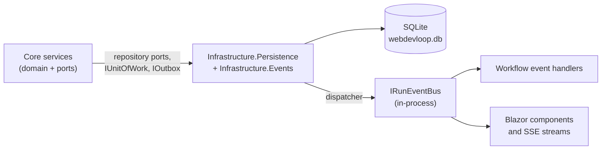
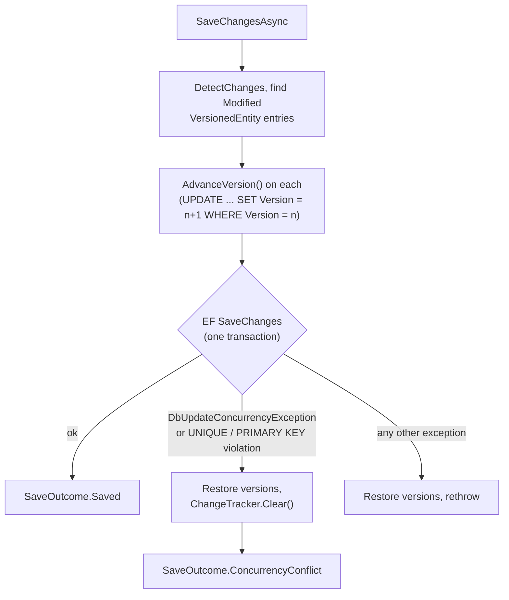
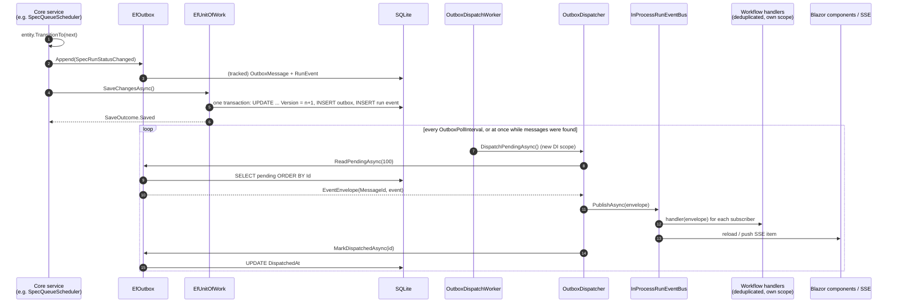
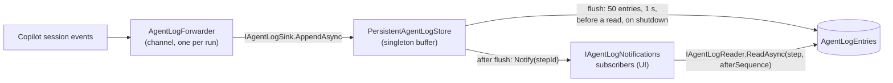

# Persistence and events

How state is stored in SQLite with EF Core, how changes are saved safely, and how the transactional outbox turns every state change into events that drive the workflow and the live UI.

Read this page when you add a column, a table, a migration, an event, or a subscriber.

## Overview

| Topic | Short answer |
| --- | --- |
| Database | One SQLite file (`webdevloop.db`) in the data directory, WAL mode. |
| Access | EF Core 11 in `WebDevLoop.Infrastructure`. `Core` never sees EF: it uses repository ports and <xref:WebDevLoop.Core.Ports.IUnitOfWork>. |
| Concurrency | Optimistic. Every mutable aggregate has a `Version`; saves are compare-and-swap. Partial unique indexes make claims race-safe. |
| Events | Transactional outbox. An event is saved in the same transaction as the state change. A worker publishes it to an in-process bus. |
| Delivery | At-least-once. Subscribers deduplicate by outbox message id. |
| Audit and logs | `RunEvents` (run timeline) and `AgentLogEntries` (agent output) are separate tables. |

## The DbContext and its model

<xref:WebDevLoop.Infrastructure.Persistence.WebDevLoopDbContext> (`src/WebDevLoop.Infrastructure/Persistence/WebDevLoopDbContext.cs`) has one `DbSet` per table. `OnModelCreating` loads every `IEntityTypeConfiguration<T>` from the assembly (`Persistence/Configurations/`). It also marks `Version` as a concurrency token on every <xref:WebDevLoop.Core.Domain.VersionedEntity>.

The domain classes are the EF entities. There are no separate persistence models. Domain classes use private setters and factory methods, which EF can populate.

### Conventions (`Persistence/ValueConverters.cs`)

| Type | Stored as |
| --- | --- |
| `RunId`, `TicketRunId`, `StepRunId`, `BranchName`, `CommitSha`, `FindingFingerprint` | `TEXT` (the `Value`) |
| `PullRequestNumber` | `INTEGER` |
| `DateTimeOffset` | `INTEGER`: UTC ticks (SQLite can order and compare them) |
| Any enum | `TEXT` (the enum name) |
| `AttentionReason` | `TEXT` JSON; unreadable JSON reads back as "no guidance" |
| `IssueRef`, `TestPortRange` | Complex properties: columns on the owning table (`IssueRefColumns`) |
| `SettingsProfile` role overrides | One `RolesJson` column |

Other details:

- `Repositories.Owner` and `Name` use `NOCASE` collation (GitHub names are case-insensitive).
- `SettingsProfiles.ScopeKey` is a stored computed column `COALESCE(RepositoryId, 0)`. A unique index on it gives exactly one global profile and one override per repository.
- Foreign keys use `Restrict` (no cascade deletes), except settings overrides, which cascade with their repository.

### Tables

```mermaid
erDiagram
    Repositories ||--o{ SpecRuns : "has"
    Repositories |o--o{ SettingsProfiles : "overrides (RepositoryId null = global)"
    SpecRuns ||--o{ TicketRuns : "snapshots"
    SpecRuns ||--o{ StepRuns : "has"
    TicketRuns |o--o{ StepRuns : "has (TicketRunId may be null)"
    TicketRuns ||--o{ IntegrationSagas : "integrated by"
    SpecRuns ||--o{ PullStackLayers : "published as"
    TicketRuns ||--o{ PullStackLayers : "one layer each"
    SpecRuns ||--o{ FindingIssuances : "raises"
    StepRuns ||--o{ FindingIssuances : "found by"
    SpecRuns ||--o{ TestLeases : "leases a port"
    SpecRuns ||--o{ RunEvents : "timeline"
    SpecRuns ||--o{ SpecDependencies : "blocked spec"
    SpecRuns ||--o{ TicketDependencies : "scope"
    TicketRuns ||--o{ TicketDependencies : "blocked/blocking"

    Repositories {
        int Id PK
        string Owner "NOCASE"
        string Name "NOCASE"
        string CloneUrl
        string LocalPath
        int Version
    }
    SpecRuns {
        string Id PK
        int RepositoryId FK
        string Status
        int QueuePosition
        int MaxActiveSpecsSlot "unique per repo while active"
        string IntegrationBranch
        int Version
    }
    TicketRuns {
        string Id PK
        string SpecRunId FK
        string Status
        string BranchName
        string WorktreePath
        int Version
    }
    StepRuns {
        string Id PK
        string SpecRunId FK
        string TicketRunId FK
        string Kind
        string AgentRole
        string Status
        string CopilotSessionId
        int Version
    }
    IntegrationSagas {
        long Id PK
        string TicketRunId FK
        string Checkpoint
        string ExternalIdempotencyKey
        int Version
    }
    PullStackLayers {
        long Id PK
        string SpecRunId FK
        string TicketRunId FK
        int PullRequestNumber
        int Position "unique per spec"
    }
    FindingIssuances {
        long Id PK
        string SpecRunId FK
        string SourceStepRunId FK
        string Fingerprint "unique per spec"
    }
    TestLeases {
        long Id PK
        string SpecRunId FK
        int Port
        long ReleasedAt "null while active"
        int Version
    }
    RunEvents {
        long Id PK
        string SpecRunId FK
        string TicketRunId FK
        string Type
        string PayloadJson
    }
    OutboxMessages {
        long Id PK
        string Type
        string PayloadJson
        long DispatchedAt
        long DeadLetteredAt
        int Attempts
    }
    AgentLogEntries {
        string StepRunId PK
        int Sequence PK
        string Kind
        string Text
    }
    SettingsProfiles {
        int Id PK
        int RepositoryId FK "null = global"
        string RolesJson
        int Version
    }
    SpecDependencies {
        long Id PK
        string BlockedSpecRunId FK
        string BlockingSpecRunId FK
    }
    TicketDependencies {
        long Id PK
        string BlockedTicketRunId FK
        string BlockingTicketRunId FK
    }
```

Notes on the diagram:

- Only key and notable columns are shown. The full model is in `Persistence/Migrations/WebDevLoopDbContextModelSnapshot.cs`.
- `OutboxMessages` and `AgentLogEntries` have no foreign keys on purpose. A log write or an event write must never fail because of a missing parent.
- `SpecDependencies.BlockingSpecRunId` can be null: then the blocker is an external issue (`ExternalBlockingIssue` columns).
- The `IntegrationSagas.ExternalIdempotencyKey` is `<specRunId>:<ticketRunId>`.

### Partial and unique indexes: claims without locks

Several rules are enforced by the database, not by code. They are built from the domain status rules in `Persistence/FilteredIndexSql.cs`, so the SQL cannot drift from the state machine.

| Index | Rule it enforces |
| --- | --- |
| `UX_SpecRuns_ActiveSlotPerRepository` | Each active spec of a repository holds its own slot (`MaxActiveSpecsSlot`). With the default limit of 1, a second active spec cannot be claimed. |
| `UX_StepRuns_ActiveImplementOrFixPerTicket` | At most one active implement or fix step per ticket. |
| `UX_StepRuns_ActiveAppOwnedKindPerRun` | At most one active app-owned step of a kind (no agent role) per spec run. |
| `UX_IntegrationSagas_IncompletePerTicket` | One incomplete integration saga per ticket. |
| `UX_PullStackLayers_SpecRun_Position` | One layer per stack position. |
| `UX_FindingIssuances_SpecRun_Fingerprint` | A finding fingerprint is issued once per spec. |
| `UX_TestLeases_ActivePerRun`, `UX_TestLeases_ActivePort` | One unreleased lease per run and per port. |
| `UX_TicketDependencies_Blocked_Blocking`, `UX_SpecDependencies_Blocked_Blocking` | No duplicate edges. |
| `UX_Repositories_Owner_Name` | One registration per GitHub repository. |
| `IX_OutboxMessages_Pending` | Fast "next pending message" lookup (filter: not dispatched and not dead-lettered). |

If you change a status set (for example, which spec statuses count as active), the index changes. Add a migration.

## Optimistic concurrency and the unit of work

Several workers and event handlers run at once, each in its own DI scope with its own DbContext. They never lock rows. Instead:

1. Every mutable aggregate derives from <xref:WebDevLoop.Core.Domain.VersionedEntity> (`int Version`).
2. Versioned entities: `RepositoryRecord`, `SpecRun`, `TicketRun`, `StepRun`, `IntegrationSaga`, `TestLease`, `SettingsProfile`.
3. Append-only or insert-only rows (`RunEvent`, `OutboxMessage` (mutated only for delivery state), `PullStackLayer`, `FindingIssuance`, dependencies, `AgentLogRecord`) have no `Version`.

<xref:WebDevLoop.Infrastructure.Persistence.EfUnitOfWork> (`Persistence/EfUnitOfWork.cs`) implements `SaveChangesAsync`:

Rules for contributors:

- **Always check the result.** `SaveOutcome.ConcurrencyConflict` means another worker won. Stop, reload, and re-evaluate. Do not retry blindly with stale entities (the tracker is cleared).
- A lost claim (slot, active step, fingerprint, test lease) is reported the same way, because the unique index rejects the insert.
- Do the state change and `outbox.Append(...)` before one `SaveChangesAsync`. Then both succeed or both fail.
- Call `SaveChangesAsync` on the port (`IUnitOfWork`). Never use `WebDevLoopDbContext` from `Core`.

`Persistence/PersistenceServiceCollectionExtensions.cs` (`AddPersistence`) registers the context and every repository as **scoped**: one context, one unit of work per scope. Web creates a scope per background launch, per event delivery, per worker pass, and for UI components and API requests.

## Migrations and database startup

| Item | Where / how |
| --- | --- |
| Migrations | `src/WebDevLoop.Infrastructure/Persistence/Migrations/` (initial: `InitialCreate`, then one per change, plus the model snapshot) |
| Design-time factory | `WebDevLoopDbContextFactory` (used by `dotnet ef` only; connection string is irrelevant) |
| Create one | `dotnet ef migrations add <Name> --project src/WebDevLoop.Infrastructure --output-dir Persistence/Migrations` (needs the `dotnet-ef` tool) |
| Applied at startup | `AppInitializer` calls `PersistenceDatabase.MigrateAsync` before the host serves requests |
| WAL | `MigrateAsync` also runs `PRAGMA journal_mode=WAL` so readers do not block the writer; the setting persists in the file |
| Guard test | `tests/WebDevLoop.Infrastructure.Tests/Persistence/MigrationAndRegistrationTests.cs` fails if the model changed without a migration |

If the migration fails, the app does **not** crash. It logs the error, uses the embedded default settings, and runs in diagnostic-only mode. The *SQLite database* prerequisite (`DatabaseCheck`) also fails when migrations are pending. See [Startup and prerequisites](startup-and-prerequisites.md).

Checklist for a schema change:

1. Change the domain class and its `IEntityTypeConfiguration`.
2. Add a migration and review the generated SQL (SQLite cannot alter some things in place, so EF may rebuild a table).
3. If you add or change a status that affects "active" sets, check `FilteredIndexSql`.
4. Run the persistence tests (`tests/WebDevLoop.Infrastructure.Tests/Persistence`).

## The transactional outbox

Problem: after a state change, other workers must react (start the next step, schedule the queue, update the UI). If the process crashes between "save state" and "notify", work would stall.

Solution: the event is saved **in the same transaction** as the state change. A separate worker publishes saved events and marks them dispatched.

| Piece | Type | File |
| --- | --- | --- |
| Port | <xref:WebDevLoop.Core.Events.IOutbox> (`Append`, `ReadPendingAsync`, `MarkDispatchedAsync`, `RecordFailureAsync`) | `Core/Events/IOutbox.cs` |
| Event base | <xref:WebDevLoop.Core.Events.WorkflowEvent> (a record with `OccurredAt`) | `Core/Events/` and `Core/Orchestration/**` |
| Row | <xref:WebDevLoop.Core.Domain.OutboxMessage> (`Type`, `PayloadJson`, `CreatedAt`, `DispatchedAt`, `DeadLetteredAt`, `Attempts`, `LastError`) | `Core/Domain/OutboxMessage.cs` |
| Adapter | <xref:WebDevLoop.Infrastructure.Events.EfOutbox> | `Infrastructure/Events/EfOutbox.cs` |
| Serializer | `WorkflowEventSerializer`: (type name, JSON) in both directions | `Infrastructure/Events/WorkflowEventSerializer.cs` |
| Dispatcher | <xref:WebDevLoop.Infrastructure.Events.OutboxDispatcher> | `Infrastructure/Events/OutboxDispatcher.cs` |
| Bus | <xref:WebDevLoop.Infrastructure.Events.InProcessRunEventBus> (singleton) | `Infrastructure/Events/InProcessRunEventBus.cs` |
| Worker | <xref:WebDevLoop.Web.Background.OutboxDispatchWorker> | `Web/Background/Workers.cs` |
| Subscriptions | <xref:WebDevLoop.Web.Background.WorkflowEventSubscriptions> | `Web/Background/WorkflowEventSubscriptions.cs` |

How it behaves:

- `EfOutbox.Append` only adds rows to the scope's DbContext. Nothing is written until `IUnitOfWork.SaveChangesAsync`.
- For progress events (<xref:WebDevLoop.Core.Events.WorkflowRunEvents>) `Append` also adds a `RunEvent` row, in the same save.
- The serializer finds the event class by **type name** among all concrete `WorkflowEvent` types in the Core assembly. Type names must be unique. Enums are stored as strings; `RunId`, `TicketRunId` and `StepRunId` as strings.
- `ReadPendingAsync` returns the oldest pending messages (batch size 100, `OutboxDispatcherOptions.BatchSize`). Unreadable rows (unknown type, bad JSON) are **dead-lettered** at once, so they never block valid ones.
- A publish failure calls `RecordFailureAsync`. The row stays pending. After `EfOutbox.MaxDeliveryAttempts` (10) failures it is dead-lettered.
- A crash between publish and "mark dispatched" redelivers the message. That is why subscribers must be idempotent.

### Sequence: state change to subscribers

Good to know:

- The dispatcher is single-threaded per pass and keeps order by outbox id. Handlers of one envelope run one after another (each handler is awaited by the bus).
- A failing subscriber is logged and does **not** stop the others. The message is still marked dispatched. Its work is recovered by periodic frontier/queue reconciliation, not by redelivery.
- Startup recovery calls `OutboxDispatcher.ReplayPendingAsync` before the schedulers start, to replay events a previous process saved but never dispatched.
- `Workflow:Enabled=false` registers no dispatch worker, so nothing is published and the UI does not live-update.

### Event handlers (subscribers)

`WorkflowEventSubscriptions` (a hosted service) subscribes these handlers when the host starts, before recovery replays the outbox. Each delivery runs in a new DI scope and is wrapped by <xref:WebDevLoop.Core.Events.DeduplicatingEventHandler> (remembers the last 1024 message ids per handler; releases the id if the handler throws).

| Handler (Core namespace) | Role |
| --- | --- |
| `SpecQueueEventHandler` (SpecQueue) | Runs the repository queue when a spec is queued or leaves its slot |
| `PreparationEventHandler` (Preparation) | Prepares a spec the queue claimed (clone, snapshot, exploration) |
| `FrontierEventHandler` (Frontier) | Recomputes the ticket frontier (which tickets may start) |
| `ReviewLoopEventHandler` (ReviewLoop) | Starts review loops for tickets entering `Reviewing` |
| `IntegrationEventHandler` (Integration) | Starts integration sagas for tickets entering `Integrating` |
| `ParentReviewEventHandler` (Completion/ParentReview) | Starts the parent review when all tickets are done |
| `TestingEventHandler` (Completion/Testing) | Starts the tester |
| `CompletionEventHandler` (Completion/ReadyAndMerge) | Starts completion after a passed test (or abort) |
| `AttentionTriageEventHandler` (Attention) | Starts the resolution pipeline when something enters `NeedsAttention` |

Each handler decides by pattern matching on the event type. See [Orchestration](orchestration.md) for what each one does and [Run lifecycle](run-lifecycle.md) for the order.

### Safety nets

Events can be lost between processes (a subscriber failed; the process died). Two mechanisms keep work moving:

- <xref:WebDevLoop.Core.Orchestration.Recovery.Startup.FrontierReconciliationSignal> appends a `FrontierReconciliationRequested` event for every non-terminal spec on each recovery cycle (startup and periodic, default every 2 minutes).
- Recovery also recomputes every repository queue and relaunches stalled work.

### Adding a new event

1. Add a `sealed record MyEvent(..., DateTimeOffset OccurredAt) : WorkflowEvent(OccurredAt)` in `Core` (`Events/` or the owning orchestration folder). The type name must be unique in the Core assembly.
2. Raise it with `outbox.Append(new MyEvent(...))` **before** the `SaveChangesAsync` that persists the state change.
3. Handle it: add a `case` to an existing handler, or create a handler and register it in `WorkflowEventSubscriptions` and in the Orchestration DI extension.
4. For the UI: add a `case` to `LiveEventViewMapper` (`Core/Queries/LiveEventViewMapper.cs`). Unmapped events still reach the UI, but with no run id, so run-scoped pages ignore them.
5. For the run timeline: add a `case` to `WorkflowRunEvents.TryCreate`, or add a `RunEvent` directly in a journal class.
6. Make the handler idempotent (it can be called twice). Add tests next to the existing ones in `tests/WebDevLoop.Infrastructure.Tests/Events` and the Core tests.

## Run events (audit timeline)

`RunEvents` is the audit log shown on the run page and in `GET /api/spec-runs/{id}/events`.

- Rows have `SpecRunId`, optional `TicketRunId`, a `Type` string, a `PayloadJson` string and `OccurredAt`.
- Two sources:
  - Progress events (`SpecRunStatusChanged`, `TicketRunStatusChanged`, `StepRunStatusChanged`, `SagaCheckpointAdvanced`) are mapped by `WorkflowRunEvents` inside `EfOutbox.Append`.
  - Journal classes add rows directly: run controls (`RunControlJournal`), attention and troubleshooter journals, recovery (`InterruptedStepFinisher`), external-state reconcilers, worktree remediation.
- They are read through `IRunEventRepository` and `IRunQueries` (`Infrastructure/Queries/EfRunQueries.cs`).
- They are never purged.

## Live UI updates

The Web process and the dispatcher share one `IRunEventBus` singleton, so the UI subscribes directly.

| Consumer | How it reacts |
| --- | --- |
| `LiveComponentBase` (`Web/Components/Dashboard`) | Subscribes in `OnInitializedAsync`; for events where `ReactsTo(view)` is true it reloads its data. Reloads are coalesced: events during a load cause exactly one more load. |
| `RunEventSubscription` / `LiveDetailPageBase` (`Web/Components/Runs`) | Same idea for run and ticket detail pages; ignores events of other spec runs. |
| `EventStreamEndpoints` (`Web/Api`) | `GET /api/events/stream` and `GET /api/spec-runs/{id}/events/stream` (server-sent events). First message is `ready`. Each client has a bounded buffer of 256 items; the oldest are dropped when it is full, so clients must reload on each message rather than trust a delta. |
| `AgentLogTail` (`Web/Components/Steps`) | Subscribes to `IAgentLogNotifications` for one step and reads new log lines. |

`LiveEventView` (`Core/Queries/LiveEventView.cs`) is the small, UI-friendly projection of an envelope (message id, type, run/ticket/step id, status). Delay from state change to UI is at most one `OutboxPollInterval` (default 1 s) plus the reload.

## Agent log persistence

Live agent output is stored so it survives restarts and can be paged.

- <xref:WebDevLoop.Infrastructure.Queries.PersistentAgentLogStore> is one singleton that implements `IAgentLogSink` (write), `IAgentLogReader` (read) and `IAgentLogNotifications` (subscribe).
- Each entry gets a per-step `Sequence` (from 1, never reused). The primary key is `(StepRunId, Sequence)`; there is no foreign key.
- Flush triggers: batch size reached, flush interval after the first buffered entry, before every read (so a read sees everything appended before it), and on shutdown (`AgentLogShutdownFlush`, then disposal).
- Each flush also deletes the oldest entries of the touched steps beyond `MaxEntriesPerStep`.
- A failing write is swallowed on the agent side (`AgentLogForwarder`): logs are best effort and must never fail a step.
- Reads return at most `PageSize` entries; clients resume with the last sequence they got.
- Options: <xref:WebDevLoop.Infrastructure.Queries.AgentLogStoreOptions>, section `WebDevLoop:AgentLogs`. See [Startup and prerequisites](startup-and-prerequisites.md#configuration).

## Retention and purge

| Data | Rule | Done by |
| --- | --- | --- |
| Dispatched `OutboxMessages` | Deleted after `Workflow:OutboxRetention` (7 days); checked every `Workflow:OutboxPurgeInterval` (6 h) | `OutboxRetentionWorker` -> <xref:WebDevLoop.Infrastructure.Events.OutboxRetention> (`ExecuteDeleteAsync`) |
| Pending and dead-lettered `OutboxMessages` | Kept (they still need delivery or diagnosis) | - |
| `AgentLogEntries` | At most `MaxEntriesPerStep` (5000) newest per step | `PersistentAgentLogStore` on each flush |
| `RunEvents`, runs, tickets, steps | Not purged | - |

## Testing

- Use the temporary-file SQLite harness `tests/WebDevLoop.Infrastructure.Tests/Persistence/PersistenceHarness.cs`.
- Concurrency and constraints: `CompareAndSwapTests`, `UniqueConstraintTests`.
- Outbox and bus: `tests/WebDevLoop.Infrastructure.Tests/Events`.
- See [Testing and contributing](testing-and-contributing.md).

## Where to look in the code

| What | Path |
| --- | --- |
| DbContext, conventions, unit of work | `src/WebDevLoop.Infrastructure/Persistence/` |
| Table configuration and indexes | `src/WebDevLoop.Infrastructure/Persistence/Configurations/`, `FilteredIndexSql.cs` |
| Repositories (`Ef*Repository`) | `src/WebDevLoop.Infrastructure/Persistence/Repositories/` |
| Migrations | `src/WebDevLoop.Infrastructure/Persistence/Migrations/` |
| Outbox, dispatcher, bus, retention | `src/WebDevLoop.Infrastructure/Events/` |
| Event types and ports | `src/WebDevLoop.Core/Events/`, `src/WebDevLoop.Core/Orchestration/**` (events next to their owner) |
| Read models and agent log store | `src/WebDevLoop.Infrastructure/Queries/`, `src/WebDevLoop.Core/Queries/` |
| Workers and subscriptions | `src/WebDevLoop.Web/Background/` |
| Live UI | `src/WebDevLoop.Web/Components/Dashboard/LiveComponentBase.cs`, `src/WebDevLoop.Web/Api/EventStreamEndpoints.cs` |
