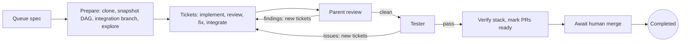
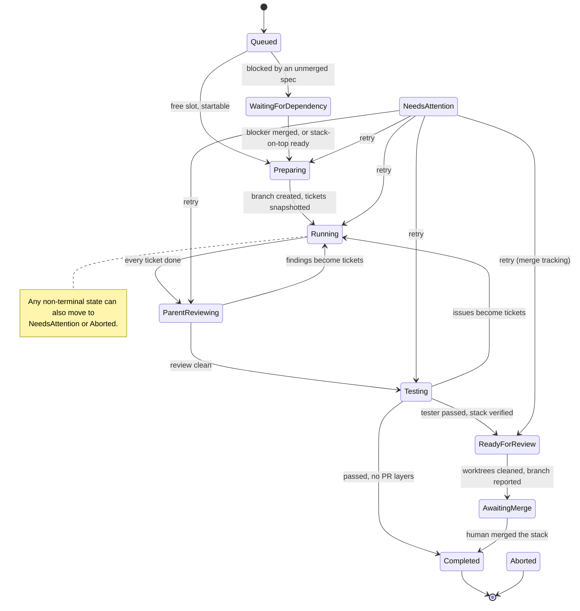
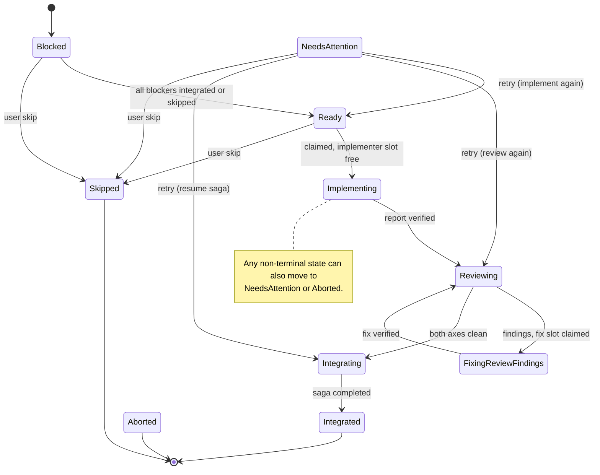
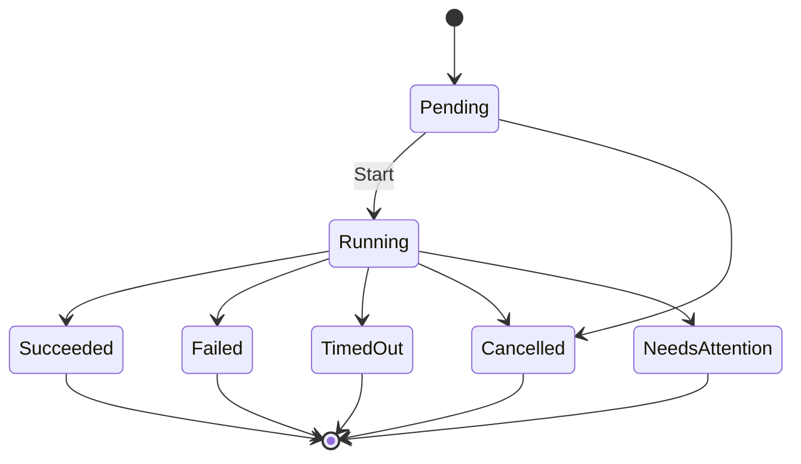
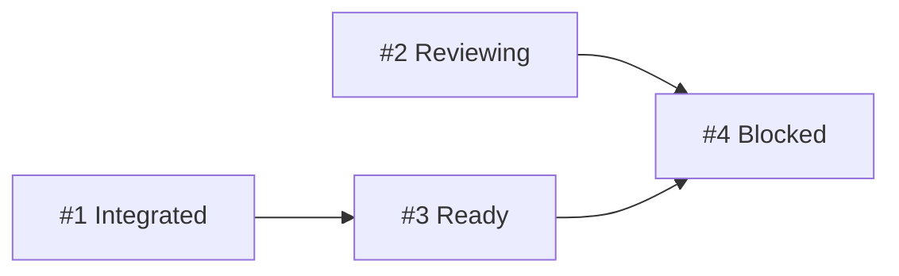
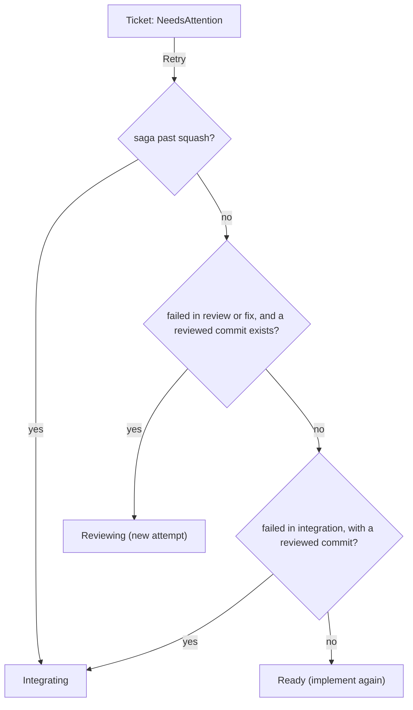
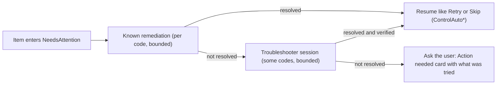

# Run lifecycle

The state machines of spec runs, ticket runs and steps, plus the ticket DAG, queueing, control actions and "needs attention".

Status rules are in code, not config: `src/WebDevLoop.Core/Domain/*StatusRules.cs`. The diagrams below are taken from those tables. See the [domain model](domain-model.md) for the entities and [orchestration](orchestration.md) for who drives each transition.

## The big picture

Finding tickets created by parent review or the tester are normal tickets. They go through the same ticket flow, then the next review cycle starts.

## Spec run states

<xref:WebDevLoop.Core.Domain.SpecRunStatus>, rules in <xref:WebDevLoop.Core.Domain.SpecRunStatusRules>.

| Status | Active slot | Meaning |
| --- | --- | --- |
| `Queued` | no | Waiting in the repository queue |
| `WaitingForDependency` | no | A spec dependency is not merged and the mode does not allow starting |
| `Preparing` | yes | Clone/fetch, snapshot, integration branch, optional exploration |
| `Running` | yes | Tickets are being worked on |
| `ParentReviewing` | yes | Two reviewers check the whole integration branch |
| `Testing` | yes | Tester agent runs the integrated app |
| `ReadyForReview` | no | Transient: PRs are marked ready, worktrees are cleaned |
| `AwaitingMerge` | no | Waiting for a human to merge the stack; polled by merge tracking |
| `Completed` | no | Terminal |
| `NeedsAttention` | no | Parked with an <xref:WebDevLoop.Core.Domain.AttentionReason> |
| `Aborted` | no | Terminal |

`IsActive` (`Preparing`, `Running`, `ParentReviewing`, `Testing`) decides slot use. `ReadyForReview` and `AwaitingMerge` are non-terminal but free the slot so the next spec can start. `TransitionTo` also keeps counters and timestamps: `StartedAt` on first `Preparing`, `ReviewCycle++` on `ParentReviewing`, `TestCycle++` on `Testing`, `ReadyAt` on `ReadyForReview`, `CompletedAt` on a terminal state.

## Ticket run states

<xref:WebDevLoop.Core.Domain.TicketRunStatus>, rules in <xref:WebDevLoop.Core.Domain.TicketRunStatusRules>.

| Status | Notes |
| --- | --- |
| `Blocked` | Initial status. Waiting for blockers in the DAG. |
| `Ready` | Dependencies satisfied; waiting for an implementer slot. |
| `Implementing`, `FixingReviewFindings` | Occupy an **implementer slot** (`OccupiesImplementerSlot`). |
| `Reviewing` | Two reviewer steps (coding standards, specification) per round, run concurrently. |
| `Integrating` | The integration saga squashes the ticket into the integration branch and publishes its PR layer. |
| `Integrated` | Terminal. Counts as done for dependents. |
| `Skipped` | Terminal. Counts as done for dependents (`SatisfiesDependents`). |
| `Aborted` | Terminal. Never satisfies dependents, so they stay blocked. |
| `NeedsAttention` | Parked with a reason. `NeedsAttentionFrom` remembers the failed phase. |

Counters on `TicketRun`: `Attempt` goes up on each `Implementing` (and when a retry starts a fresh review round); `ReviewIteration` goes up on each `FixingReviewFindings` and resets on a new attempt. Together they identify a review round, so old results are not read as current.

## Step run states

<xref:WebDevLoop.Core.Domain.StepStatus>, rules in <xref:WebDevLoop.Core.Domain.StepStatusRules>.

All end states are final. In practice a runner creates a step and starts it in the same save, so a step is normally `Running` from its first row. `Pending` and `Running` are "active" (`IsActive`).

<xref:WebDevLoop.Core.Domain.StepKind> and the role that runs it:

| Kind | Role | Scope |
| --- | --- | --- |
| `Explore` | `Explorer` | spec |
| `Implement`, `Fix` | `Implementer` | ticket (share one active slot) |
| `Review` | `ReviewerCodingStandards`, `ReviewerSpecification` | ticket |
| `ParentReview` | the same two reviewers | spec |
| `ResolveConflict` | `ConflictResolver` | ticket |
| `Test` | `Tester` | spec |
| `Troubleshoot` | `Troubleshooter` | ticket |

## The ticket DAG

- **Snapshot.** At preparation, `SpecSnapshotter` reads the spec's sub-issues and their native "blocked by" edges from GitHub. Only **open** sub-issues become `TicketRun`s. Edges to issues outside the spec are dropped. A spec without open sub-issues needs attention (`SpecHasNoTickets`): WebDevLoop does not split a spec itself. A cycle needs attention (`TicketDependencyCycle`). The snapshot is kept on replay.
- **Edges.** `TicketDependency(Blocked, Blocking)`; `DependencyGraph.EnsureAcyclic` rejects cycles.
- **Frontier.** <xref:WebDevLoop.Core.Orchestration.Frontier.TicketFrontier> is a pure function. A ticket is *free* when it is `Blocked` or `Ready` and every blocker is `Integrated` or `Skipped`. Blocked ones become `Ready`. Candidates are ordered by issue number.
- **Dispatch.** <xref:WebDevLoop.Core.Orchestration.Frontier.FrontierService> saves the unblocking, then <xref:WebDevLoop.Core.Orchestration.TicketExecution.TicketDispatcher> claims `Ready` tickets (`Ready` to `Implementing`) up to the free capacity: `min(global limit − used, per-repository limit − used)`.
- **Continuous.** The frontier is recomputed on events, not in waves. When a ticket integrates, its dependents start while other tickets are still in review.
- **Live changes.** While a spec runs, `TicketGraphReconciler` skips unstarted tickets whose issue was closed or detached, and adds tickets for new open sub-issues.

Here `#3` depends on `#1` (done), so it is `Ready`; `#4` waits for `#2` and `#3`.

## Queueing and the active-spec limit

1. `POST /api/repos/{id}/spec-runs` (or the UI) calls <xref:WebDevLoop.Core.Orchestration.SpecQueue.SpecQueueService>. It loads the spec issue, creates a `Queued` `SpecRun` with the next `QueuePosition`, mirrors GitHub "blocked by" relations as `SpecDependency` rows, and appends `SpecRunQueued`. A non-terminal run of the same issue gives `AlreadyQueued`.
2. <xref:WebDevLoop.Core.Orchestration.SpecQueue.SpecQueueScheduler> runs on `SpecRunQueued`, on status changes that may free a slot, and in every recovery cycle. It visits queued specs in order:
   - blocked specs move to `WaitingForDependency` and do **not** hold up independent specs behind them;
   - startable specs take the lowest free slot (1..`MaxActiveSpecsPerRepo`) and move to `Preparing`. Each claim is one compare-and-swap save; the unique index on (repository, slot) makes a concurrent claim lose.
3. The limit counts **active** specs only (`Preparing`, `Running`, `ParentReviewing`, `Testing`). A spec waiting for review or merge does not hold a slot. A parked spec has released its slot, so a retry needs a free one (`NoActiveSlot`).

### Dependency modes

<xref:WebDevLoop.Core.Orchestration.SpecQueue.SpecDependencyGate> decides per spec. A blocker is *merged* when its run is `Completed`, or (no usable run) when its GitHub issue is closed.

| Situation | `WaitForMerge` (default) | `StackOnTop` |
| --- | --- | --- |
| No unmerged blocker | Start from trunk | Start from trunk |
| One blocker spec run in `ReadyForReview` or `AwaitingMerge` | Wait | Start on top: integration base is the blocker's `IntegrationTipSha`; the first PR layer is based on the blocker's top stack branch |
| Blocker still running, several blockers, or an open issue without a run | Wait | Wait |

`DependencyModeUsed` records which one the spec started with. When a stack-on-top blocker is merged, `StackBaseReconciler` retargets the bottom PR to trunk.

## Control actions

<xref:WebDevLoop.Core.Orchestration.Control.IRunControl> is the one entry point for UI and API (implemented by <xref:WebDevLoop.Core.Orchestration.Control.RunControlService>, which delegates to `SpecRunControl` and `TicketRunControl`). Every command is compare-and-swap safe, audited as a run event, and emits outbox events.

| Action | Allowed when | Effect |
| --- | --- | --- |
| Retry spec | Spec is `NeedsAttention` | Resume the failed phase (`SpecRetryPlanner`). Active phases need a free slot. If open tickets exist (finding tickets), go to `Running` first. A spec that failed before it started must be aborted and queued again. |
| Retry ticket | Ticket is `NeedsAttention` | `TicketRun.Retry`: implement again (`Ready`), review again (`Reviewing`, new attempt, full iteration budget), or resume the saga (`Integrating`). A saga past the squash always resumes. |
| Skip ticket | `Blocked`, `Ready`, `NeedsAttention` | Ticket becomes `Skipped`. `SkipDependents.Unblock`: dependents start without its change. `SkipDependents.Skip`: not-yet-started dependents are skipped too. Refused when its squash commit is already on the integration branch. |
| Abort spec | Spec not terminal | Spec, open tickets become `Aborted`; active steps are cancelled; sessions and tester app stopped; lease and slot released; worktrees cleaned by completion. |
| Abort ticket | Ticket not terminal | Ticket `Aborted`, steps cancelled. Dependents stay blocked. |

Outcomes (<xref:WebDevLoop.Core.Orchestration.Control.ControlOutcome>): `Applied`, `NotFound`, `NotAllowed`, `NoActiveSlot`, `ConcurrencyConflict` (also when a merge of the repository is in progress). Audit types: `ControlRetry`, `ControlSkip`, `ControlAbort`, and `ControlAutoRetry`/`ControlAutoSkip` when the app resumed work itself.

A remediation may pass `resumeAt` to resume somewhere else (for example review a branch that was just updated to the integration tip).

## Needs attention

Work enters `NeedsAttention` only through `MarkNeedsAttention(reason)`. Then the resolution order runs (<xref:WebDevLoop.Core.Orchestration.Attention.AttentionTriageService>):

- `AttentionTriageEventHandler` launches triage when a spec or ticket enters `NeedsAttention`. A periodic `FrontierReconciliationRequested` relaunches items whose automatic fix is still pending.
- Stages implement <xref:WebDevLoop.Core.Orchestration.Attention.IAttentionStage>. `KnownRemediationStage` runs first (`IKnownRemediation`, one per code, deterministic, bounded until the user's next Retry). `TroubleshooterStage` follows for codes that `TroubleshooterEscalation` lets through. See [agents](agents.md#troubleshooter).
- Run events record the path: `AttentionRaised`, `AttentionRemediationAttempted`, `AttentionTroubleshooterStarted`, `AttentionTroubleshooterFinished`, `AttentionAutoResolved`, `AttentionNeedsYou`.
- Specs are parked by preparation, parent review, tester, completion and merge tracking. Tickets are parked by the implementer, review loop, integration saga and recovery (a step interrupted more than `MaxRetries` times in a row).
- Merge tracking parks a spec when the stack was closed unmerged, or when every PR is merged but trunk lacks the top layer after `TrunkContainmentTimeout`.
- Cycle limits park a spec: findings in the last allowed parent-review cycle (`ParentReviewCycleLimit`) or test cycle (`TesterCycleLimit`), or findings that only repeat already-done tickets (`NoNewWork`).

## Where to look in the code

| Topic | Path |
| --- | --- |
| Status tables | `src/WebDevLoop.Core/Domain/SpecRunStatusRules.cs`, `TicketRunStatusRules.cs`, `StepStatusRules.cs` |
| Queue, gate, scheduler | `src/WebDevLoop.Core/Orchestration/SpecQueue/` |
| Snapshot and preparation | `src/WebDevLoop.Core/Orchestration/Preparation/` |
| Frontier and dispatch | `src/WebDevLoop.Core/Orchestration/Frontier/`, `TicketExecution/` |
| Control actions | `src/WebDevLoop.Core/Orchestration/Control/` |
| Attention pipeline | `src/WebDevLoop.Core/Orchestration/Attention/` |
| Tests | `tests/WebDevLoop.Core.Tests/Orchestration/`, `tests/WebDevLoop.Web.Tests/Workflow/` |
