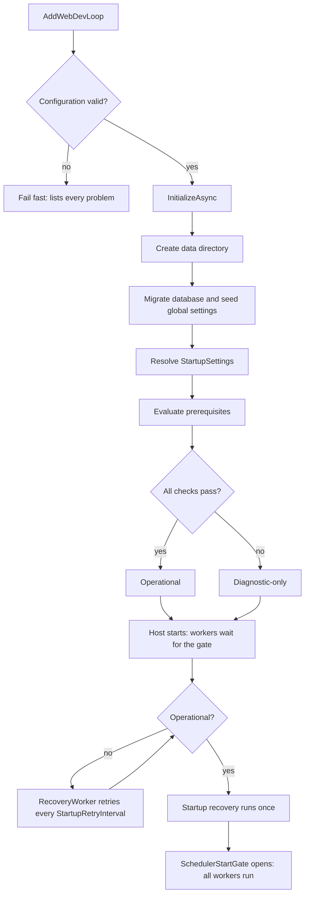

# Startup and prerequisites

How the app boots, which checks decide if the workflow may run, and which background workers keep it going.

## Startup in four steps

`src/WebDevLoop.Web/Program.cs` is short on purpose:

```csharp
builder.Services.AddWebDevLoop(builder.Configuration);   // 1. register everything
var app = builder.Build();
await app.InitializeWebDevLoopAsync();                   // 2. prepare data, check prerequisites
app.UseWebDevLoop();                                     // 3. HTTP pipeline
await app.RunAsync();                                    // 4. host starts, workers run
```

| Step | Code | What happens |
| --- | --- | --- |
| 1 | `WebDevLoopServiceCollectionExtensions.AddWebDevLoop` | Loads and validates `WebDevLoopOptions`, registers Infrastructure, Core orchestration, API, UI, Blazor and (if `Workflow:Enabled`) the hosted workers. |
| 2 | <xref:WebDevLoop.Web.Background.AppInitializer> | Migrates the database, seeds settings, resolves startup settings, evaluates prerequisites. |
| 3 | `WebDevLoopApplicationExtensions.UseWebDevLoop` | Error pages, HTTPS, antiforgery, static assets, REST API + OpenAPI, GitHub sign-in endpoints, Blazor UI. |
| 4 | Hosted services | Workers wait for startup recovery, then run on timers. |



Only an invalid configuration stops the process. A broken database or a failing prerequisite never throws: the app starts in diagnostic mode instead.

## Configuration

- Section `WebDevLoop`, read by <xref:WebDevLoop.Web.DependencyInjection.WebDevLoopOptions>. Sources are the usual ASP.NET Core ones (`appsettings*.json`, user secrets, environment variables with `__`, command line).
- The [public WebDevLoop GitHub App](https://github.com/apps/webdevloop) uses `https://localhost:7233/auth/github/callback`. Use the `https` launch profile for it. Installation does not replace local `GitHub:AppClientId`/`GitHub:AppClientSecret` configuration; see [GitHub App user sign-in](git-and-github.md#github-app-user-sign-in).
- `WebDevLoopOptions.Load` validates every value and throws <xref:WebDevLoop.Web.DependencyInjection.WebDevLoopConfigurationException> with **all** problems in one message.
- Timer values are in <xref:WebDevLoop.Web.DependencyInjection.WorkflowWorkerOptions>. The full key list with defaults is in the [README](https://github.com/FlorianAlbert/WebDevLoop#configuration).
- Settings users change at runtime (limits, prompts, models, workspace root, test ports) are **not** here. They live in the database. See [Domain model](domain-model.md).
- `StartupSettings` holds the global settings that process-wide adapters are built from (for example the workspace root). They are resolved once at startup, so a change needs a restart.

### Data directory

Default: `<LocalApplicationData>/WebDevLoop` (override with `WebDevLoop:DataDirectory`).

| Path | Content |
| --- | --- |
| `webdevloop.db` | SQLite database (migrated at startup) |
| `workspaces/` | Default workspace root: clones and run worktrees |
| `copilot/` | Copilot home |
| `ui-state.json` | Selected repository in the UI |
| `github-credentials.dat`, `keys/` | Encrypted GitHub sign-in and data protection keys |

## Prerequisites and readiness

Each check implements <xref:WebDevLoop.Infrastructure.Prerequisites.IPrerequisiteCheck>. <xref:WebDevLoop.Infrastructure.Prerequisites.PrerequisiteValidator> runs them all. <xref:WebDevLoop.Infrastructure.Prerequisites.DiagnosticReadiness> keeps the latest <xref:WebDevLoop.Infrastructure.Prerequisites.ReadinessSnapshot> and its mode (`Operational` or diagnostic-only).

| Check | What it verifies |
| --- | --- |
| SQLite database | The database opens and is fully migrated |
| Workspace root | The workspace root exists and is writable |
| git CLI | `git` runs |
| LibGit2Sharp | The native library loads |
| GitHub authentication | Someone is signed in |
| Copilot runtime | The Copilot CLI can be started |
| Bundled skills | All skills of the manifest are present |
| playwright-cli | `playwright-cli` runs (used by the tester agent) |
| Test port range | The configured tester port range is valid |
| gh stack | Only needed when `GitHub:GhStackMode` is `FallbackRequired` |

Files: `src/WebDevLoop.Infrastructure/Prerequisites/*Check.cs`. External access goes through probes (`IProcessProbe`, `IFileSystemProbe`, `IDatabaseProbe`, `ILibGit2Probe`) so tests can fake it.

All executable checks share the same process probe. On Linux, commands are launched directly using the executable name or path. On Windows, extensionless names are resolved using `PATH` and `PATHEXT`, so npm launchers such as `playwright-cli.cmd` work alongside native `.exe` tools. Explicit paths, including paths with spaces, are supported on both platforms.

What readiness controls:

| Mode | UI | Read API | Mutating API | Workers |
| --- | --- | --- | --- | --- |
| Operational | yes | yes | yes | run |
| Diagnostic-only | yes | yes | `503` with the failing checks | wait |

Readiness is re-evaluated:

- at startup (`AppInitializer`),
- on **Re-check** (Health page, `GET /api/prerequisites`),
- on GitHub sign-in or sign-out (`GitHubSignInReadinessSync`, so the workflow starts or stops without a restart).

See [Web API](web-api.md) for how `OperationalOnlyFilter` returns the `503`.

## Hosted workers

The periodic workers (all except `RecoveryWorker`, which opens the gate itself) derive from `GatedPeriodicWorker`: they wait until the <xref:WebDevLoop.Core.Orchestration.Recovery.Startup.SchedulerStartGate> opens (never while diagnostic-only), then run one pass per interval, each in a fresh DI scope. A failing pass is logged and retried on the next tick.

Registered only when `Workflow:Enabled` is `true`. Start order below; they stop in reverse.

| Worker | Job | Interval option |
| --- | --- | --- |
| `AgentLogShutdownFlush` | Writes pending agent logs on shutdown (starts first, so it flushes last) | – |
| `BackgroundWorkRunner` | Runs launched agent and integration work; cancels it on shutdown | – |
| `WorkflowEventSubscriptions` | Connects workflow handlers to the event bus | – |
| `RecoveryWorker` | Waits for readiness, runs startup recovery once, then reconciles periodically | `StartupRetryInterval`, `RecoveryInterval` |
| <xref:WebDevLoop.Web.Background.OutboxDispatchWorker> | Publishes outbox messages; loops at once while messages are pending | `OutboxPollInterval` |
| `MergeTrackingWorker` | Polls ready PR stacks for the human merge | `MergeTrackingInterval` |
| `CopilotRuntimeMaintenanceWorker` | Evicts idle Copilot runtimes, refreshes expiring tokens | `RuntimeMaintenanceInterval` |
| `OutboxRetentionWorker` | Deletes dispatched outbox messages after the retention time | `OutboxPurgeInterval`, `OutboxRetention` |

`GitHubSignInReadinessSync` is a hosted service too, but it is registered even when the workers are off.

### Startup recovery

<xref:WebDevLoop.Core.Orchestration.Recovery.Startup.RecoveryCoordinator> runs once when the app is operational. It reconciles Git and GitHub state, resumes interrupted agent sessions and integration sagas, replays undispatched events and recomputes queues. Steps that started before the process boot time are treated as left over from a previous process. Then the gate opens. Details: [Orchestration](orchestration.md).

## Where to look in the code

| Topic | Path |
| --- | --- |
| Composition root | `src/WebDevLoop.Web/DependencyInjection/` |
| Options and validation | `src/WebDevLoop.Web/DependencyInjection/WebDevLoopOptions.cs` |
| Startup sequence | `src/WebDevLoop.Web/Background/AppInitializer.cs` |
| Workers | `src/WebDevLoop.Web/Background/` |
| Prerequisite checks | `src/WebDevLoop.Infrastructure/Prerequisites/` |
| Recovery | `src/WebDevLoop.Core/Orchestration/Recovery/` |

Related: [Persistence and events](persistence-and-events.md), [Copilot runtime](copilot-runtime.md), [Git and GitHub](git-and-github.md).
