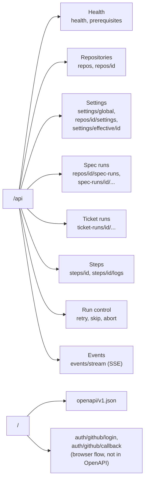
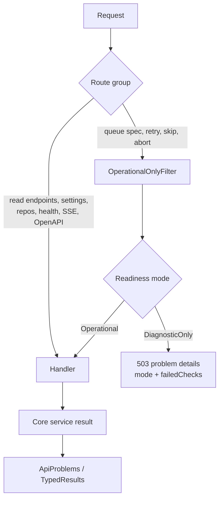
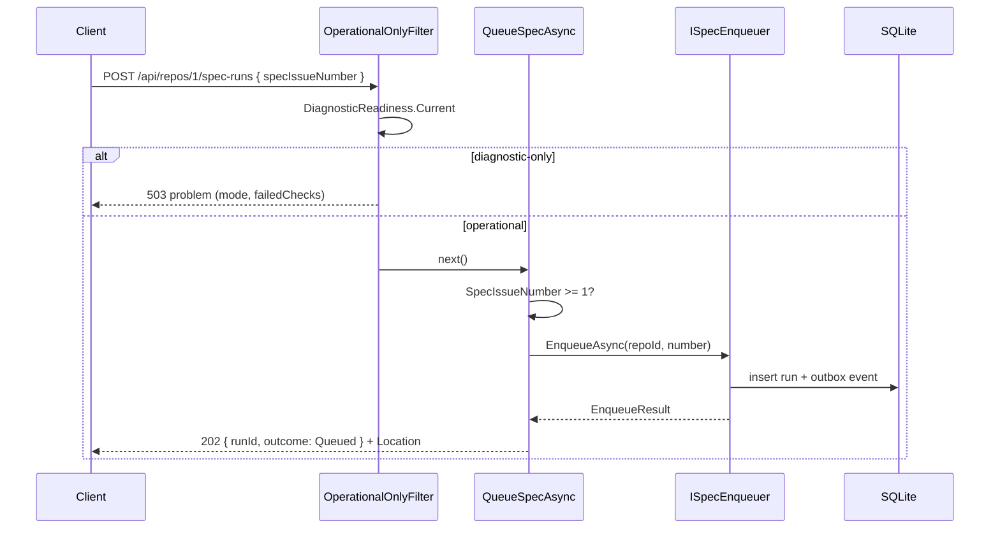
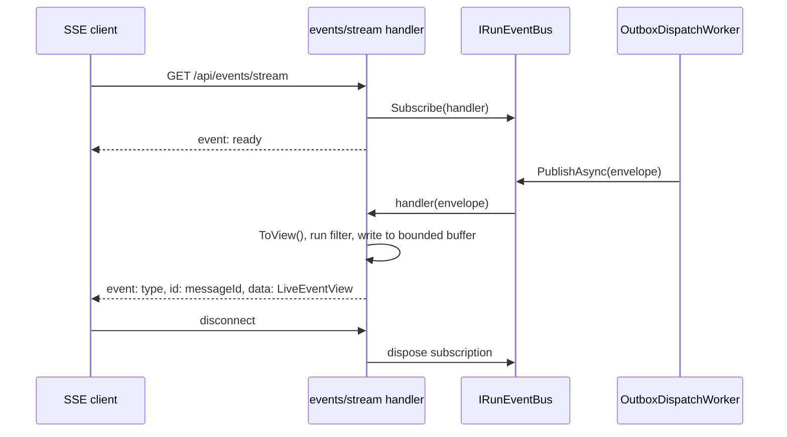

# Web API

How the REST API is designed, which endpoints exist, and how to add one.

The API is a thin layer of ASP.NET Core minimal APIs in `src/WebDevLoop.Web/Api/`. Handlers do no business logic. They parse ids, call a Core service or query interface, and map the result to an HTTP response. The Blazor UI does **not** call this API; it uses the same Core services directly (see [Web UI](web-ui.md)). The API exists for scripts, tools and agents.

The generated reference of every route and schema is in the [REST API reference](../rest-api/index.md). This page explains the design and the conventions behind it.

## Design rules

| Rule | Detail |
| --- | --- |
| Base path | Everything is under `/api` (`WebApiEndpoints`). The OpenAPI document is outside it. |
| One class per area | `Api/<Area>Endpoints.cs`, an `internal static class` with `Map(IEndpointRouteBuilder api)`. |
| Thin handlers | Inject Core interfaces with `[FromServices]`. No EF Core, no Git, no GitHub code in `Api/`. |
| JSON | `System.Text.Json`, enums as strings (`JsonStringEnumConverter`, set in `AddWebDevLoopApi`). |
| Errors | RFC 9457 problem details. See [Errors](#errors-and-problem-details). |
| Ids | Strings for runs, tickets and steps; integers for repositories. See [Ids](#ids). |
| Names | Every route has `.WithName(...)` (the OpenAPI `operationId`), a tag group and `.Produces...` metadata. |
| Mutations | Workflow-changing endpoints sit behind `OperationalOnlyFilter`. See [Readiness](#readiness-and-diagnostic-only-mode). |

## Route map

`MapWebDevLoopApi` calls the area classes in this order: Health, Repositories, Settings, Spec runs, Ticket runs, Steps, Run control, Events; then `MapOpenApi()`.

## Endpoints

"Gated" means the route uses `OperationalOnlyFilter` and answers `503` in diagnostic-only mode.

### Health (`Api/HealthEndpoints.cs`)

| Method | Route | Purpose | Notes |
| --- | --- | --- | --- |
| GET | `/api/health` | Readiness. | `200` when operational, `503` with the failing checks otherwise. |
| GET | `/api/prerequisites` | Latest prerequisite checks with remediation. | Always `200`, also in diagnostic-only mode. |

### Repositories (`Api/RepositoryEndpoints.cs`)

| Method | Route | Purpose | Notes |
| --- | --- | --- | --- |
| GET | `/api/repos` | List registered repositories. | |
| POST | `/api/repos` | Register a repository. | `201` + `Location`; `400` validation; `409` conflict. |
| GET | `/api/repos/{repoId:int}` | One repository. | `404`. |
| PATCH | `/api/repos/{repoId:int}` | Update base branch, clone URL, local path, enabled flag. | `400`, `404`. |
| DELETE | `/api/repos/{repoId:int}` | Remove a repository. | `204`; `404`; `409` when it cannot be removed. |
| POST | `/api/repos/{repoId:int}/select` | Set the repository the UI views. | View context only; never changes scheduling. |

### Settings (`Api/SettingsEndpoints.cs`)

| Method | Route | Purpose | Notes |
| --- | --- | --- | --- |
| GET | `/api/settings/global` | Global settings layer. | |
| PUT | `/api/settings/global` | Replace the global layer, including prompt templates. | Validated; `400` with field errors, `409`. |
| GET | `/api/repos/{repoId:int}/settings` | A repository's override layer. | `404`. |
| PUT | `/api/repos/{repoId:int}/settings` | Replace the override layer. Unset values fall through. | `400`, `404`, `409`. |
| GET | `/api/settings/effective/{repoId:int}` | Fully resolved settings (repository, then global, then defaults). | `404`, `409`. |

### Spec runs (`Api/SpecRunEndpoints.cs`)

| Method | Route | Purpose | Notes |
| --- | --- | --- | --- |
| POST | `/api/repos/{repoId:int}/spec-runs` | Queue a parent spec issue. Body: `{ "specIssueNumber": 123 }`. | Gated. `202` `Queued`, or `200` `AlreadyQueued`; `400`, `404`, `409`, `503`. |
| GET | `/api/repos/{repoId:int}/spec-runs` | The repository's queue. | `404`. |
| GET | `/api/spec-runs/{id}` | One spec run. | `404`. |
| GET | `/api/spec-runs/{id}/tickets` | Ticket runs of the spec. | `404`. |
| GET | `/api/spec-runs/{id}/events` | Persisted audit events. | `404`. |
| GET | `/api/spec-runs/{id}/stack` | Stack layers (draft PRs). | `404`. |
| GET | `/api/spec-runs/{id}/merge-status` | Awaiting merge, merged, or closed unmerged, as last tracked. | `404`. |
| GET | `/api/spec-runs/{id}/events/stream` | Live events of one run (SSE). | `404`. See [Event stream](#event-stream-sse). |

### Ticket runs and steps (`Api/TicketRunEndpoints.cs`, `Api/StepEndpoints.cs`)

| Method | Route | Purpose | Notes |
| --- | --- | --- | --- |
| GET | `/api/ticket-runs/{id}` | One ticket run. | `404`. |
| GET | `/api/ticket-runs/{id}/steps` | Steps of the ticket run. | `404`. |
| GET | `/api/steps/{id}` | One step run. | `404`. |
| GET | `/api/steps/{id}/logs?after=N` | Agent output. Pass the returned `lastSequence` as `after` to get only new entries. | `404`; `after` below 0 counts as 0. |

### Run control (`Api/RunControlEndpoints.cs`)

All routes in this group are gated. Success returns `200` with <xref:WebDevLoop.Web.Api.Contracts.RunControlResponse`1> (`action`, the run as it is now, `warnings` for cleanup that failed after the command was applied).

| Method | Route | Purpose | Failures |
| --- | --- | --- | --- |
| POST | `/api/spec-runs/{id}/retry` | Resume a spec run that needs attention at its failed phase. | `404`, `409`, `503` |
| POST | `/api/spec-runs/{id}/abort` | Abort a spec run: stop agent sessions and tester app, cancel steps, abort open tickets, free the slot. | `404`, `409`, `503` |
| POST | `/api/ticket-runs/{id}/retry` | Resume a ticket run that needs attention. | `404`, `409`, `503` |
| POST | `/api/ticket-runs/{id}/skip` | Skip a ticket run that is not being worked on. Optional body `{ "dependents": "Unblock" \| "Skip" }`, default `Unblock`. | `400`, `404`, `409`, `503` |
| POST | `/api/ticket-runs/{id}/abort` | Abort a ticket run. Dependents stay blocked. | `404`, `409`, `503` |

### Events and OpenAPI

| Method | Route | Purpose |
| --- | --- | --- |
| GET | `/api/events/stream` | Live events of all runs (SSE, `text/event-stream`). |
| GET | `/openapi/v1.json` | OpenAPI document. Served also in diagnostic-only mode. |

### Browser sign-in (not part of `/api`)

`GitHubAuth/GitHubSignInEndpoints.cs` maps `GET /auth/github/login` and `GET /auth/github/callback`. They are redirects for the GitHub App web flow, so they are excluded from OpenAPI (`ExcludeFromDescription`). See [Git and GitHub](git-and-github.md).

## Ids

| Kind | Format | Source |
| --- | --- | --- |
| Repository | Integer in the route (`{repoId:int}`). A non-number does not match the route. | Database key. |
| Spec run | String, e.g. `r` + 12 hex digits | <xref:WebDevLoop.Infrastructure.Runtime.GuidIdGenerator> (`NewRunId`). |
| Ticket run | String, e.g. `t` + 12 hex digits | `NewTicketRunId`. |
| Step run | String. Generated ones are `s` + 12 hex digits; some are derived, for example `{specRunId}-test-{attempt}` for tester steps. | `NewStepRunId`, review and tester runners. |

Run, ticket and step ids are validated by `BranchSegment.Require` in Core, because they are embedded in Git branch names: only ASCII letters, digits, `-`, `_`, `.`, and no `..`. `Api/ApiIds.cs` wraps the constructors (`SpecRun`, `TicketRun`, `Step`) and returns `null` for an invalid id, so an invalid id gives `404 Not found` and never `400` or `500`. Use `ApiIds` in every new handler that takes such an id.

## Errors and problem details

`Api/ApiProblems.cs` is the only place that builds error responses. Every error carries a body, so the host's status-code pages (`UseStatusCodePagesWithReExecute("/not-found")`) never replace it with HTML.

| Status | When | Body | Helper |
| --- | --- | --- | --- |
| `400` | Invalid input or settings. | `ValidationProblem`: `errors` grouped by field name. | `ApiProblems.Validation` |
| `400` | Plain bad request. | `ProblemDetails`, title `Bad request`. | `ApiProblems.BadRequest` |
| `404` | Unknown or malformed id. | `ProblemDetails`, title `Not found`. | `ApiProblems.NotFound` |
| `409` | State conflict, concurrent change, command not allowed in the run's state, no free active-spec slot. | `ProblemDetails`; title tells which (`Conflict`, `Not allowed in the run's current state`, `No free active-spec slot`). | `Conflict`, `ForControl` |
| `503` | Diagnostic-only mode, gated endpoint. | `ProblemDetails` with extensions `mode` and `failedChecks`. | `ApiProblems.PrerequisitesFailed` |

Mapping from Core results:

| Core result | Mapped by | To |
| --- | --- | --- |
| `CommandResult<T>` (`NotFound`, `Invalid`, `Conflict`) | `ApiProblems.ForFailure` | `404`, `400` validation problem, `409` |
| `ControlResult` (`NotFound`, `NotAllowed`, `NoActiveSlot`, `ConcurrencyConflict`) | `ApiProblems.ForControl` | `404`, `409`, `409`, `409` |
| `EnqueueResult` (`Queued`, `AlreadyQueued`, `RepositoryNotFound`, else) | `SpecRunEndpoints.QueueSpecAsync` | `202`, `200`, `404`, `409` |

Core services return result objects for expected failures. They do not throw for them. Keep it that way: add a status to the result type and map it in `ApiProblems`.

## Readiness and diagnostic-only mode

At startup and on demand, <xref:WebDevLoop.Infrastructure.Prerequisites.DiagnosticReadiness> evaluates the prerequisites into a <xref:WebDevLoop.Infrastructure.Prerequisites.ReadinessSnapshot> with a <xref:WebDevLoop.Infrastructure.Prerequisites.ReadinessMode> (`Operational` or `DiagnosticOnly`). Details: [Startup and prerequisites](startup-and-prerequisites.md).

- <xref:WebDevLoop.Web.Api.OperationalOnlyFilter> (`Api/OperationalOnlyFilter.cs`) is an `IEndpointFilter`. In diagnostic-only mode it returns `ApiProblems.PrerequisitesFailed(snapshot)`. If no evaluation has run yet, the text says the prerequisites were not evaluated.
- Gated: queue a spec, and the whole Run control group (applied once with `MapGroup(...).AddEndpointFilter<OperationalOnlyFilter>()`).
- Not gated: health, prerequisites, all reads, repository and settings changes, `select`, event streams and OpenAPI. Registering a repository or editing settings must work so a user can fix the setup.
- `GET /api/health` uses `ReadinessResponses.ToHealth` and returns `503` itself (it is not filtered).
- No workflow worker runs in diagnostic-only mode, so a gated endpoint that would start work must stay gated.

Example: queueing a spec.

The run itself is started later by the background workers. See [Run lifecycle](run-lifecycle.md) and [Orchestration](orchestration.md).

## Event stream (SSE)

`Api/EventStreamEndpoints.cs` serves `text/event-stream` with `TypedResults.ServerSentEvents`.

| Route | Scope |
| --- | --- |
| `GET /api/events/stream` | All runs. |
| `GET /api/spec-runs/{id}/events/stream` | One run. `404` before the stream opens when the run is unknown. |

Message format:

| Part | Value |
| --- | --- |
| First message | Event name `ready`, sent once the subscription is active. Data is a <xref:WebDevLoop.Core.Queries.LiveEventView> with type `Ready` (and the `specRunId` for the per-run stream). |
| Later messages | Event name = workflow event type (for example `SpecRunStatusChanged`). Data = `LiveEventView` (`messageId`, `type`, `specRunId`, `ticketRunId`, `stepRunId`, `status`, `occurredAt`). SSE `id` = `messageId`. |

Rules for clients and for changes to this endpoint:

- Each client has a bounded buffer of 256 events with `DropOldest`. A slow client can miss events.
- Delivery is at-least-once. A client should treat each message as "something changed" and reload the affected resource with a normal GET. The UI does the same.
- The payload is a small projection, not the full state. Keep it that way: add fields to `LiveEventView` and its mapper in Core, not to the endpoint.
- The stream is not gated, so it also works in diagnostic-only mode.

## OpenAPI

- `AddOpenApi()` is called in `AddWebDevLoopApi` (`DependencyInjection/WebApiServiceCollectionExtensions.cs`); `MapOpenApi()` in `MapWebDevLoopApi`. The document is at `/openapi/v1.json`. The package is `Microsoft.AspNetCore.OpenApi`.
- What ends up in the document comes from endpoint metadata: `WithName` (operationId), `WithTags` (group), `WithSummary`, `Produces<T>(status)`, `ProducesProblem(status)`, `ProducesValidationProblem()`. Missing metadata means a missing or wrong response in the reference.
- Request and response schemas are the C# records: `Api/Contracts/*.cs` for API-only types, and the Core `*View`, `*Command` and settings records for the rest.
- `tests/WebDevLoop.Web.Tests/Api/OpenApiDocumentTests.cs` checks that key paths exist. Add your route there when it matters.
- The [REST API reference](../rest-api/index.md) is generated from this document by DocFX. Do not copy schemas into the guide.

### Contracts

| Type | File | Used by |
| --- | --- | --- |
| `QueueSpecRequest`, `QueueSpecResponse`, `AgentLogsResponse` | `Api/Contracts/RunContracts.cs` | Queue spec, step logs. |
| `SkipTicketRequest`, `RunControlResponse<TRun>` | `Api/Contracts/ControlContracts.cs` | Run control. |
| `HealthResponse`, `PrerequisitesResponse`, `PrerequisiteCheckResponse` | `Api/Contracts/HealthContracts.cs` | Health. `ReadinessResponses.cs` maps from the readiness snapshot. |
| `RepositoryView`, `SpecRunView`, `TicketRunView`, `StepRunView`, `StackLayerView`, `RunEventView`, `MergeStatusView`, `AgentLogView`, `LiveEventView` | `src/WebDevLoop.Core/Queries/` | Read endpoints and SSE. |
| `RegisterRepositoryCommand`, `UpdateRepositoryCommand`, `SettingsProfileData`, `EffectiveSettingsView` | `src/WebDevLoop.Core/Management/` | Repository and settings endpoints. |

## How to add an endpoint

1. **Core first.** Put the logic in a Core service or query (`src/WebDevLoop.Core/Management`, `Queries` or `Orchestration`). Return a result object for expected failures. Register it in the DI extensions (see `AddWebDevLoopApplicationServices`).
2. **Contract.** If the body or response is API-only, add a `sealed record` in `Api/Contracts/`. Otherwise reuse a Core view.
3. **Route.** Add it to the matching `Api/<Area>Endpoints.cs`, or create a new class with a `Map` method and call it from `WebApiEndpoints.MapWebDevLoopApi`.
4. **Metadata.** `.WithName("VerbNoun")`, `.WithSummary(...)` when the name is not enough, and every `.Produces<T>()` / `.ProducesProblem(status)` the handler can return.
5. **Ids.** Run, ticket and step ids go through `ApiIds`. Unknown means `ApiProblems.NotFound`.
6. **Errors.** Map results with `ApiProblems.ForFailure` / `ForControl`. Do not return bare `Results.NotFound()` or plain strings.
7. **Gate.** If it starts or changes workflow work, add `.AddEndpointFilter<OperationalOnlyFilter>()`.
8. **Test.** Add a test under `tests/WebDevLoop.Web.Tests/Api/` with `ApiFactory` (fakes for every service, workers off). Cover the success path, `404`, the error mapping, and `503` if gated. See [Testing and contributing](testing-and-contributing.md).
9. **UI and docs.** If the UI shows the same data, it needs no API call: use the Core service from the component ([Web UI](web-ui.md)). The reference page updates itself from OpenAPI.

## Where to look in the code

| What | Path |
| --- | --- |
| Route registration | `src/WebDevLoop.Web/Api/WebApiEndpoints.cs` (<xref:WebDevLoop.Web.Api.WebApiEndpoints>) |
| Endpoint groups | `src/WebDevLoop.Web/Api/*Endpoints.cs` |
| Contracts | `src/WebDevLoop.Web/Api/Contracts/` |
| Problem details, ids, readiness filter | `Api/ApiProblems.cs`, `Api/ApiIds.cs`, `Api/OperationalOnlyFilter.cs`, `Api/ReadinessResponses.cs` |
| JSON and OpenAPI setup | `src/WebDevLoop.Web/DependencyInjection/WebApiServiceCollectionExtensions.cs` |
| Readiness | `src/WebDevLoop.Infrastructure/Prerequisites/` |
| Event bus and outbox | `src/WebDevLoop.Infrastructure/Events/` |
| API tests | `tests/WebDevLoop.Web.Tests/Api/` |

Related: [Web UI](web-ui.md), [Persistence and events](persistence-and-events.md), [Startup and prerequisites](startup-and-prerequisites.md).
