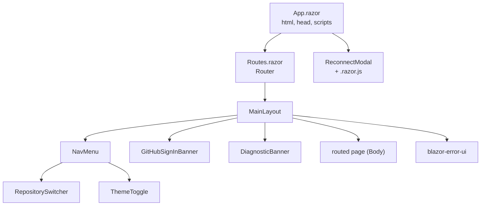
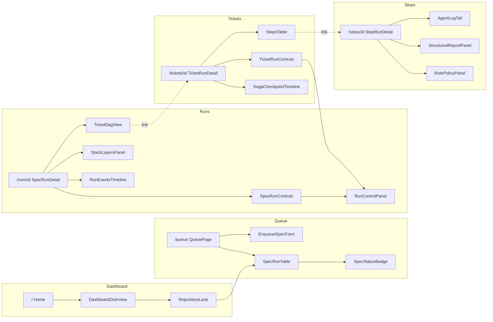
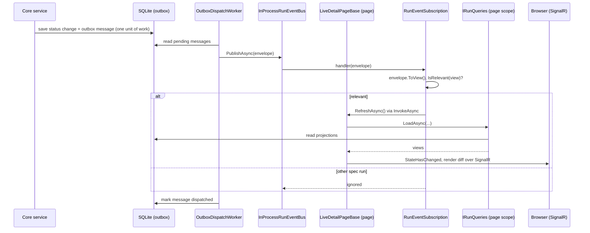

# Web UI

How the Blazor Server UI is built: layout, pages, live updates, theming, and where to add things.

The UI lives in `src/WebDevLoop.Web/Components/`. It is server-rendered and interactive over one SignalR circuit per browser tab. It reads data through Core query interfaces and changes state through Core application services. It never touches the database or Git directly. For the services behind it, see [Persistence and events](persistence-and-events.md) and [Orchestration](orchestration.md).

## At a glance

| Topic | Fact |
| --- | --- |
| Render mode | `InteractiveServer`, chosen in `App.razor` (`PageRenderMode`). `Error.razor` is excluded (`[ExcludeFromInteractiveRouting]`) so it works without a circuit. |
| Routing | `Routes.razor` has a `Router` with `MainLayout` as default layout and `Pages/NotFound` as not-found page. |
| Data access | Components resolve Core interfaces (`IRunQueries`, `IRepositoryQueries`, `ISettingsManager`, `IRunControl`, ...) from a DI scope they own. |
| Live updates | Components subscribe to <xref:WebDevLoop.Core.Events.IRunEventBus> in-process. There is no polling of the REST API and no SSE from the UI. |
| Styling | Bootstrap 5.3 plus a design layer in `wwwroot/css/theme.css`. Light and dark via `data-bs-theme`. |
| Tests | bUnit tests in `tests/WebDevLoop.Web.Tests/Components/` (see [Testing and contributing](testing-and-contributing.md)). |

## Component structure

### Shell and layout

| Component | Source | Role |
| --- | --- | --- |
| <xref:WebDevLoop.Web.Components.Layout.MainLayout> | `Layout/MainLayout.razor` (+ `.razor.css`) | Skip link, sidebar, main area, banners, `#blazor-error-ui`. |
| <xref:WebDevLoop.Web.Components.Layout.NavMenu> | `Layout/NavMenu.razor` | Brand, repository switcher, six nav links, theme toggle. Collapses on small screens. |
| <xref:WebDevLoop.Web.Components.Layout.ReconnectModal> | `Layout/ReconnectModal.razor` (+ `.css`, `.js`) | See [Reconnect modal](#reconnect-modal). |
| <xref:WebDevLoop.Web.Components.GitHub.GitHubSignInBanner> | `GitHub/GitHubSignInBanner.razor` | Shown on every page except `/github` while GitHub sign-in is missing or not configured. |
| <xref:WebDevLoop.Web.Components.Dashboard.DiagnosticBanner> | `Dashboard/DiagnosticBanner.razor` | Warning while <xref:WebDevLoop.Infrastructure.Prerequisites.DiagnosticReadiness> is `DiagnosticOnly`. Links to Health. |

### Pages by area

Other pages (not drawn): `/repositories` (`RepositoriesPage` with registration, edit and remove forms), `/settings` (`SettingsPage` with `SettingsEditor`), `/github` (`GitHubPage`), `/health` (`HealthPage`), `/not-found`, `/Error`.

| Area | Folder | Routes | Main components |
| --- | --- | --- | --- |
| Dashboard | `Dashboard/` | `/` (`Pages/Home.razor` hosts `DashboardOverview`) | `DashboardOverview` (alerts, lane counts, one `RepositoryLane` per repository), `DiagnosticBanner`, `RepositoryOverview` (record). |
| Queue | `Queue/` | `/queue` | `QueuePage`, `EnqueueSpecForm`, `SpecRunTable`, `SpecStatusBadge`, `SpecRunLane`/`SpecRunLanes` (status to lane mapping), `SpecRunDisplay`. |
| Repositories | `Repositories/` | `/repositories` | `RepositoriesPage`, `RepositoryRegistrationForm`, `RepositoryEditForm`, `RepositoryRemoveConfirm`, `RepositorySwitcher`, `RepositoryContext`. |
| Runs | `Runs/` | `/runs/{Id}` | `SpecRunDetail`, `SpecRunControls`, `RunControlPanel`, `RunControlsArea`, `StackLayersPanel`, `MergeTrackingPanel`, `SpecBlockersPanel`, `RunEventsTimeline`, `StatusBadge`, `ShortHash`, `LiveDetailPageBase`, `RunEventSubscription`. |
| Tickets | `Tickets/` | `/tickets/{Id}` | `TicketRunDetail`, `TicketDagView` (+ `TicketDagLayout`), `TicketRunControls`, `TicketFindingsPanel`, `SagaCheckpointTimeline`. |
| Steps | `Steps/` | `/steps/{Id}` | `StepRunDetail`, `StepsTable`, `AgentLogTail`, `StructuredReportPanel` (+ `StepReportParser`), `RolePolicyPanel`. |
| Settings | `Settings/` | `/settings` | `SettingsPage` (scope picker, unsaved-changes guard), `SettingsEditor`, field components `TextOverride`, `NumberOverride`, `ChoiceOverride`, `PromptTemplateField`, `OverrideFieldFrame`, `SettingsEditModel`. |
| GitHub | `GitHub/` | `/github` | `GitHubPage` (who is signed in, installations, unreachable repositories), `GitHubSignInBanner`, `SignInNavigation` (full-page redirect to the sign-in endpoint). |
| Health | `Health/` | `/health` | `HealthPage` (prerequisite checks, **Re-check** button calls `DiagnosticReadiness.RefreshAsync`). |
| Shared | `Shared/` | none | See [Shared components](#shared-components). |

### Routes

Routes are declared with `@page` in each page. Links use <xref:WebDevLoop.Web.Components.Layout.UiRoutes> (`Layout/UiRoutes.cs`):

| Constant | Path |
| --- | --- |
| `Dashboard` | `/` |
| `Repositories` | `/repositories` |
| `Queue` | `/queue` |
| `Settings` | `/settings` |
| `Health` | `/health` |
| `GitHub` | `/github` |
| `Run(specRunId)` | `/runs/{id}` (id is URL-escaped) |

Ticket and step links (`/tickets/{id}`, `/steps/{id}`) are written inline in the components that link to them. Run, ticket and step ids come from the route as strings; the detail pages treat an invalid or unknown id as "not found" and show an `EmptyState`.

## Data loading and scopes

Blazor Server keeps one long-lived DI scope per circuit. The EF Core `DbContext` behind the query services is not thread-safe. So components never share the circuit scope for data calls.

| Base class | Source | Use for |
| --- | --- | --- |
| <xref:WebDevLoop.Web.Components.Dashboard.ScopedComponentBase> | `Dashboard/ScopedComponentBase.cs` | Components that call services on demand (forms, buttons). `InScopeAsync(...)` creates a fresh scope per call. |
| <xref:WebDevLoop.Web.Components.Dashboard.LiveComponentBase> | `Dashboard/LiveComponentBase.cs` | List-style views that reload on events: dashboard, queue, repositories, switcher. Extends `ScopedComponentBase`. |
| <xref:WebDevLoop.Web.Components.Runs.LiveDetailPageBase> | `Runs/LiveDetailPageBase.cs` | Detail pages (spec run, ticket run, step). Extends `OwningComponentBase`: one scope for the page lifetime, reached through `ScopedServices`. |

Rules:

- Do not inject query services with `@inject` in a component that stays open. Use `InScopeAsync` or `ScopedServices`.
- Singletons are fine to inject: `RepositoryContext`, `DiagnosticReadiness`, `IGitHubSignInState`, `GitHubUserSession`, `IRunEventBus`.
- Pass a `CancellationToken` from the base class into every query.

## Live updates

Events flow from the database outbox to the UI in one process. No browser connection is needed beyond the Blazor circuit itself.

Step by step:

1. A Core service changes state and writes an outbox message in the same unit of work.
2. `OutboxDispatchWorker` (`Background/Workers.cs`) calls `OutboxDispatcher.DispatchPendingAsync`. The poll interval is `WebDevLoop:Workflow:OutboxPollInterval` (default 1 s), and it keeps going while messages are pending.
3. <xref:WebDevLoop.Infrastructure.Events.InProcessRunEventBus> hands the envelope to every subscriber, in subscription order. A failing subscriber is logged and does not stop the others. Delivery is at-least-once.
4. UI subscribers convert the envelope with `ToView()` into a <xref:WebDevLoop.Core.Queries.LiveEventView> (`Type`, `SpecRunId`, `TicketRunId`, `StepRunId`, `Status`, `OccurredAt`) and decide if it matters.
5. A relevant event triggers a full reload of the component's data. The UI does not patch state from the event payload.

### Coalescing

Both bases collapse bursts: events that arrive during a load cause exactly one more load afterwards.

| Class | How |
| --- | --- |
| `LiveComponentBase.ReloadAsync` | `_loading` and `_reloadRequested` flags. Loops until no new request. Event handler returns at once (`_ = InvokeAsync(ReloadAsync)`) so a slow query never blocks the bus. |
| <xref:WebDevLoop.Web.Components.Runs.RunEventSubscription> | Lock-protected `_reloading`/`_reloadRequested`. Used by `LiveDetailPageBase`. `LiveDetailPageBase` also has a `SemaphoreSlim` so loads on one scope never overlap. |

### What each page reacts to

| Page | Relevance rule |
| --- | --- |
| `DashboardOverview`, `QueuePage` | `ReactsTo` returns `SpecQueueEvents.Affects(...)`: only `SpecRunQueued` and `SpecRunStatusChanged`. They also reload when `RepositoryContext.Changed` fires. |
| `RepositorySwitcher`, `RepositoriesPage` | No events by default (`ReactsTo` is `false`). They reload on `RepositoryContext.Changed`. |
| `SpecRunDetail` | Events of this spec run (`RunEventSubscription.Concerns`), plus events of any run that blocks it (`SpecDependencyView.BlockingSpecRunId`). |
| `TicketRunDetail`, `StepRunDetail` | Events of the owning spec run. Until the item is loaded, every event counts. |
| `AgentLogTail` | Not event-driven. Polls the log reader every 15 s (`DefaultPollInterval`) while the step is pending or running. |
| Health, GitHub, banners | Read `DiagnosticReadiness` or `IGitHubSignInState`; the sign-in banner and GitHub page subscribe to its `Changed` event. |

Control buttons (`RunControlPanel`) run a command through `IRunControl` in a fresh scope, then call `OnApplied` so the page reloads at once instead of waiting for the next event. They are disabled in diagnostic-only mode.

### Add live behavior to a component

1. Inherit `LiveComponentBase` (lists) or `LiveDetailPageBase` (detail pages).
2. Implement `LoadAsync(CancellationToken)`. Load everything the view needs; assign fields; do not call `StateHasChanged`.
3. Override `ReactsTo` (list) or `IsRelevant` (detail). Keep it narrow: each hit is a full reload.
4. If you need a new event field, extend `LiveEventView` and `LiveEventViewMapper` in Core (`src/WebDevLoop.Core/Queries/`) and its test.

## Repository context and switcher

<xref:WebDevLoop.Web.Components.Repositories.RepositoryContext> is the UI's "current repository". It is a singleton that wraps <xref:WebDevLoop.Core.Management.ICurrentRepositorySelection>. The selection is stored in a file (`FileCurrentRepositorySelection`, under the data directory), so it survives restarts and is shared by all tabs.

- `RepositorySwitcher` (sidebar) lists enabled repositories and calls `RepositoryContext.Select(id)`.
- `Select` raises `Changed`; every `LiveComponentBase` reloads.
- `ClearIfDangling` resets the selection when the repository no longer exists. The switcher calls it on each load.
- `RepositoryLane` also selects a repository when you press **Open queue**.
- It is view context only. It filters what the Queue page shows. It never starts, stops or filters scheduling. The same is true for `POST /api/repos/{repoId}/select` (see [Web API](web-api.md)).

## Reconnect modal

Blazor Server shows a built-in dialog when the circuit drops. WebDevLoop replaces it with `ReconnectModal.razor` (a `<dialog id="components-reconnect-modal">`).

- Blazor sets one `components-reconnect-*` (or `components-pause-*`, `components-resume-failed`) CSS class on the dialog. `ReconnectModal.razor.css` shows only the parts for that state.
- `ReconnectModal.razor.js` is loaded as a module. It opens the dialog on `show`, closes it on `hide`, and handles `failed` (Try again, retries when the tab becomes visible again) and `rejected` (reloads the page).
- States and texts: reconnecting (first and repeated attempt with a countdown), can't reach the server, session paused, couldn't resume, session ended.
- `bUnit` test: `tests/WebDevLoop.Web.Tests/Components/Layout/ReconnectModalTests.cs`.

## Theming

| Piece | Source | Role |
| --- | --- | --- |
| Bootstrap 5.3 | `wwwroot/lib/bootstrap/` | Base grid, forms, tables, buttons. |
| Design tokens | `wwwroot/css/theme.css` | `--wdl-*` variables, mapped onto Bootstrap's `--bs-*` variables. |
| App overrides | `wwwroot/app.css` | Validation outlines, Blazor error boundary. |
| Scoped CSS | `Layout/MainLayout.razor.css`, `Layout/ReconnectModal.razor.css`, `Repositories/RepositoriesPage.razor.css` | Compiled into `WebDevLoop.Web.styles.css`, linked in `App.razor`. |
| Theme script | `wwwroot/js/theme.js` | Runs synchronously in `<head>` so the theme is set before first paint. |
| Toggle | `Shared/ThemeToggle.razor` | System / Light / Dark buttons. Calls `wdlTheme.set(mode)` through JS interop. |

How the light/dark switch works:

1. `theme.js` reads `localStorage["wdl-theme"]` (`light`, `dark`, or absent = system).
2. It sets `data-bs-theme="light|dark"` on `<html>`. For "system" it follows `prefers-color-scheme` and updates on change.
3. `theme.css` defines the light tokens on `:root` and the dark tokens under `[data-bs-theme="dark"]`. Components use only tokens, so they work in both modes.

Token groups in `theme.css` (read the file for the full list):

| Group | Examples |
| --- | --- |
| Brand | `--wdl-accent`, `--wdl-accent-hover`, `--wdl-accent-soft`, `--wdl-accent-text` |
| Surface and text | `--wdl-bg`, `--wdl-surface`, `--wdl-surface-muted`, `--wdl-border`, `--wdl-text`, `--wdl-text-muted` |
| Status | `--wdl-success-*`, `--wdl-warning-*`, `--wdl-danger-*`, `--wdl-info-*`, `--wdl-neutral-*` (each with `-bg`, `-fg`, `-dot`) |
| Shape, space, type | `--wdl-radius*`, `--wdl-space-1..6`, `--wdl-text-xs..xl`, `--wdl-font-sans`, `--wdl-font-mono` |
| Layout | `--wdl-sidebar-width`, `--wdl-transition` |

Rules: no hard-coded colors in components; use a token or a Bootstrap utility. Put shared look in `theme.css` (sections: buttons, tables, status pill, shared components, app shell, settings, detail pages, attention card, run controls). Put one-page-only CSS in a `Component.razor.css` file.

## Shared components

All in `Components/Shared/` and imported in `Components/_Imports.razor`.

| Component | Purpose |
| --- | --- |
| <xref:WebDevLoop.Web.Components.Shared.PageHeader> | Page `h1`, optional description and `Actions` slot. Sets the document title (`DocumentTitle` or `Title`, with the app name added by `PageTitles`). |
| <xref:WebDevLoop.Web.Components.Shared.SectionCard> | Titled card with `Actions` and body. `NoPadding` for tables. |
| <xref:WebDevLoop.Web.Components.Shared.StatusPill> | Colored pill. `Variant` is a <xref:WebDevLoop.Web.Components.Shared.StatusVariant> (`Neutral`, `Success`, `Warning`, `Danger`, `Info`). `ShowDot` adds a dot. |
| <xref:WebDevLoop.Web.Components.Shared.StatusVariants> | `For(statusName)` maps run, ticket and step status names to a variant. Used by the status badges. |
| <xref:WebDevLoop.Web.Components.Shared.EmptyState> | Icon, title, text, and an `Action` slot for empty lists and "not found". |
| <xref:WebDevLoop.Web.Components.Shared.Icon> | Inline SVG by name. Paths live in `IconPaths.cs`; add new icons there. |
| <xref:WebDevLoop.Web.Components.Shared.IconButton> | Icon-only button or link with an accessible label. |
| <xref:WebDevLoop.Web.Components.Shared.CopyButton> | Copies a text to the clipboard. |
| <xref:WebDevLoop.Web.Components.Shared.AppDateTime> | `<time>` element. Relative ("2 min ago") or absolute local time. Formats in `DateTimeFormats`. |
| <xref:WebDevLoop.Web.Components.Shared.AttentionCard> | The "Action needed" card of a run, ticket or step, built from an `AttentionReason`. Control buttons go in its `ChildContent`; leave it empty for read-only. Wording rules in `AttentionDisplay`. |
| `DisplayNames` | Static helpers: human names for enums (`Humanize`, `For`, `Describe`) and the one-line text of run events (`DescribeRunEvent`). |
| <xref:WebDevLoop.Web.Components.Shared.ThemeToggle> | See [Theming](#theming). |

Small status components also exist per area: `Runs/StatusBadge`, `Queue/SpecStatusBadge`, `Runs/ShortHash`.

## How to add a page

1. Pick the area folder under `Components/` (or add one, plus a `_Imports.razor` if it needs `@using`s).
2. Create `MyPage.razor` with `@page "/my-page"`. Start with `<PageHeader Title="..." />`.
3. Choose a base:
   - read-only or form page: `@inherits ScopedComponentBase`
   - list that follows events: `@inherits LiveComponentBase`
   - detail page for one run, ticket or step: `@inherits LiveDetailPageBase` with a `[Parameter] public string Id`
4. Load data with `InScopeAsync` / `ScopedServices`. Show three states: loading placeholder, error (`LoadError`), and `EmptyState`.
5. Build the view from `SectionCard`, `StatusPill`, `EmptyState`, `AppDateTime`. Do not add new CSS before checking `theme.css`.
6. If it is a main page, add a constant to `UiRoutes` and a `NavLink` in `NavMenu.razor` (add an icon in `IconPaths.cs` if needed).
7. If the page must work in diagnostic-only mode, do not call mutating services without checking `DiagnosticReadiness` (see `EnqueueSpecForm` and `RunControlPanel`).
8. Add a bUnit test in `tests/WebDevLoop.Web.Tests/Components/<Area>/` using `UiTestContext` (see [Testing and contributing](testing-and-contributing.md)).

Services are registered once: `AddWebDevLoopDashboardUi` registers `RepositoryContext`; `AddRazorComponents().AddInteractiveServerComponents()` is in `AddWebDevLoop`. A new component needs no registration unless it needs a new singleton service.

## Conventions

- One component per `.razor` file; code-behind logic stays in `@code` unless it is a pure helper. Pure logic goes into a `static` class next to the component (`SpecRunLanes`, `TicketDagLayout`, `StepReportParser`, `DisplayNames`). These are easy to unit test without bUnit.
- Components receive data as `[Parameter]`, mark required ones `[EditorRequired]`, and report back with `EventCallback` (`OnSaved`, `OnChanged`, `OnApplied`).
- Add a `data-testid` to anything a test must find (`spec-status`, `control-retry`, `enqueue-submit`). Keep them stable.
- Accessibility: labels for inputs, `role="status"`/`role="alert"` for messages, `aria-busy` while loading, a skip link, focus on the page `h1` after navigation.
- Destructive commands ask for confirmation and say what they affect (`RunControlCommand.Confirmation`, `Consequence`, `Impact`).
- Dispose subscriptions. Live bases do this for you; if you subscribe to `RepositoryContext.Changed` or a sign-in event yourself, implement `IDisposable`.
- Catch `OperationCanceledException` after disposal; the live bases already do.
- Use Core types and `*View` records from `WebDevLoop.Core.Queries`. Do not reference EF entities.

## Where to look in the code

| What | Path |
| --- | --- |
| Shell, router, render mode | `src/WebDevLoop.Web/Components/App.razor`, `Routes.razor` |
| Layout, nav, routes, reconnect | `src/WebDevLoop.Web/Components/Layout/` |
| Live base classes | `Components/Dashboard/LiveComponentBase.cs`, `ScopedComponentBase.cs`, `Components/Runs/LiveDetailPageBase.cs`, `RunEventSubscription.cs` |
| Repository context | `Components/Repositories/RepositoryContext.cs`, `RepositorySwitcher.razor` |
| Shared components | `Components/Shared/` |
| CSS and theme script | `src/WebDevLoop.Web/wwwroot/css/theme.css`, `wwwroot/app.css`, `wwwroot/js/theme.js` |
| UI service registration | `DependencyInjection/WebUiServiceCollectionExtensions.cs`, `WebDevLoopServiceCollectionExtensions.cs` |
| Event bus and outbox | `src/WebDevLoop.Infrastructure/Events/`, `src/WebDevLoop.Core/Events/IRunEventBus.cs` |
| Event to view mapping | `src/WebDevLoop.Core/Queries/LiveEventViewMapper.cs` |
| UI tests | `tests/WebDevLoop.Web.Tests/Components/` |

Related: [Web API](web-api.md) (same data over HTTP and SSE), [Persistence and events](persistence-and-events.md), [Run lifecycle](run-lifecycle.md).
