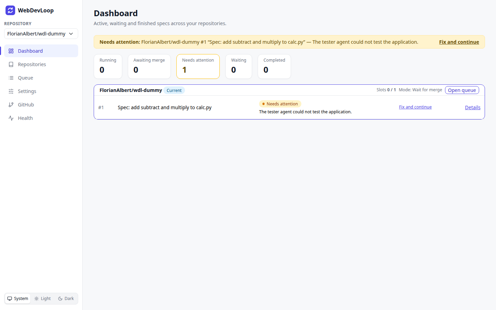
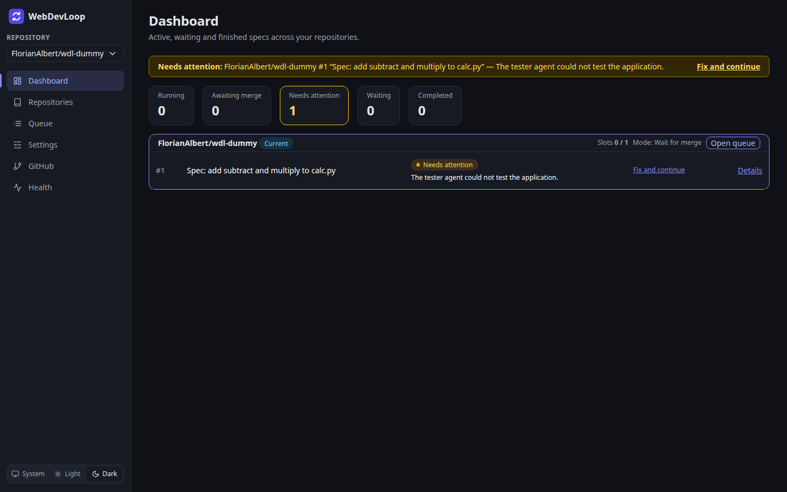

# Dashboard

The dashboard is the home page. It shows active, waiting and finished specs across all your repositories.

## What you can do here

- See at a glance how many specs are running, awaiting merge, stuck, waiting or completed.
- Jump straight to a spec that needs attention.
- Open the queue of a repository.

## Alerts

Alerts sit at the top of the page.

- **Needs attention** (yellow): one alert per spec run that is stuck. It names the repository, the spec issue and the reason. The link says **Fix and continue** when you have to fix something first. Otherwise it shows the main button, for example **Retry**. If WebDevLoop is trying a fix itself, it says **Open (WebDevLoop is on it)**. Click the link to open the run. See [Needs attention](needs-attention.md).
- **Awaiting merge** (blue): the stack of pull requests is open and waits for you to merge it. Click **Open** to see the run.

When WebDevLoop is in diagnostic-only mode, a banner explains that queueing is disabled and links to [Health](health.md).

## Counts

The cards show how many spec runs are in each lane. The same names are used on the [Queue](queue.md) page.

| Card | Meaning |
| --- | --- |
| Running | Specs that are being prepared, implemented, reviewed or tested. They use an active slot. |
| Awaiting merge | The stack is ready for review or open and waits for you to merge it. |
| Needs attention | The spec is stopped until you act. The card turns yellow when the count is above zero. |
| Waiting | Specs that wait for a free slot or for another spec. |
| Completed | Specs that are merged or aborted. |

## Repository lanes

Below the counts there is one box per repository. It shows:

- the repository name, with a **Current** label for the repository selected in the sidebar,
- **Slots**: running specs out of the allowed number (default `1 / 1`),
- **Mode**: the spec dependency mode, for example "Wait for merge" (hover for a description),
- **Open queue**, which selects the repository and opens the [Queue](queue.md),
- a table of open specs with status, a short note, and a link to the run. Click **Details** to open [the run](runs.md),
- a footer with the number of completed specs.

## Theme

At the bottom of the sidebar you can choose **System**, **Light** or **Dark**. The choice is remembered in your browser.

## Live updates

The page updates by itself. You do not need to reload it.
