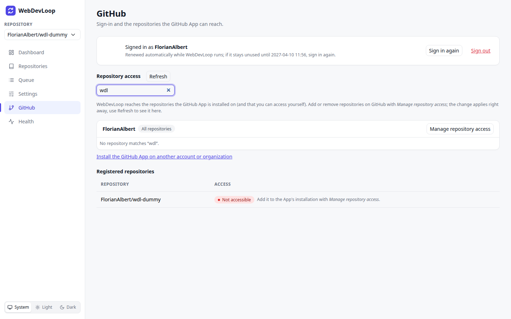

# GitHub

The GitHub page shows who is signed in and which repositories the GitHub App can reach.

## What you can do here

- Sign in, sign in again, or sign out.
- See the repositories the App can reach, and which of them are registered.
- Open GitHub to change the App's repository access.
- Install the App on another account or organization.

WebDevLoop works on GitHub as you. It uses your sign-in for everything: reading issues, pushing branches, opening pull requests and running Copilot agents. Pull requests and commits are attributed to you. Copilot usage is billed to your Copilot subscription.

## Sign-in

You can install the [public WebDevLoop GitHub App](https://github.com/apps/webdevloop), or use your own App. The public App's callback URL is `https://localhost:7233/auth/github/callback`, so open WebDevLoop at `https://localhost:7233` to sign in. Local client ID/secret configuration is still required; see [Getting started](getting-started.md#choose-a-github-app).

| State | What you see | What to do |
| --- | --- | --- |
| Not configured | "GitHub sign-in is not configured." | Set the chosen GitHub App's client ID and secret and restart. Installing the App alone is not enough. See [Getting started](getting-started.md#configure-the-local-instance). |
| Not signed in | A **Sign in with GitHub** button. Other pages show a banner with the same button. | Click it, authorize the App on GitHub, and you come back here. |
| Signed in | **Signed in as `<login>`** with your avatar and a note about when the sign-in would expire. | Nothing. The sign-in renews itself while WebDevLoop runs. |

Buttons when signed in:

- **Sign in again**: runs the GitHub sign-in again, for example to switch accounts.
- **Sign out**: asks you to confirm with **Confirm sign out**. WebDevLoop then stops new GitHub work at once, and goes into diagnostic-only mode. See [Health](health.md).

The sign-in survives restarts. You only sign in again after a long pause (the refresh token lasts six months and renews itself), after signing out, or when the App's authorization was revoked on GitHub.

## Repository access

WebDevLoop reaches the repositories that the GitHub App is installed on and that you can access yourself. The page lists them per installation, for example your account or an organization. Each installation shows **All repositories** or the number of selected repositories.

For the public App, start at [github.com/apps/webdevloop](https://github.com/apps/webdevloop) to install it or manage an existing installation. If you use your own App, manage that App instead.

- **Filter repositories** narrows the list.
- **Refresh** reloads the list. Use it after you changed the access on GitHub.
- **Manage repository access** opens the installation settings on GitHub. There you add or remove repositories. The change applies right away.
- **Install the GitHub App on another account or organization** adds an installation.
- Next to every repository, **Registered** means it is already in WebDevLoop. **Add** opens [Repositories](repositories.md#add-a-repository).

## Registered repositories

The table at the bottom lists the repositories you registered. **Reachable** means the App can reach the repository. **Not accessible** means it cannot, usually because the repository is not part of the installation (the screenshot shows this case). Click **Manage repository access** and add it. Until then, work on that repository fails.

If an installation is missing, the page says "The GitHub App is not installed on any account you can access". Install it first.
