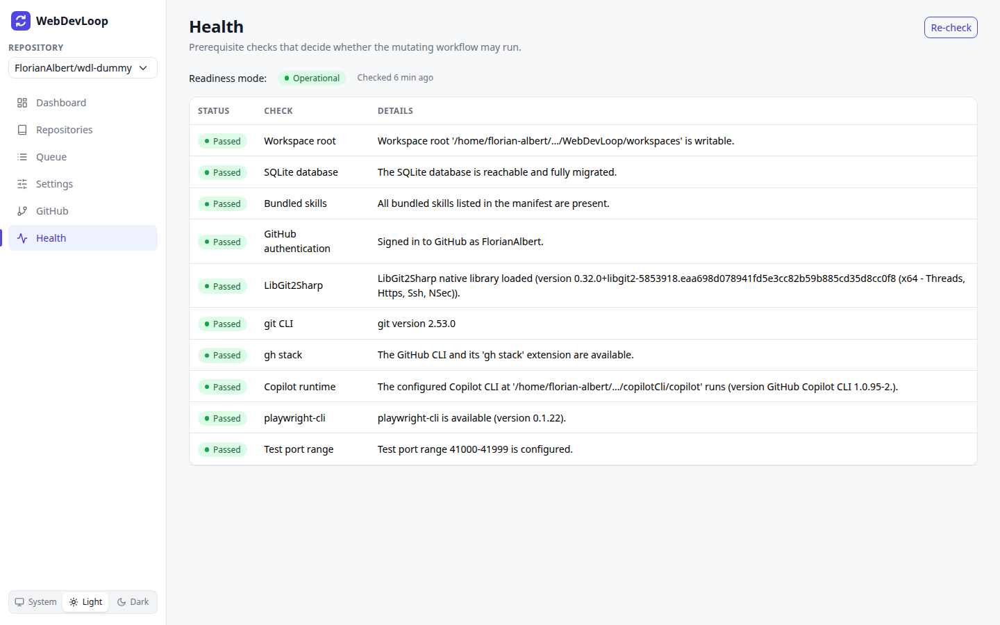

# Health

The Health page shows the prerequisite checks. They decide whether WebDevLoop may do real work.

## What you can do here

- See whether WebDevLoop is **Operational** or in **Diagnostic-only** mode.
- See which check failed and how to fix it.
- Run all checks again with **Re-check**.

## Readiness mode

| Mode | Meaning |
| --- | --- |
| Operational | All checks passed (warnings are allowed). The workflow runs. |
| Diagnostic-only | At least one check failed, or the checks have not run yet. |

The page also shows when the checks last ran.

## Diagnostic-only mode

In this mode the app still starts, so you can see what is wrong. You can still:

- open every page and read all runs, tickets, steps and settings,
- use the read endpoints of the API.

You cannot:

- queue a spec (the form is disabled),
- use Retry, Skip or Abort (the buttons are disabled),
- start any work. No workflow worker runs.

A yellow banner on every page says "Diagnostic-only mode" and links here. The Health page itself says "Mutating workflow is disabled".

To leave the mode, fix the failed checks and click **Re-check**. The workflow starts as soon as all checks pass. You do not need to restart the app, except for a wrong configuration value. The app refuses to start when a configuration value is invalid, for example a malformed URL. The error message lists every problem.

## The checks

Failed checks are listed first. Each row has a status (**Passed**, **Warning** or **Failed**), the name of the check and details. A check that is not passed also shows a **Fix** hint.

| Check | What it verifies |
| --- | --- |
| Workspace root | The folder for clones and worktrees exists and is writable. |
| SQLite database | The database can be reached and is migrated. |
| Bundled skills | The agent skills that ship with WebDevLoop are all present. |
| GitHub authentication | You are signed in to GitHub. Fix it on the [GitHub](github.md) page. |
| LibGit2Sharp | The native git library loads. |
| git CLI | `git` is installed and on the `PATH`. |
| gh stack | The GitHub CLI and its `gh stack` extension. This is a **Warning** when missing, because it is only needed when the stack REST API is not available. It is **Failed** when the configuration requires the fallback. |
| Copilot runtime | The Copilot CLI starts. Set `WebDevLoop:Copilot:CliPath` when you run with `dotnet run`. |
| playwright-cli | `playwright-cli` is installed. The tester agent needs it. |
| Test port range | The port range for the tester is valid. |

Long paths in the details are shortened. Hover over the text to see the whole message.

## Re-check

Click **Re-check** after you fixed something. It runs all checks again and updates the mode.
