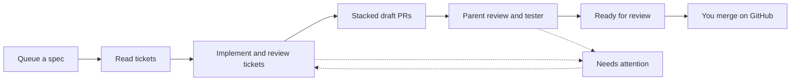

# WebDevLoop user guide

WebDevLoop is a local web app that implements a GitHub *spec* for you. You give it a spec issue that already has ticket sub-issues. It lets Copilot agents build, review and test the tickets, and it opens a stack of draft pull requests. You review and merge the stack.

It runs on your own machine and works on GitHub as you.

## How it works

1. You queue a spec issue on the [Queue](queue.md) page.
2. WebDevLoop reads the spec's open sub-issues (the tickets) and their "blocked by" links. This forms a graph of tickets (a DAG).
3. Copilot agents implement the tickets that are free to start. Every ticket is reviewed twice (coding standards and specification) and fixed until the reviews are clean.
4. Each finished ticket is squash-merged into an integration branch and shows up as one layer of a stacked draft PR.
5. When all tickets are done, an agent reviews the whole spec and a tester agent runs the app. Problems they find become new finding tickets, and the loop repeats.
6. The stack is marked ready for review. You merge it on GitHub. WebDevLoop notices and completes the run.
7. If something gets stuck, the run shows **Needs attention** with the steps to fix it. See [Needs attention](needs-attention.md).

WebDevLoop does not split a spec into tickets. The spec must already have open sub-issues. Otherwise the run needs attention until you add them.

## Where do I find...?

| I want to... | Go to | Page |
| --- | --- | --- |
| Install, sign in and run my first spec | - | [Getting started](getting-started.md) |
| See what is running, waiting or stuck | Dashboard | [Dashboard](dashboard.md) |
| Switch the current repository | Repository box in the sidebar | [Repositories](repositories.md#current-repository) |
| Add, disable or edit a repository | Repositories | [Repositories](repositories.md) |
| Queue a spec issue | Queue, "Queue parent spec issue" | [Queue](queue.md#queue-a-spec) |
| See why a spec is waiting | Queue, Waiting lane | [Queue](queue.md#statuses) |
| Open a spec run | Queue or Dashboard, "Details" | [Spec runs](runs.md) |
| See which tickets block each other | Spec run, Tickets table | [Spec runs](runs.md#tickets-and-the-dag) |
| Find the draft pull requests | Spec run, Pull request stack | [Spec runs](runs.md#pull-request-stack) |
| Check if my stack was merged | Spec run, Merge tracking | [Spec runs](runs.md#merge-tracking) |
| See what happened and when | Spec run, Events | [Spec runs](runs.md#events) |
| Retry or abort a run | Spec run, Action needed or Controls | [Spec runs](runs.md#run-controls) |
| Skip or retry one ticket | Ticket page, Controls | [Tickets and steps](tickets-and-steps.md#ticket-controls) |
| Read review findings | Ticket page, Review findings | [Tickets and steps](tickets-and-steps.md#review-findings) |
| Read what an agent did | Step page, Agent log | [Tickets and steps](tickets-and-steps.md#agent-log) |
| Fix a run that needs attention | Action needed card | [Needs attention](needs-attention.md) |
| Turn the Troubleshooter agent on or off | Settings, Troubleshooter | [Needs attention](needs-attention.md#the-troubleshooter), [Settings](settings.md#troubleshooter) |
| Change models, prompts or timeouts | Settings, Agent roles | [Settings](settings.md#agent-roles) |
| Change limits or concurrency | Settings, Concurrency, review and retries | [Settings](settings.md#concurrency-review-and-retries) |
| Tell the tester how to start my app | Settings, Tester | [Settings](settings.md#tester) |
| Override a setting for one repository | Settings, "Edit settings for" | [Settings](settings.md#global-settings-and-repository-overrides) |
| Sign in or out of GitHub | GitHub | [GitHub](github.md) |
| Let the App reach another repository | GitHub, "Manage repository access" | [GitHub](github.md#repository-access) |
| Find out why queueing is disabled | Health | [Health](health.md) |
| Switch between light and dark | Theme buttons at the bottom of the sidebar | [Dashboard](dashboard.md#theme) |
| Understand a word | - | [Glossary](glossary.md) |
| Fix a common problem | - | [FAQ and troubleshooting](faq-troubleshooting.md) |

For how WebDevLoop is built, see the [developer guide](../developer-guide/index.md).
