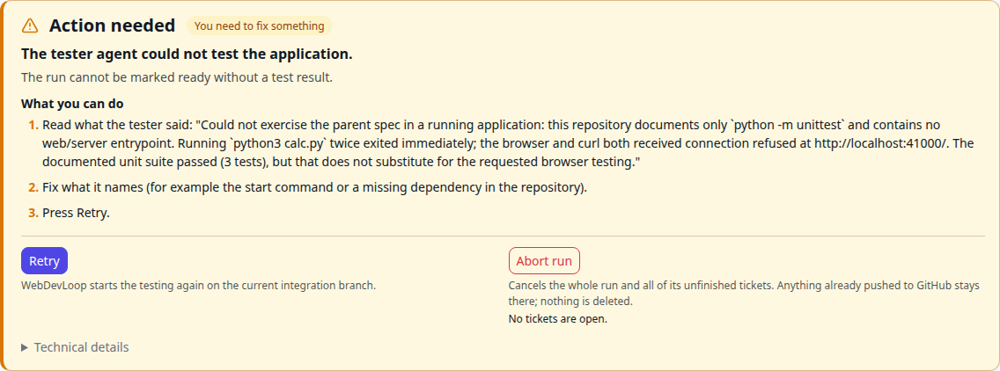

# Needs attention

When WebDevLoop cannot go on, it stops the run, ticket or step and marks it **Needs attention**. It always tells you why and what to do. It never stops with only "something went wrong".

## Where you see it

- **Dashboard**: a yellow alert for every stuck run, and the **Needs attention** count. See [Dashboard](dashboard.md#alerts).
- **Queue**: the run sits in the **Needs attention** lane with the reason and a link such as **Fix and continue**. See [Queue](queue.md#lanes).
- **Run page and ticket page**: an **Action needed** card with the buttons. See [Spec runs](runs.md#action-needed).
- **Step page**: a read-only card. Use the buttons on the ticket or run page.

## The Action needed card

The card has these parts:

| Part | Meaning |
| --- | --- |
| Title | **Action needed**, or **Fixing automatically** while WebDevLoop tries its own fix. In that case you do not need to do anything yet. The page updates by itself. |
| Cause label | Who has to act. See below. |
| Summary | One sentence: what happened. |
| Why it matters | One sentence: why WebDevLoop cannot just go on. |
| What the Troubleshooter found | The diagnosis of the Troubleshooter agent, if it looked at the problem. |
| What WebDevLoop already tried | Automatic fixes and retries that did not work. |
| What you can do | Numbered steps. Commands have a copy button. Links open GitHub or the right place in the app. |
| Buttons | The actions that make sense, each with one line saying what it does. |
| Technical details | The raw error text, paths and hashes. Open it when you want to report a bug. |

### Cause labels

| Label | Meaning | What you do |
| --- | --- | --- |
| WebDevLoop got stuck | The problem is inside WebDevLoop's own working folders or agents. | Often nothing. WebDevLoop fixes what it can. Otherwise follow the steps. |
| You need to fix something | Something outside WebDevLoop is wrong: GitHub, a setting, the spec, the repository. | Fix it, then press **Retry**. |
| Your decision | Nothing is broken. A limit was reached or a choice is needed. | Choose how to go on. |

## What happens before you are asked

Every stuck item goes through this order:

1. **Known automatic fix.** WebDevLoop repairs common problems itself. For example, it cleans a dirty ticket folder, brings a ticket branch up to date, retries a short GitHub outage with growing pauses, or skips a ticket that needs no change. If it worked, the work goes on. The timeline records it, for example "WebDevLoop fixed it by itself".
2. **Troubleshooter agent.** For problems that need judgement, one agent session looks into it. See [The Troubleshooter](#the-troubleshooter).
3. **You.** The card now shows what was tried.

## Typical causes and what to do

These are the most common ones. The card always shows the exact steps for your case.

### The spec or the repository

| Summary on the card | Cause | What to do |
| --- | --- | --- |
| The spec has no open tickets to implement. | You | Add the work as sub-issues of the spec on GitHub, then **Retry**. |
| The tickets of this spec block each other in a circle... | You | On GitHub, remove one "blocked by" link of the circle, then **Retry**. |
| The base branch '...' does not exist on GitHub. | You | Check the branch. If it has another name, set the base branch in [Settings](settings.md#general), then **Retry**. |
| The repository of this run is no longer registered... | You | Add the repository again on [Repositories](repositories.md), queue the spec again and abort the old run. |
| A leftover integration branch of an earlier attempt... | WebDevLoop | WebDevLoop resets its own branch. If that fails, delete the branch in the local clone (the card has the command), then **Retry**. |

### Agents

| Summary on the card | Cause | What to do |
| --- | --- | --- |
| The implementer agent could not complete this ticket. | WebDevLoop | Read the failed step's [agent log](tickets-and-steps.md#agent-log). Make the ticket text clearer on GitHub if needed, or change the model or timeout of the Implementer in [Settings](settings.md#agent-roles). **Retry**. |
| The implementer agent says it cannot continue without something it does not have. | You | Add the missing detail to the ticket on GitHub, then **Retry**. |
| The prompt template of the ... role cannot be filled in. | You | Fix the template in [Settings](settings.md#agent-roles) or reset it to the default, then **Retry**. |
| A reviewer agent could not finish its review. | WebDevLoop | Check the review step. Raise the reviewer timeout if it ran out of time. **Retry**. |
| The explorer agent could not finish its look at the repository. | WebDevLoop | WebDevLoop already runs it once more. If it still fails, raise the Explorer timeout, then **Retry**. |
| WebDevLoop was interrupted again and again... | WebDevLoop | Keep the app running, check memory and disk, then **Retry**. |

### Reviews and limits (your decision)

| Summary on the card | What to do |
| --- | --- |
| The reviewers still find N issue(s) after N round(s) of fixes. | Read the open findings. If they are fine, **Skip** the ticket. Or raise **Max review iterations per ticket** in [Settings](settings.md#concurrency-review-and-retries) and **Retry**. |
| The final review still finds N issue(s) after N cycle(s). | Decide if the findings matter. Raise **Parent review cycle limit**, or close the finding tickets on GitHub, then **Retry**. |
| The tester still finds problems after N test cycle(s). | Same idea with **Tester cycle limit**. |
| The final review or the test only repeated findings whose tickets are already done. | Check if the problem is really fixed, or describe it better in the ticket, then **Retry**. |

### Testing

| Summary on the card | Cause | What to do |
| --- | --- | --- |
| The tester agent could not test the application. | You | Read what the tester said. It usually means WebDevLoop could not start the app. Write run instructions in [Settings](settings.md#tester), or fix the start command or a missing dependency in the repository, then **Retry**. |
| The testing of the spec could not be completed. | WebDevLoop | Read the tester step log, then **Retry**. |

### Merging and GitHub

| Summary on the card | Cause | What to do |
| --- | --- | --- |
| GitHub or the network did not respond while publishing this ticket. | WebDevLoop | WebDevLoop retries on its own. When your connection works again, **Retry**. |
| WebDevLoop failed to publish this ticket's change. | WebDevLoop | Read the technical details. Missing permissions and branch protection are the usual causes. Fix it, then **Retry**. |
| This ticket's change conflicts with other tickets' changes... | WebDevLoop | A conflict resolver agent tried first. Resolve the conflict in the ticket's worktree (the card has the commands), then **Retry**. |
| The integration branch was changed outside WebDevLoop. | You | Find out who pushed. Reset the branch or abort the run and queue the spec again. |
| GitHub refused the push of the branch '...'. | You | Remove the unexpected commits on the remote branch, or abort and queue again. |
| A branch named '...' already exists on GitHub with different content. | You | If nobody needs it, delete it (the card has the command), then **Retry**. |
| Pull request #N was closed outside WebDevLoop. | Your decision | Reopen it and **Retry**, or **Skip** the ticket, or abort the run. |
| The pull request stack on GitHub was changed by hand... | You | Put the pull requests back in the order shown, then **Retry**. |
| The pull requests of this run were closed without being merged. | Your decision | Reopen them and **Retry**, or abort the run. |
| All pull requests are merged, but 'main' does not contain the final change yet. | You | Check that the last PR was merged into the base branch, then **Retry**. |
| WebDevLoop found its own records in an unexpected state. | WebDevLoop | This is a bug. Copy the technical details into an issue on the WebDevLoop repository. **Retry** once. **Abort** if it does not help. |

Do not edit or retarget the pull requests of a running stack by hand. WebDevLoop checks them and stops when they differ from what it built.

## The Troubleshooter

The Troubleshooter is an agent that looks into a stuck ticket before you are asked.

- It can read and edit files, run git, build and test commands in the ticket's worktree and in a scratch copy of the integration branch.
- It cannot push, fetch, talk to GitHub, change settings, force-push, delete branches or merge. Those stay with you.
- It reports `resolved`, `needs_user` or `cannot_resolve`. WebDevLoop does not take `resolved` on trust. It checks the ticket's branch and worktree itself, and only then goes on. Otherwise it discards the claim and records it.
- Before it starts, WebDevLoop saves uncommitted changes as a patch in the run folder, so nothing is lost.
- Its session is a normal step with the role *Troubleshooter*. You can open its log. While it works, the card says **A Troubleshooter agent is looking into this...** and pressing a button stops it.
- It is not used for every problem. It handles things that need judgement: failed agents, unexpected git states, unknown integration errors. It does not handle decisions (limits), settings problems, temporary outages and GitHub problems. Those have a fixed instruction.
- It never looks twice at the same problem in an unchanged state, and it is limited to the allowed number of attempts per problem, so it cannot loop.

If it cannot fix the problem, its diagnosis, its actions and its suggested buttons appear on the card.

Every attempt costs model usage. In [Settings](settings.md#troubleshooter) you can switch it off (**Try to resolve problems automatically with an agent**) and set **Troubleshooter attempts per problem** (default 2). Its model, timeout and prompt are under **Agent roles**.

## Retry or Abort

| Button | Use it when | Effect |
| --- | --- | --- |
| **Retry** | You fixed the cause, or the cause was temporary. This is the normal choice. | Resumes the phase that stopped. Nothing is lost. A ticket that failed after its squash commit always resumes its integration. |
| **Skip** (ticket) | You accept the spec without this ticket's change. | The ticket counts as done. Tickets that depend on it start without its change. |
| **Skip with dependents** (ticket) | The ticket and everything that needs it should be dropped. | Skips the ticket and all tickets that depend on it. |
| **Abort ticket** | The ticket is wrong and you will not do it. | Stops the ticket for good. Dependents stay blocked until you skip them. |
| **Abort run** | The whole run is wrong, for example the spec changed a lot. | Cancels the run and all unfinished tickets, stops agents and the tester app, cleans up worktrees. Pushed branches and pull requests stay on GitHub. You can queue the spec again. |

Rules of thumb:

- Not sure? Press **Retry**. It is safe.
- Retry does not help until the cause is fixed. The steps on the card tell you what to fix.
- Abort cannot be undone. It asks for confirmation first.
- The buttons are disabled in diagnostic-only mode. Fix the problem on [Health](health.md) first.
- A spec run that is retried can come back as **Running** first when open finding tickets still exist. That is normal.

See also the [FAQ](faq-troubleshooting.md).
