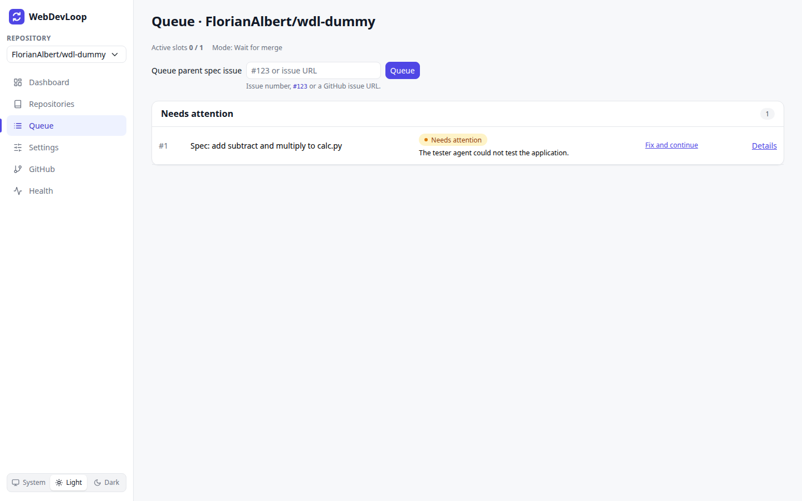

# Queue

The Queue page shows every spec run of the current repository and lets you queue a new spec.

## What you can do here

- Queue a parent spec issue.
- See how many active slots are used.
- See all spec runs, grouped into lanes.
- Open a run with **Details**, or **Fix and continue** when it needs attention.

## Queue a spec

A spec is a GitHub issue with open sub-issues (the tickets). WebDevLoop does not create the tickets for you.

1. Select the repository in the sidebar.
2. Enter the issue in **Queue parent spec issue**. You can type `123`, `#123` or the full issue URL.
3. Click **Queue**.

A message tells you what happened:

| Message | Meaning |
| --- | --- |
| Queued #123. | The spec is in the queue. A link opens the run. |
| #123 is already queued. | There already is a run for this issue. A link opens it. |
| The queue changed at the same time; please try again. | Another change was faster. Click **Queue** again. |
| Enter a positive issue number... | The text was not an issue number or URL. |
| Could not queue #123: ... | The issue could not be read, for example because it does not exist or the App cannot reach the repository. See [GitHub](github.md). |

The form is disabled while WebDevLoop is in diagnostic-only mode. See [Health](health.md).

WebDevLoop reads the sub-issues when the run starts, not when you queue it. If the spec has no open sub-issues, the run needs attention. Add the sub-issues on GitHub and press **Retry**. See [Needs attention](needs-attention.md).

## Slots and mode

Above the form you see two values:

- **Active slots** `0 / 1`: how many specs are being worked on out of the allowed number. The limit is **Max active specs per repository** in [Settings](settings.md#concurrency-review-and-retries). Specs beyond the limit wait in the queue. Specs that await merge or need attention do not use a slot.
- **Mode**: the spec dependency mode. It decides what happens when one spec is blocked by another spec.
  - **Wait for merge**: the blocked spec starts only after the blocking pull requests were merged. This is the default.
  - **Stack on top**: the blocked spec starts right away, stacked on top of the blocking branch.

## Lanes

Runs are grouped into lanes. A lane only shows when it has runs. Within a lane, runs are sorted by queue position.

| Lane | Statuses |
| --- | --- |
| Running | Preparing, Running, Parent reviewing, Testing |
| Awaiting merge | Ready for review, Awaiting merge |
| Needs attention | Needs attention |
| Waiting | Queued, Waiting for dependency |
| Completed | Completed, Aborted |

## Statuses

| Status | What it means |
| --- | --- |
| Queued | Waiting for a free active slot. |
| Waiting for dependency | The spec issue is blocked ("blocked by" on GitHub) by another issue. The row shows the mode and the blocking issues. |
| Preparing | WebDevLoop reads the tickets, creates the integration branch and explores the repository. |
| Running | Tickets are implemented, reviewed and integrated. |
| Parent reviewing | An agent reviews the whole integrated spec. |
| Testing | The tester agent runs the integrated app. |
| Ready for review | The stack of pull requests is ready for you. |
| Awaiting merge | The stack is open and waits for you to merge it. |
| Completed | The stack was merged. |
| Needs attention | The run stopped. The row shows the reason and a link such as **Fix and continue**. |
| Aborted | The run was cancelled. |

Every row shows the issue number, the title, the status, a short note and a **Details** link to the [run page](runs.md).

The page updates by itself when a run changes.
