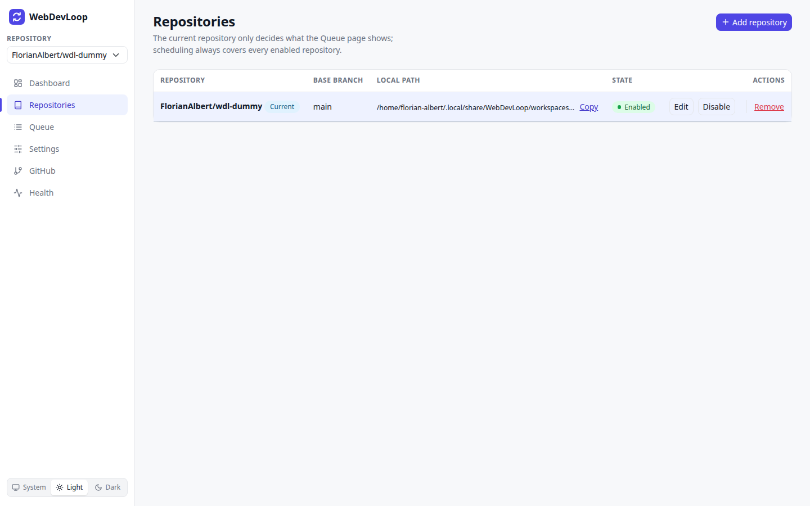
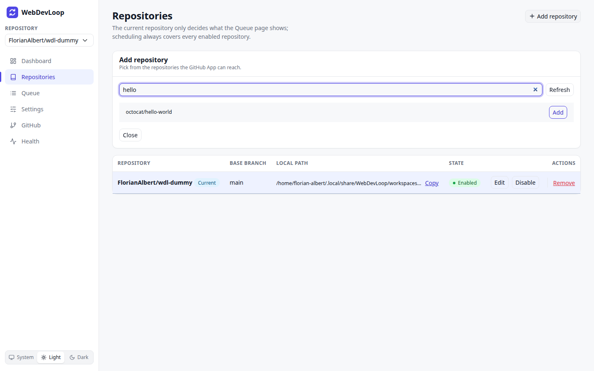
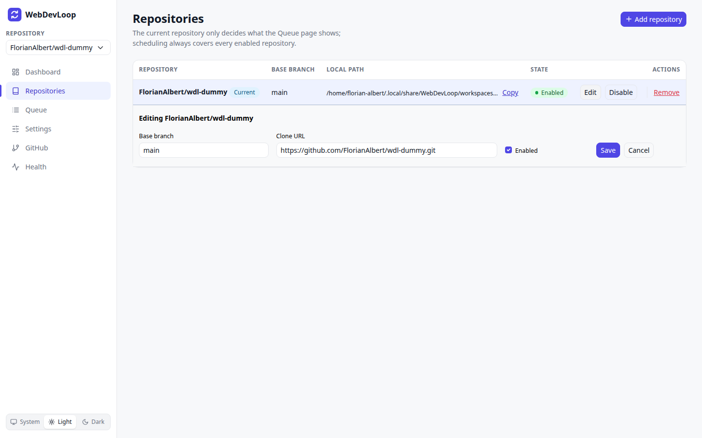

# Repositories

The Repositories page lists the GitHub repositories WebDevLoop works on. You add, edit, disable and remove them here.

## What you can do here

- Add a repository from the ones your GitHub App can reach.
- Change a repository's base branch or clone URL.
- Disable a repository without losing its history.
- Choose the current repository.
- Remove a repository that has no runs.

## The list

| Column | Meaning |
| --- | --- |
| Repository | `owner/name`. The **Current** label marks the repository selected in the sidebar. |
| Base branch | The branch that runs start from and that the stack is merged into. Default `main`. |
| Local path | The local clone WebDevLoop works in, below the workspace root. **Copy** copies the path. |
| State | **Enabled** or **Disabled**. |
| Actions | **Use**, **Edit**, **Disable** / **Enable**, **Remove**. |

## Add a repository

1. Click **Add repository**.
2. Wait for the list. It shows the repositories of every GitHub App installation you can access. Use **Filter repositories** to narrow it down. **Refresh** reloads it.
3. Click **Add** next to a repository. It is added as enabled and shows **Added**.
4. Click **Close**.

The list is empty or shows a warning when you are not signed in, or when the App is not installed on the repository. Fix this on the [GitHub](github.md) page.

## Current repository

The repository box at the top of the sidebar sets the *current repository*. It lists enabled repositories only.

The current repository only decides what the [Queue](queue.md) page shows and which scope the [Settings](settings.md) page opens. It does not change what runs. WebDevLoop schedules work for every enabled repository. WebDevLoop remembers your choice across restarts.

On the Repositories page, click **Use** to make another repository current.

## Edit a repository

Click **Edit** to open the form.

- **Base branch**: the trunk branch of this repository.
- **Clone URL**: where WebDevLoop clones from.
- **Enabled**: untick to stop new work for this repository.

Click **Save**, or **Cancel** to close the form without saving.

## Disable or enable

**Disable** hides the repository from the sidebar and stops WebDevLoop from taking new work from it. Its runs and history stay. Click **Enable** to turn it on again.

## Remove

Click **Remove** and confirm with **Confirm remove**. A repository that already has spec runs cannot be removed. Disable it instead.

## Per-repository settings

Models, limits and prompts can be set for one repository only. See [Settings](settings.md#global-settings-and-repository-overrides).
