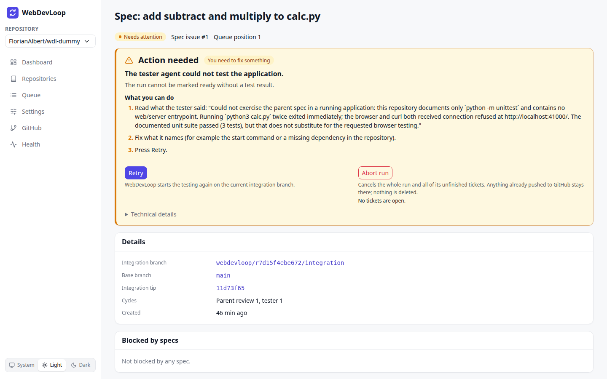
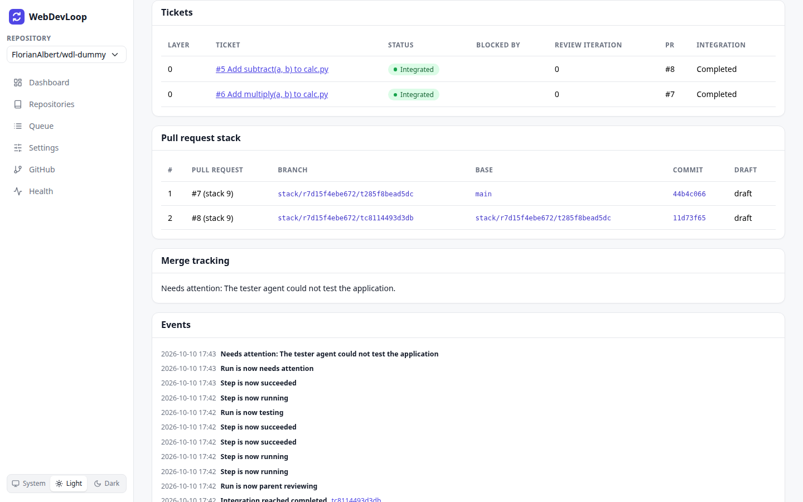
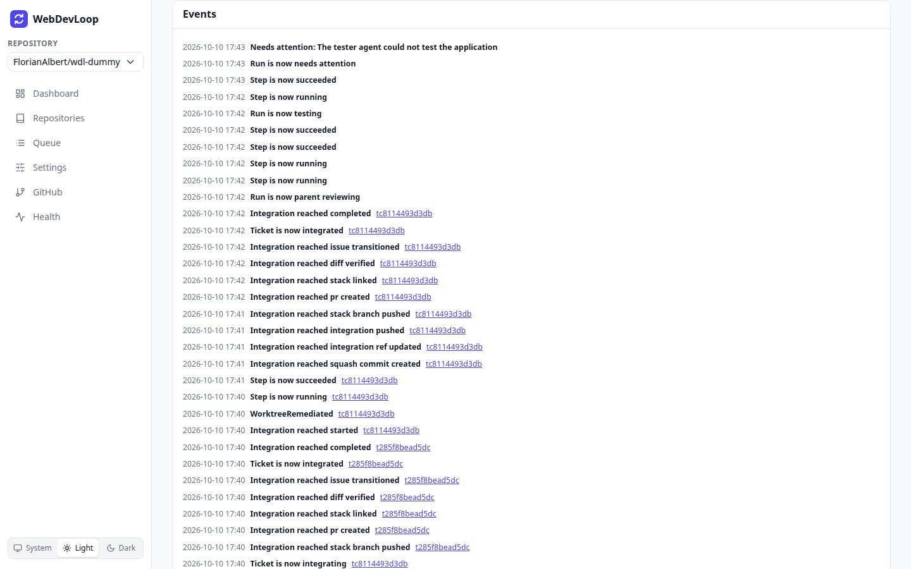

# Spec runs

A spec run is one pass of WebDevLoop over one spec issue. Its page shows the status, the tickets, the pull requests and everything that happened. You get there with **Details** on the [Queue](queue.md) or the [Dashboard](dashboard.md).

The page updates by itself while the run changes.

## What you can do here

- Follow the run from preparation to merge.
- See which tickets are blocked, running or done.
- Open a ticket to see its steps and agent logs. See [Tickets and steps](tickets-and-steps.md).
- Find the draft pull requests.
- Fix, retry or abort a run.

## Header

Under the title you see:

- the status, for example **Needs attention** or **Running**,
- **Spec issue #N**: the GitHub issue,
- **Queue position**,
- **Mode**: the dependency mode used by this run (shown when it is known).

### Run statuses

The statuses are the same as in the [Queue](queue.md#statuses). A normal run goes through these:

Queued, then Preparing, Running, Parent reviewing, Testing, Ready for review, Awaiting merge and Completed.

After parent review or testing, the run can go back to **Running** when the agents found problems. Those problems became new finding tickets. A run can also end in **Needs attention** or **Aborted**.

## Action needed

When the run needs attention, a yellow **Action needed** card is shown at the top. It tells you what happened and what to do, and it has the buttons. See [Needs attention](needs-attention.md).

## Details

| Field | Meaning |
| --- | --- |
| Integration branch | The branch of this run that collects all finished tickets, `webdevloop/<run id>/integration`. |
| Base branch | The trunk branch the run started from. |
| Integration tip | The short commit hash at the top of the integration branch. |
| Cycles | How often the parent review and the tester have run. The limits are in [Settings](settings.md#concurrency-review-and-retries). |
| Created | When the run was queued. |

## Blocked by specs

Lists other specs that block this one, with their status and whether they are **merged** or **waiting**. It says "Not blocked by any spec" when there are none. A blocker that WebDevLoop does not track is shown as "not tracked by this app". The blockers come from the "blocked by" links of the spec issue on GitHub.

## Tickets and the DAG

The **Tickets** table shows the tickets of the spec and how they depend on each other.

| Column | Meaning |
| --- | --- |
| Layer | Depth in the dependency graph. `0` has no blockers. `1` waits for layer `0`, and so on. This is not the same as a stack layer. |
| Ticket | The issue number and title. Click it to open the [ticket page](tickets-and-steps.md). |
| Status | See below. A **Frontier** label means that all blockers are integrated, so the ticket may start now. |
| Blocked by | The blocking tickets with their status. Green means satisfied. |
| Review iteration | How many review and fix rounds the ticket has had. |
| PR | The pull request of the ticket. |
| Integration | The last finished step of putting the ticket into the integration branch. |

### Ticket statuses

| Status | Meaning |
| --- | --- |
| Blocked | Waiting for other tickets. |
| Ready | May start, waiting for a free implementer. |
| Implementing | An agent writes the change. |
| Reviewing | Two reviewer agents check the change. |
| Fixing review findings | An agent fixes what the reviewers found. |
| Integrating | The change is squash-merged into the integration branch and published as a pull request. |
| Integrated | Done. |
| Needs attention | The ticket stopped. See [Needs attention](needs-attention.md). |
| Skipped | You skipped it. It counts as done, without its change. |
| Aborted | Cancelled. Tickets that depend on it stay blocked. |

Only integrated or skipped tickets unblock the tickets that depend on them.

## Pull request stack

The **Pull request stack** table lists one draft pull request per integrated ticket, in stack order.

| Column | Meaning |
| --- | --- |
| # | Position in the stack. `1` is the bottom layer. |
| Pull request | The PR number and, when GitHub stacks are used, the stack number. |
| Branch | The stack branch of this layer. |
| Base | The branch the PR points to. Layer 1 targets the base branch, each next layer targets the layer below. |
| Commit | The short hash of the layer's commit. |
| Draft | `draft` until the run is ready for review, then `ready`. |

The table says "No stack layers yet" until the first ticket is integrated.

## Merge tracking

The **Merge tracking** card says where the stack is on its way to the base branch:

| Text | Status |
| --- | --- |
| Merge tracking starts once the stack is ready for review. | The run is still working. |
| Stack ready for review (N pull requests). | Ready for review. |
| Awaiting merge of N stacked pull requests into the base branch. | Awaiting merge. Merge the stack on GitHub. |
| Merged: the base branch contains the top layer of the stack. | Completed. |
| Needs attention: ... | For example the pull requests were closed without being merged. |
| Aborted before the stack was merged. | Aborted. |

WebDevLoop checks GitHub regularly. You do not need to tell it that you merged.

## Events

The **Events** list is the timeline of the run, newest first. It shows the last 50 events with the time. Examples: "Run is now testing", "Ticket is now integrated", "Integration reached pr created", "Needs attention: ...", "You retried it". Events that belong to a ticket link to that ticket.

## Run controls

A run that needs attention shows its buttons inside the **Action needed** card. Other runs show a **Controls** card.

| Button | What it does |
| --- | --- |
| Retry | Resumes the run at the phase that stopped. Only available when the run needs attention. Nothing is lost. |
| Abort run | Cancels the run and all unfinished tickets, stops their agent sessions and the tester app, and cleans up their worktrees. Anything already pushed to GitHub stays there. Not available when the run has finished. |

Under every button a line explains what it does and which tickets are affected. **Abort run** asks you to confirm first and names the open tickets. You cannot undo an abort.

The buttons are disabled in diagnostic-only mode. See [Health](health.md).

Which button to press when is explained in [Needs attention](needs-attention.md#retry-or-abort).
