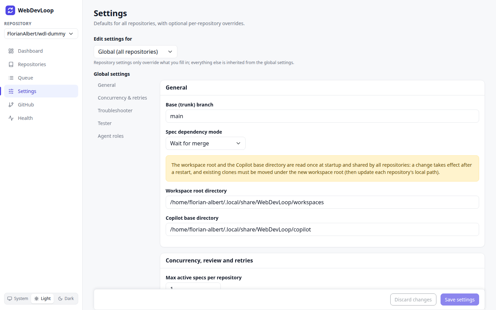
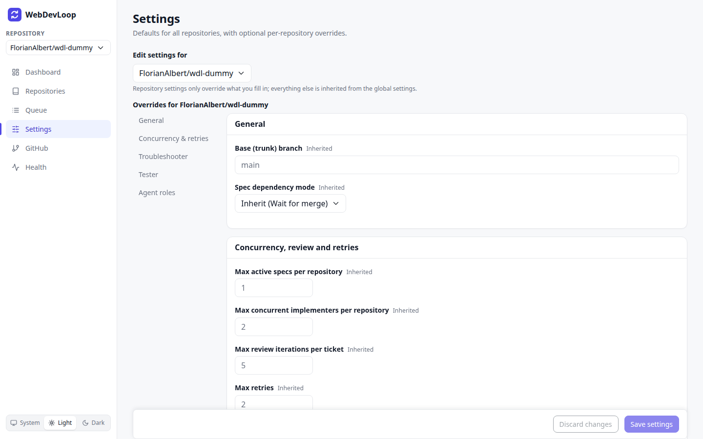
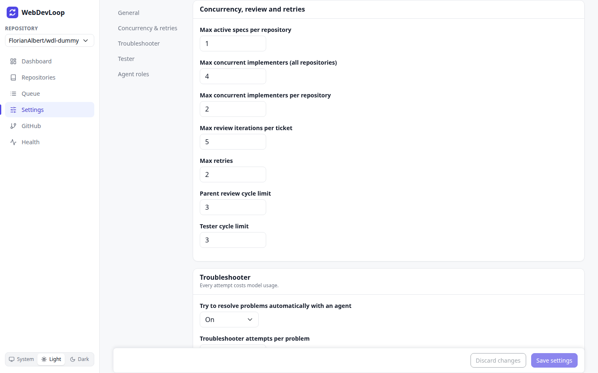
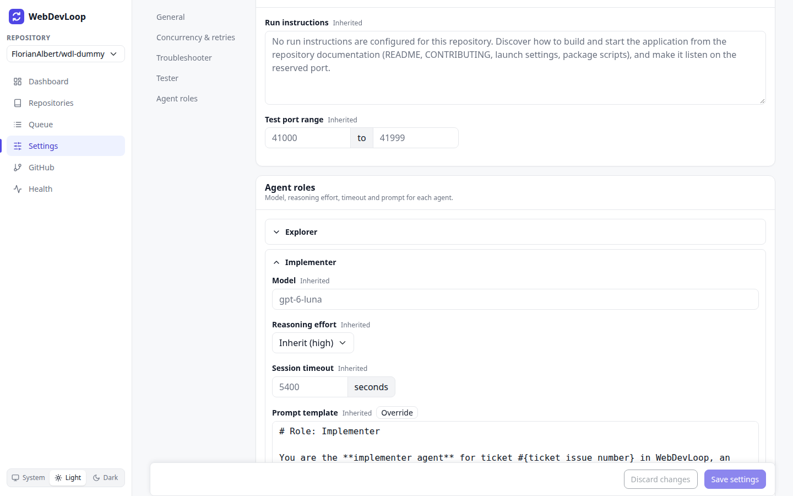

# Settings

The Settings page controls how WebDevLoop behaves: which models the agents use, their prompts and timeouts, the limits, and how specs depend on each other.

## Global settings and repository overrides

There are two levels.

- **Global settings** apply to all repositories. They are filled with defaults on the first start.
- **Repository overrides** change a value for one repository only. Everything you do not fill in is inherited from the global settings.

Choose the level in **Edit settings for**. The page opens on the current repository (see [Repositories](repositories.md#current-repository)). Pick **Global (all repositories)** to edit the global values.

In a repository, every field shows where its value comes from:

- **Inherited** (grey text): the repository uses the global value. The field is empty and shows the inherited value as a hint.
- **Overridden** (blue label): you set a value. It shows `Inherited: <value>` below the field and a **Reset to inherited** link.

To override a value, type it in. To go back, click **Reset to inherited**, or empty the field.

Some settings exist only globally: the workspace root, the Copilot base directory and the maximum number of implementers across all repositories. They are not shown in a repository.

## Save and discard

A bar at the bottom of the page has **Save settings** and **Discard changes**. They are active when you changed something. The bar says "You have unsaved changes". If you leave the page or switch scope with unsaved changes, the browser asks you to confirm.

If a value is not valid, an error summary appears above the form. Each item links to the field. Nothing is saved until all values are valid.

Use the links on the left (**General**, **Concurrency & retries**, **Troubleshooter**, **Tester**, **Agent roles**) to jump between groups.

## General

| Setting | Meaning | Default |
| --- | --- | --- |
| Base (trunk) branch | The branch every run starts from. The final pull requests target it. | `main` |
| Spec dependency mode | What happens when one spec is blocked by another. **Wait for merge** starts the blocked spec after the blocker's stack is merged. **Stack on top** starts it right away on top of the blocker's branch. | Wait for merge |
| Workspace root directory (global only) | The folder with the clones and worktrees. | `<data folder>/workspaces` |
| Copilot base directory (global only) | The Copilot home used by the agents. | `<data folder>/copilot` |

The workspace root and the Copilot base directory are read once at startup. A change needs a restart. Existing clones are not moved. Move them under the new root yourself and update each repository's local path. Until then the tickets of such repositories need attention.

## Concurrency, review and retries

| Setting | Meaning | Default |
| --- | --- | --- |
| Max active specs per repository | How many specs of a repository run at the same time. More specs wait in the [queue](queue.md#slots-and-mode). | 1 |
| Max concurrent implementers (all repositories) (global only) | The total number of implementer agents at once. | 4 |
| Max concurrent implementers per repository | Implementer agents at once in one repository. | 2 |
| Max review iterations per ticket | How many review and fix rounds a ticket gets before it needs your decision. | 5 |
| Max retries | How often a failed agent turn or a failing publish step is retried automatically before the item needs attention. | 2 |
| Parent review cycle limit | How many times the final review may create new finding tickets. | 3 |
| Tester cycle limit | How many times the tester may create new finding tickets. | 3 |

## Troubleshooter

| Setting | Meaning | Default |
| --- | --- | --- |
| Try to resolve problems automatically with an agent | Turns the Troubleshooter on or off. | On |
| Troubleshooter attempts per problem | How many sessions it may use for one problem. Every attempt costs model usage. | 2 |

See [Needs attention](needs-attention.md#the-troubleshooter).

## Tester

| Setting | Meaning |
| --- | --- |
| Run instructions | Free text for the tester agent: how to build and start your app, and which command to use. The default tells the agent to find this out from the README and project files. Write precise instructions here if the tester cannot start your app. |
| Test port range | The ports the tester may reserve for the app under test. The app must listen on the reserved port. Default `41000` to `41999`. |

## Agent roles

Every agent role has its own model, reasoning effort, session timeout and prompt. Click a role to open it. A repository shows **Customized** next to roles with overrides.

| Role | Job | Default timeout |
| --- | --- | --- |
| Explorer | Looks at the repository before tickets start. | 30 min |
| Implementer | Implements a ticket and fixes review findings. | 90 min |
| Reviewer - coding standards | Reviews the change for code quality. | 30 min |
| Reviewer - specification | Reviews the change against the ticket and spec. | 30 min |
| Conflict resolver | Settles merge conflicts between tickets. | 45 min |
| Tester | Starts and tests the integrated app. | 60 min |
| Troubleshooter | Looks into stuck tickets. | 30 min |

| Field | Meaning |
| --- | --- |
| Model | The Copilot model name. |
| Reasoning effort | `low`, `medium`, `high` or `xhigh`. |
| Session timeout | How long one agent session may run, in seconds. A step that takes longer is stopped. |
| Prompt template | The instructions sent to the agent. The placeholders (shown below the field, like `{ticket issue number}`) are filled in for every session. |

The prompt template is read-only until you click **Override**. **Reset to default template** brings back the shipped text. A template with an unknown placeholder cannot be saved. If a template cannot be filled in at run time, the ticket needs attention with the code "prompt template cannot be filled in". Fix it here.

Defaults for the models are chosen by WebDevLoop. Check the field for the current value.

## Other settings

Operational values such as polling intervals, the stall grace period and log limits are not on this page. They live in the configuration of the app (`appsettings.json`, user secrets, environment variables). See the [README](https://github.com/FlorianAlbert/WebDevLoop#readme) and the [developer guide](../developer-guide/index.md).
