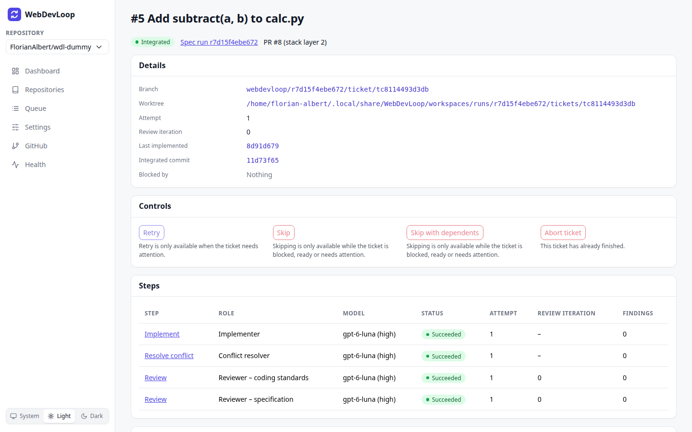
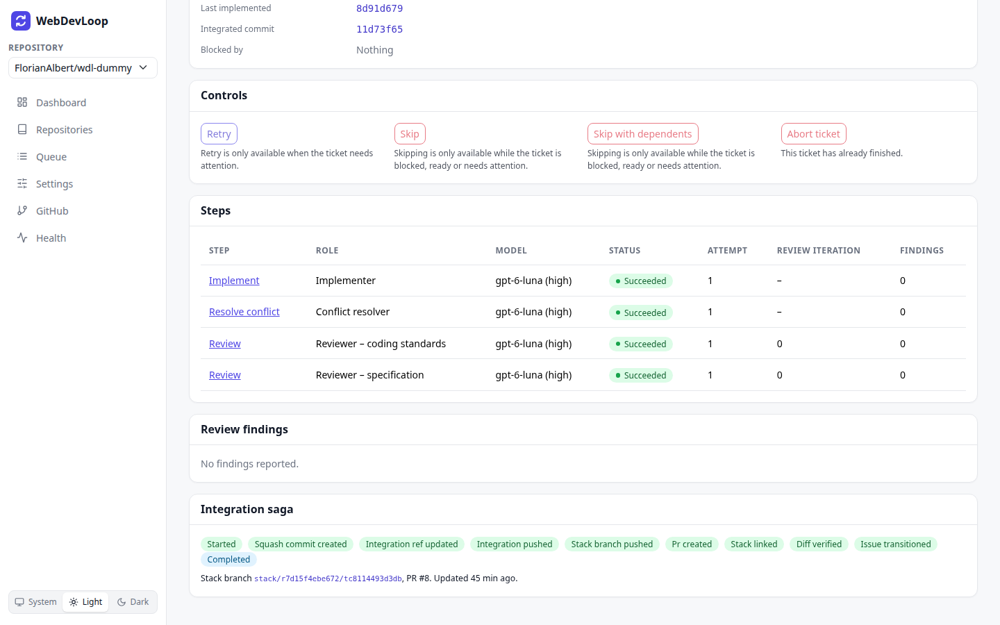
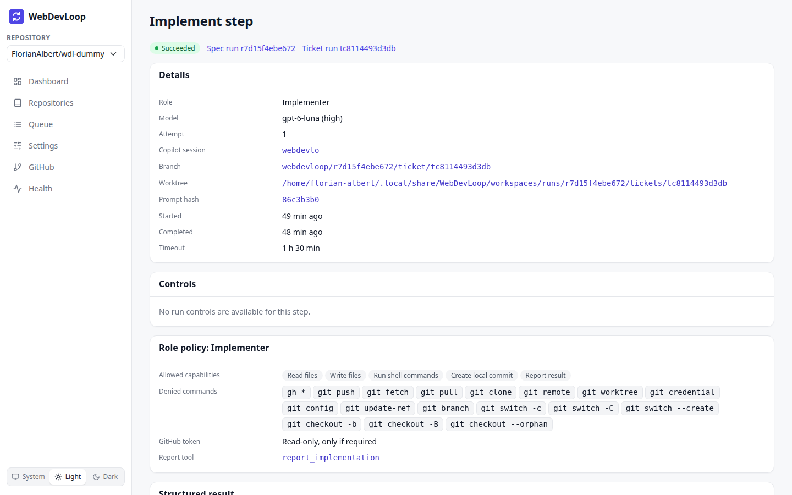
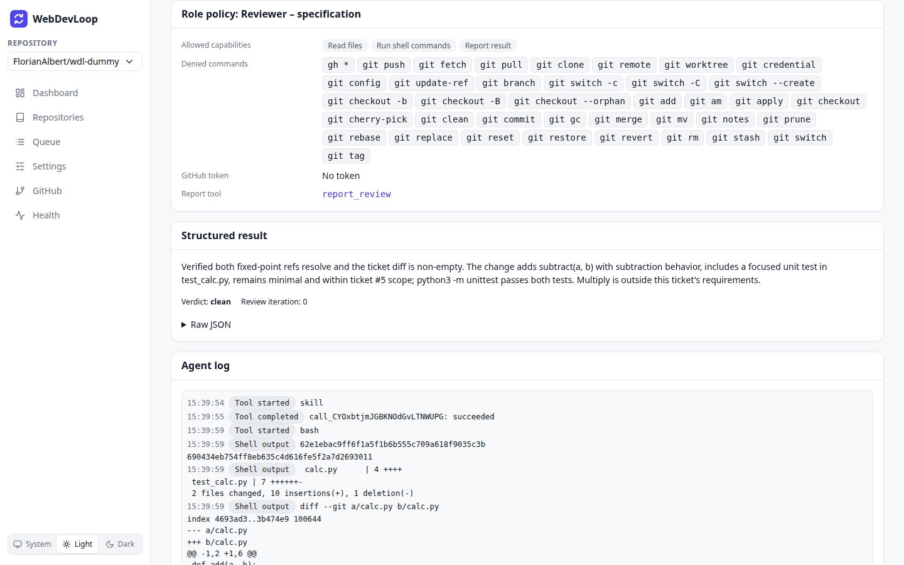
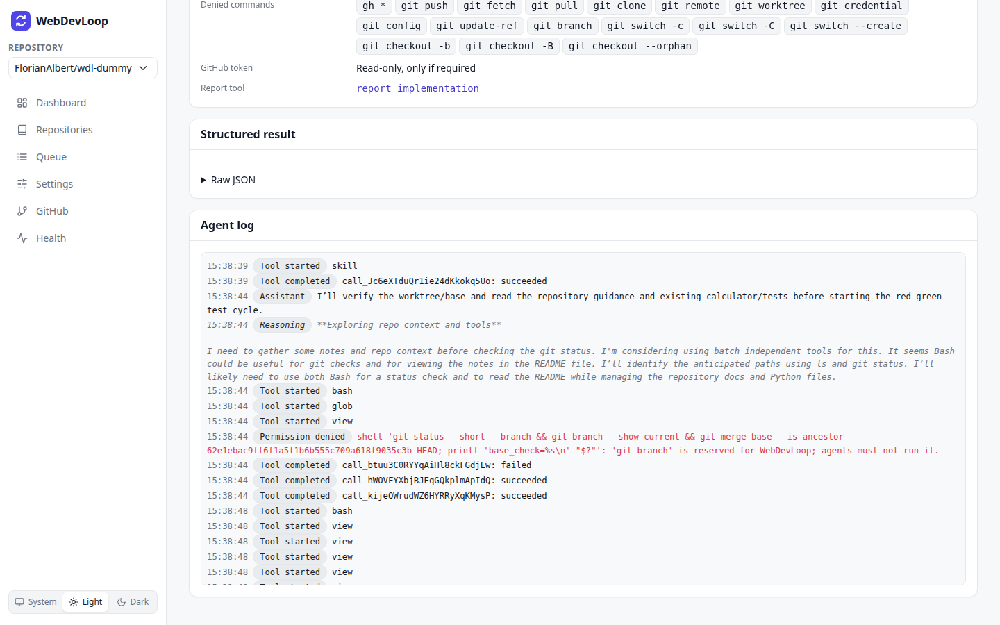

# Tickets and steps

A spec run is made of tickets. Every ticket is worked on in steps. This page explains the ticket page and the step page.

## Ticket page

Open a ticket from the **Tickets** table on the [run page](runs.md#tickets-and-the-dag). The title is `#<issue number> <title>`.

### What you can do here

- See the ticket status and its pull request.
- See which tickets block it.
- Open its steps, findings and agent logs.
- Retry, skip or abort the ticket.

### Header and details

The header shows the status, a link to the spec run, and the pull request with its stack layer, for example `PR #8 (stack layer 2)`.

| Field | Meaning |
| --- | --- |
| Branch | The ticket's own branch. |
| Worktree | The local folder where agents work on this ticket. "Not created" until work starts. |
| Attempt | How many times the implementation was started. |
| Review iteration | The current review round. |
| Last implemented | The short hash of the last commit the implementer made. |
| Integrated commit | The short hash of the squash commit on the integration branch. |
| Blocked by | The tickets that must be done first. Green means done. |

The statuses are explained in [Spec runs](runs.md#ticket-statuses).

### Ticket controls

A ticket that needs attention shows an **Action needed** card with the right buttons. See [Needs attention](needs-attention.md). Other tickets show a **Controls** card. A button that does not apply says why.

| Button | What it does | When |
| --- | --- | --- |
| Retry | Resumes the phase that stopped. Nothing already integrated is lost. | Only when the ticket needs attention. |
| Skip | Gives up on this ticket. It counts as done without its change, so tickets that depend on it are released and continue without it. | While the ticket is blocked, ready or needs attention. |
| Skip with dependents | Skips this ticket and every ticket that depends on it. The rest of the spec carries on. | Same as Skip. |
| Abort ticket | Stops this ticket for good. Tickets that depend on it stay blocked until you skip them. | Until the ticket has finished. |

Skip, Skip with dependents and Abort ticket ask for confirmation and name the tickets they affect. If the ticket's commit is already on the integration branch, you cannot skip it. Retry it instead.

### Steps

The **Steps** table lists every agent step of the ticket.

| Column | Meaning |
| --- | --- |
| Step | The kind of step. Click it to open the step page. |
| Role | The agent role that ran it. |
| Model | The model and reasoning effort, for example `gpt-6-luna (high)`. |
| Status | Pending, Running, Succeeded, Failed, Timed out, Cancelled or Needs attention. |
| Attempt | How many times this step was started. |
| Review iteration | The review round of a review step. |
| Findings | The number of findings the step reported. |

Step kinds. Explore, Parent review and Test belong to the whole run, so the ticket page does not list them:

| Kind | What the agent does |
| --- | --- |
| Explore | Reads the repository and writes notes for the other agents. |
| Implement | Writes the change for the ticket. |
| Review | Reviews the change. Two roles do it: coding standards and specification. |
| Fix | Fixes the findings of the reviewers. |
| Resolve conflict | Settles a merge conflict between tickets. |
| Parent review | Reviews the whole integrated spec. |
| Test | Starts the integrated app and tests it. |
| Troubleshoot | Looks into a problem. See [Needs attention](needs-attention.md#the-troubleshooter). |

### Review findings

The **Review findings** card lists what reviewers found, with a title, a category, the file and line, a description and a recommendation. Each finding links to the step that reported it. It says "No findings reported" when the reviews were clean.

### Integration saga

The **Integration saga** card shows how far the ticket got on its way into the integration branch. Done steps are green and the current one is blue:

Started, Squash commit created, Integration ref updated, Integration pushed, Stack branch pushed, PR created, Stack linked, Diff verified, Issue transitioned, Completed.

It also shows the stack branch, the PR number and the time of the last update. If publishing failed, the error is shown in red. WebDevLoop continues from the last finished step, so nothing is done twice.

## Step page

Click a step name in the Steps table to open the step page, for example **Implement step**.

The header shows the status and links to the spec run and the ticket.

| Section | What it shows |
| --- | --- |
| Details | Role, model, attempt, Copilot session, branch, worktree, prompt hash, start and end time, and the timeout. |
| Controls | Steps have no controls. Use the buttons on the ticket or run page. |
| Role policy | What the agent was allowed to do: the allowed capabilities, the denied commands, whether it had a GitHub token, and the tool it reports with. |
| Structured result | The report the agent sent when it finished. |
| Agent log | The log of the agent session. |

A step that needs attention shows an **Action needed** card with a link to the page where the buttons are.

### Reports

The **Structured result** card shows the summary, the verdict (for example `clean`), the review iteration and the findings. **Raw JSON** shows the full report.

### Agent log

The **Agent log** shows everything the agent did, with the time. While the step runs, new lines appear by themselves. The log keeps the newest 500 lines on screen and says how many earlier lines are hidden.

Entry types:

| Type | Meaning |
| --- | --- |
| Assistant | What the agent said. |
| Reasoning | The agent's thinking (grey, in italics). |
| Tool started / Tool completed | A tool call and whether it succeeded or failed. |
| Shell output | Output of a shell command. |
| Permission denied | The agent tried something its role may not do (red). This is normal and safe. The agent is told and carries on. |
| Error | Something went wrong (red). |

Agent shell commands never see your GitHub token, and `git push` and `gh` are denied. WebDevLoop does the GitHub work itself.
