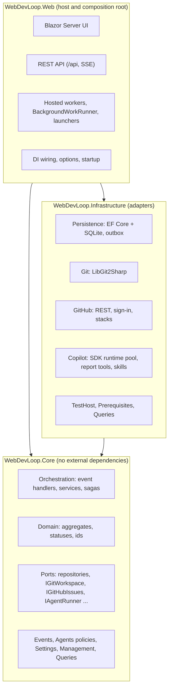
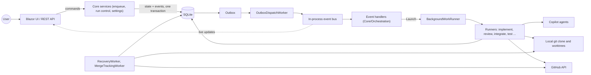

# Developer guide

This guide explains how WebDevLoop is built, so you can find the right place to change things. It is written for people and for coding agents.

## What the system is

WebDevLoop is a local ASP.NET Core Blazor Server app (.NET 11, SQLite with EF Core, LibGit2Sharp, GitHub Copilot SDK). You queue a GitHub *spec* issue. WebDevLoop snapshots its open ticket sub-issues as a dependency graph (DAG), implements the tickets with Copilot agents on run-scoped branches, reviews and fixes each one, and squash-merges it into a run-scoped *integration branch*. Each merged ticket becomes one layer of a stacked draft PR stack. Then a parent review and a tester agent check the integrated app, the stack is marked ready, and the run completes when a human merges it.

For the user's point of view, see the [user guide](../user-guide/index.md).

## Architecture at a glance

Three projects. Dependencies point inwards: `Web` references `Core` and `Infrastructure`; `Infrastructure` references `Core`; `Core` references no other project and no NuGet package.



### Ports and adapters

Core defines interfaces (`src/WebDevLoop.Core/Ports`). Infrastructure implements them. Web chooses the implementations at startup (`src/WebDevLoop.Web/DependencyInjection`). Tests swap them for fakes.

| Port (Core) | Adapter (Infrastructure) |
| --- | --- |
| Repositories, <xref:WebDevLoop.Core.Ports.IUnitOfWork> | `Persistence/` (EF Core, SQLite) |
| <xref:WebDevLoop.Core.Events.IOutbox>, <xref:WebDevLoop.Core.Events.IRunEventBus> | `Events/` (EF outbox, in-process bus, dispatcher) |
| <xref:WebDevLoop.Core.Ports.IGitWorkspace> | `Git/` (LibGit2Sharp) |
| <xref:WebDevLoop.Core.Ports.IGitHubIssues>, <xref:WebDevLoop.Core.Ports.IGitHubPullsAndStacks> | `GitHub/` (REST, stacks, GitHub App sign-in) |
| <xref:WebDevLoop.Core.Ports.IAgentRunner>, <xref:WebDevLoop.Core.Ports.ICopilotRuntimePool> | `Copilot/` (SDK runtimes, report tools), `Skills/` |
| <xref:WebDevLoop.Core.Ports.ITestTargetRunner> | `TestHost/` (tester app process, ports) |
| <xref:WebDevLoop.Core.Ports.IPrerequisiteValidator> | `Prerequisites/` |
| <xref:WebDevLoop.Core.Queries.IRunQueries>, <xref:WebDevLoop.Core.Queries.IRepositoryQueries>, <xref:WebDevLoop.Core.Queries.IAgentLogReader> | `Queries/` (read models) |

### Main runtime components



| Component | Job | Where |
| --- | --- | --- |
| Event handlers | React to status events and *launch* work | `Core/Orchestration/*/*EventHandler.cs` |
| `BackgroundWorkRunner` | Runs each launch in its own DI scope, one per key | `Web/Background` |
| Runners and services | Do the work: git, GitHub, agent turns, state changes | `Core/Orchestration` |
| Outbox + `OutboxDispatchWorker` | Make events durable and deliver them at least once | `Infrastructure/Events`, `Web/Background` |
| `RecoveryWorker` | Startup recovery, then periodic reconciliation | `Core/Orchestration/Recovery`, `Web/Background` |
| `MergeTrackingWorker` | Polls ready stacks for the human merge | `Web/Background` |
| Agents | Explore, implement, review, resolve conflicts, test, troubleshoot | `Core/Agents`, `Infrastructure/Copilot` |

Details: [orchestration](orchestration.md), [agents](agents.md), [persistence and events](persistence-and-events.md).

## Design principles

| Principle | What it means in code |
| --- | --- |
| The app is the coordinator, agents are workers | Queueing, scheduling, git/GitHub writes (push, PR, stack, issues) and recovery are app code. Agents only edit local worktrees and return a report. Role policies deny `git push`, `gh` and similar. See [agents](agents.md). |
| State lives in the database | Every status change is saved with compare-and-swap on a `Version` column (<xref:WebDevLoop.Core.Domain.VersionedEntity>). A lost race returns `ConcurrencyConflict`; the caller reloads. |
| Events go through a transactional outbox | A change and its <xref:WebDevLoop.Core.Events.WorkflowEvent> are saved in one unit of work. Delivery is at least once; handlers must be idempotent. |
| Handlers are small and idempotent | A handler checks persisted state, then calls a launcher. Running a phase twice is safe: claims use compare-and-swap, unique indexes, and checkpointed sagas. |
| Recovery over hope | Startup recovery and a periodic cycle re-derive state from Git and GitHub, finish interrupted steps, replay the outbox, and recompute queues and frontiers. A missed event only delays work. |
| Run-scoped names | Branches embed the run id (`webdevloop/<run>/integration`, `webdevloop/<run>/ticket/<ticket>`, `stack/<run>/<ticket>`), so runs never move each other's refs. See <xref:WebDevLoop.Core.Domain.RunScopedNaming>. |
| Needs attention, not "failed" | Work parks with a structured <xref:WebDevLoop.Core.Domain.AttentionReason>. The app tries known fixes, then a troubleshooter agent, then asks the user. |
| Prompts are not security | Authorization is a <xref:WebDevLoop.Core.Agents.RoleCapabilityPolicy> enforced by the runner (tool list, path confinement, denied commands, no token in shells). |
| Diagnostic-only mode | If prerequisites fail, the UI and read endpoints work but no worker runs. See [startup and prerequisites](startup-and-prerequisites.md). |

## Reading map

| I want to… | Read |
| --- | --- |
| Get the big picture and find my way | this page |
| Learn the entities, ids and invariants | [Domain model](domain-model.md) |
| Understand spec, ticket and step statuses, the DAG, queueing and control actions | [Run lifecycle](run-lifecycle.md) |
| Follow the coordinator: events, handlers, sagas, recovery, locks | [Orchestration](orchestration.md) |
| Change an agent prompt, role policy, report or skill | [Agents](agents.md) |
| Change the database, outbox or events | [Persistence and events](persistence-and-events.md) |
| Change git, GitHub, PR stack or sign-in code | [Git and GitHub](git-and-github.md) |
| Understand how Copilot sessions run | [Copilot runtime](copilot-runtime.md) |
| Understand startup, prerequisites and diagnostic mode | [Startup and prerequisites](startup-and-prerequisites.md) |
| Change a Blazor page or component | [Web UI](web-ui.md) |
| Add or change a REST endpoint | [Web API](web-api.md) |
| Run the tests, follow conventions, open a PR | [Testing and contributing](testing-and-contributing.md) |
| Look up a type or member | [Code reference](../api/index.md) |
| Look up an HTTP endpoint | [REST API reference](../rest-api/index.md) |
| Use the app (not change it) | [User guide](../user-guide/index.md) |

## Solution layout

```text
WebDevLoop.slnx
global.json, Directory.*.props   SDK pin, shared build settings, central package versions
src/
  WebDevLoop.Core/               domain and logic, no I/O
    Domain/                      aggregates, statuses and their rules, ids, attention reasons
    Orchestration/               the coordinator (see orchestration.md)
      SpecQueue/ Preparation/ Frontier/ TicketExecution/ ReviewLoop/
      Integration/ Completion/ Findings/ Control/ Attention/ Recovery/ Results/
    Agents/                      run request/result, role capability policies, report tool names
    Events/                      WorkflowEvent records, outbox and bus interfaces
    Ports/                       interfaces implemented by Infrastructure
    Settings/                    effective settings, prompt rendering and validation
    Management/                  repository registry, settings manager, spec enqueuer
    Queries/                     read-side interfaces and views for UI and API
  WebDevLoop.Infrastructure/     adapters
    Persistence/ Events/ Git/ GitHub/ Copilot/ Skills/ TestHost/ Prerequisites/ Queries/ Runtime/
  WebDevLoop.Web/                host
    Api/ Components/ Background/ DependencyInjection/ GitHubAuth/ Resources/Prompts/
tests/
  WebDevLoop.Core.Tests/  WebDevLoop.Infrastructure.Tests/  WebDevLoop.Web.Tests/
docs/                            this DocFX site
```

## Where to look in the code

| Topic | Path |
| --- | --- |
| Composition root | `src/WebDevLoop.Web/Program.cs`, `src/WebDevLoop.Web/DependencyInjection/` |
| Hosted workers | `src/WebDevLoop.Web/Background/` |
| Domain | `src/WebDevLoop.Core/Domain/` |
| Ports | `src/WebDevLoop.Core/Ports/` |
| Coordinator | `src/WebDevLoop.Core/Orchestration/` |
