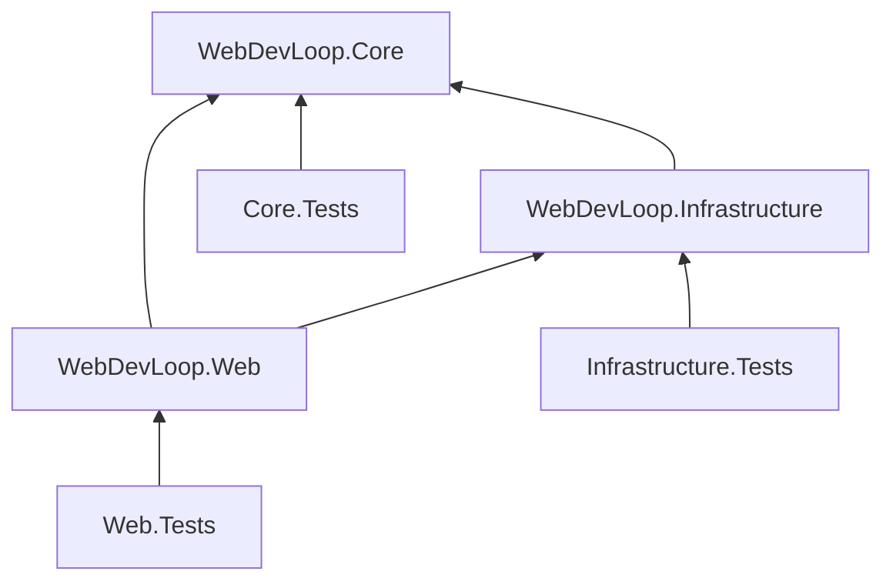
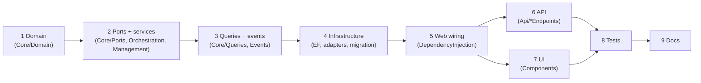

# Testing and contributing

How the tests are organized, how to run them, how to add a feature, and how the docs are built.

## Build and test commands

The repo pins the SDK in `global.json` (`11.0.100-rc.1.26425.128`, `rollForward: latestFeature`). It also sets `"test": { "runner": "Microsoft.Testing.Platform" }`, so `dotnet test` runs in Microsoft.Testing.Platform (MTP) mode. The test projects are executables (`OutputType` `Exe`) that use `xunit.v3.mtp-v2`.

```bash
dotnet build WebDevLoop.slnx                                   # warnings are errors
dotnet test --solution WebDevLoop.slnx                         # everything
dotnet test --project tests/WebDevLoop.Core.Tests              # one project
dotnet test --project tests/WebDevLoop.Web.Tests --filter-class "WebDevLoop.Web.Tests.Api.QueueEndpointTests"
dotnet test --project tests/WebDevLoop.Core.Tests --filter-method "*some_method_name*"
dotnet test --project tests/WebDevLoop.Core.Tests --list-tests # list without running
```

Notes:

- With MTP the old VSTest `--filter` and `dotnet test <path>` forms do not apply. Use `--solution` / `--project` and the xUnit v3 filters: `--filter-class`, `--filter-method`, `--filter-namespace`, `--filter-trait`, their `--filter-not-*` forms, and `--filter-query`. `dotnet test --help` lists them.
- `--no-build` skips the build when you just built.
- A test project is also a normal executable: `dotnet run --project tests/WebDevLoop.Core.Tests` runs it directly.
- Tests need no network, no GitHub account and no Copilot. They use fakes only. A few tests use the real `git` through LibGit2Sharp against a local bare repository.
- Run the narrowest project and filter that covers your change first; run the whole solution before you open a PR.

## Test projects



Each test project references only the project it tests (and, through it, the lower layers). They do not share helper code. Each has its own fakes.

| Project | References | What it covers |
| --- | --- | --- |
| `tests/WebDevLoop.Core.Tests` | Core | Domain entities and status rules, dependency graph, settings resolution, validation and prompt rendering, spec-queue, frontier, ticket execution, review loop, integration, completion, recovery, attention, run control, event handlers, query mapping. Also the architecture test (`SolutionArchitectureTests`: Core must not reference Infrastructure or Web) and port contract tests. |
| `tests/WebDevLoop.Infrastructure.Tests` | Infrastructure (it has `InternalsVisibleTo`) | EF Core mappings and migrations on real SQLite files, compare-and-swap and unique constraints, outbox and event bus, queries and agent log store, Git workspace (LibGit2Sharp against a local bare remote), GitHub REST/GraphQL clients and OAuth with stubbed HTTP handlers, Copilot runner and runtime pool with a fake SDK runtime, prerequisite checks, test-target supervisor, bundled skills. |
| `tests/WebDevLoop.Web.Tests` | Web | bUnit tests of the Blazor components, REST endpoint tests through `WebApplicationFactory`, composition root and diagnostic-mode tests, options validation, GitHub sign-in endpoints and UI, background worker resilience, and the end-to-end workflow scenario. |

Layout inside the projects follows the code: `Core.Tests/Orchestration/<Area>` mirrors `Core/Orchestration/<Area>`, `Infrastructure.Tests/<Area>` mirrors `Infrastructure/<Area>`, `Web.Tests/Api`, `Components/<Area>`, `Background`, `Composition`, `GitHubAuth`, `Workflow`.

## Test helpers and fakes

### Core.Tests

| Helper | Path | Purpose |
| --- | --- | --- |
| In-memory port fakes | `Ports/Fakes/` | `InMemoryWorkflowStore`, `InMemoryGitWorkspace`, `InMemoryGitHubIssues`, `InMemoryPullsAndStacks`, `InMemoryRunEventBus`, `ScriptedAgentRunner`, `FakeClock`, `SequentialIdGenerator`, `FakeTestTargetRunner`, `FakeCopilotRuntimePool`, `FakeTokenProvider`, `FakePrerequisiteValidator`, `RecordingAgentLogSink`. |
| `PortFakeCoverageTests` | `Ports/` | Fails when a public interface in `WebDevLoop.Core.Ports` or `WebDevLoop.Core.Events` has no in-memory fake. **Adding a port means adding a fake.** |
| Fixtures | `Orchestration/<Area>/*Fixture.cs`, `*Scope.cs` | Wire the real Core services to the fakes for one area (`SpecWorkflowFixture`, `TicketExecutionFixture`, `ReviewLoopFixture`, `IntegrationFixture`, `RunControlFixture`, ...). |
| `ScriptedAgentRunner` | `Ports/Fakes/` | Plays scripted agent turns per `AgentRole`; records started, resumed and aborted sessions. |

### Infrastructure.Tests

| Helper | Path | Purpose |
| --- | --- | --- |
| `PersistenceHarness` | `Persistence/` | Isolated SQLite file database, migrated; `OpenScope()` gives an independent `DbContext`. |
| `GitSandbox` | `Git/` | A bare "origin" and a workspace root under the test output folder. |
| `TestDirectory` | root | Scratch directory under the test output folder, deleted on dispose. |
| HTTP stubs | `GitHub/**` (`FakeIssuesApiHandler`, `StubGitHubHandler`, `FakeGitHubOAuthHandler`) | Stubbed GitHub endpoints. |
| `FakeCopilotRuntimeFactory` | `Copilot/Fakes/` | Stands in for the Copilot SDK runtime. |
| `FakePortProbe`, `FakeProcessTable` | `TestHost/FakeHost.cs` | Fakes for the test-target supervisor. |

Scratch data goes under `AppContext.BaseDirectory`, not the system temp directory. Keep it that way.

### Web.Tests

| Helper | Path | Purpose |
| --- | --- | --- |
| `ApiFactory` | `Api/ApiFactory.cs` | `WebApplicationFactory` over the real `Program` with every application service replaced by a fake (`FakeRepositoryRegistry`, `FakeRunQueries`, `FakeRunControl`, ...). Workers off, startup initialization skipped. `EvaluateAsync()` runs the prerequisite evaluation. |
| `UiTestContext` | `Components/Dashboard/UiTestContext.cs` | bUnit context with the same fakes, a counting event bus, `Readiness` operational (call `EnterDiagnosticModeAsync()` for diagnostic-only). JS interop is loose. |
| `RunDetailHarness`, `Views`, `Events`, `AttentionData` | `Components/Support/` | Sample views and events, and a context for the run/ticket/step detail pages. |
| `WorkflowHost`, `WorkflowSandbox`, `WorkflowApi`, `AgentScript`, `FakeGitHubIssues`, `FakeGitHubPulls` | `Workflow/` | The end-to-end scenario: the real app (all workers, SQLite, real Git against a local bare remote), only GitHub, Copilot, the tester's app host and the prerequisite probes faked. Timers are shortened so a run finishes in seconds. `WorkflowScenarioTests` drives it over the REST API. |

### About `Infrastructure/TestHost`

`src/WebDevLoop.Infrastructure/TestHost/` is **not** test tooling for this repo. It is product code: it supervises the application a *tester agent* starts when it tests a spec's integrated app (`TestTargetRunner` implements `ITestTargetRunner`: reserves a free port, waits for readiness, kills leftover processes by a lease marker). Its own tests are in `tests/WebDevLoop.Infrastructure.Tests/TestHost/`. See [Agents](agents.md) and [Orchestration](orchestration.md) for how the tester uses it.

## Test conventions

- Framework: xUnit v3 (`[Fact]`, `[Theory]`, `Assert`). `Xunit` is a global using in each test project.
- Names: `snake_case` sentences that state behavior, e.g. `core_has_no_infrastructure_reference`, `the_openapi_document_describes_the_api_routes`. Classes end with `Tests`.
- One behavior per test; arrange with the fixture of the area, act, assert on observable state (store contents, events, HTTP result, rendered markup).
- Fakes over mocks. There is no mocking library. Write a small `Fake*`, `InMemory*`, `Scripted*` or `Recording*` class.
- No real network, GitHub or Copilot in tests. Real SQLite files and real Git against local bare repositories are fine, in the test output folder.
- Async tests return `Task`; use `await using` for hosts and factories.
- Find UI elements by `data-testid`. Keep those attributes stable.
- Add a regression test with every bug fix, in the project of the layer that owns the bug.

## Build conventions

| Setting | Where | Effect |
| --- | --- | --- |
| `TreatWarningsAsErrors` = true | `Directory.Build.props` | Any compiler warning fails the build, in src and tests. |
| `Nullable` = enable, `ImplicitUsings` = enable, `LangVersion` = latest | `Directory.Build.props` | Nullable reference types everywhere. Do not suppress with `!` without a reason. |
| Central package management | `Directory.Packages.props` (`ManagePackageVersionsCentrally`) | Add `<PackageVersion>` there; `<PackageReference>` in a project has **no** `Version`. |
| SDK pin | `global.json` | .NET 11 SDK; MTP test runner. |
| Solution | `WebDevLoop.slnx` | Three src projects and three test projects. |
| Target framework | each csproj | `net11.0`. |

Packages in use: `Microsoft.EntityFrameworkCore.Sqlite` (+ `.Design`), `LibGit2Sharp`, `GitHub.Copilot.SDK`, `Microsoft.AspNetCore.OpenApi`, and for tests `xunit.v3.mtp-v2`, `bunit`, `Microsoft.AspNetCore.Mvc.Testing`.

## Coding conventions

Inferred from the code. Follow the style of the file you edit.

- **Layering.** `Core` has no reference to Infrastructure or Web (checked by a test). Core defines ports (interfaces in `Core/Ports`) and services; Infrastructure implements the ports; Web wires everything and hosts the UI and API. See [Index](index.md) and [Domain model](domain-model.md).
- **Types.** File-scoped namespaces. One public type per file, named like the file. `sealed` by default. Records for data (`*View`, commands, results); `readonly record struct` for ids. Primary constructors for services.
- **Visibility.** `public` for Core contracts and DI extensions; `internal` for Infrastructure and API implementation details (`internal static class *Endpoints`).
- **Async.** `Async` suffix, `CancellationToken` as the last parameter, passed through to every call.
- **Results over exceptions.** Expected failures return result objects (`CommandResult<T>`, `ControlResult`, `EnqueueResult`, `AgentRunOutcome`). Exceptions are for programmer errors and the unexpected.
- **Time and ids.** Use `IClock` and `IIdGenerator`, never `DateTime.UtcNow` or `Guid.NewGuid()` in Core.
- **State changes.** Go through `IUnitOfWork`. Status changes use the domain's status rules and compare-and-swap in persistence. Events go to the outbox in the same transaction. See [Persistence and events](persistence-and-events.md).
- **DI.** Each layer has `*ServiceCollectionExtensions` (`AddWebDevLoopInfrastructure`, `AddWebDevLoopOrchestration`, `AddWebDevLoopApi`, ...). `TryAdd*` so tests can pre-register fakes.
- **Logging.** Source-generated `[LoggerMessage]` methods in `partial` classes.
- **Comments.** XML summary on public types and non-obvious members; no comments that repeat the code.
- **Settings.** Configuration in `WebDevLoop:*` is validated at startup (`WebDevLoopOptions.Load`); a bad value fails fast with all problems listed.
- **UI.** See the conventions in [Web UI](web-ui.md#conventions). **API.** See [Web API](web-api.md#design-rules).

## Add a feature end to end

Work from the inside out. Write the test with each step.



Checklist:

1. **Domain** (`src/WebDevLoop.Core/Domain`). New entity, field, status or transition rule. Keep it free of I/O. Test in `Core.Tests/Domain`.
2. **Ports and services.**
   - New external capability: add an interface in `Core/Ports`, an in-memory fake in `Core.Tests/Ports/Fakes` (`PortFakeCoverageTests` enforces it).
   - New workflow step: add the service in `Core/Orchestration/<Area>`. Test with the area's fixture.
   - User-facing command: `Core/Management` with a result type.
3. **Queries and events.** Read model: add or extend a `*View` and the query interface in `Core/Queries`. New event: add a `WorkflowEvent` subclass in `Core/Events` (see `WorkflowRunEvents.cs`). `WorkflowEventSerializer` (Infrastructure) finds all subclasses by reflection, so it needs no registration. Map it in `LiveEventViewMapper` if the UI or SSE needs it.
4. **Infrastructure.**
   - Persistence: entity configuration in `Infrastructure/Persistence/Configurations`, repository in `Persistence/Repositories`, query in `Infrastructure/Queries`.
   - Migration: `dotnet ef migrations add <Name> --project src/WebDevLoop.Infrastructure` (a design-time factory exists). Review the generated file; it lands in `Persistence/Migrations`. The app migrates at startup.
   - Adapter (Git, GitHub, Copilot): implement the port under the matching folder; test with the sandbox, stub handler or fake runtime.
5. **Web wiring.** Register new services in the matching `*ServiceCollectionExtensions` (`Web/DependencyInjection`, `Infrastructure/*`). Workers and launchers are in `Web/Background`. New setting: add it to the settings model, `SettingsValidator`, defaults, `appsettings.json`/`WebDevLoopOptions` for host options, and the Settings UI.
6. **API.** Add the endpoint with metadata, `ApiIds`, problem mapping, and a gate if it changes workflow work. See [Web API](web-api.md#how-to-add-an-endpoint).
7. **UI.** Add or extend a component; pick the right base class. See [Web UI](web-ui.md#how-to-add-a-page).
8. **Tests.** Unit tests in the layer that owns the logic; `ApiFactory` test for the endpoint; bUnit test for the component; extend `WorkflowScenarioTests` if the workflow changes end to end. Run `dotnet build` and `dotnet test --solution WebDevLoop.slnx`.
9. **Docs.** Update the page of the area (domain, run lifecycle, orchestration, ...). Add XML docs to new public types; they feed the code reference. User-visible behavior goes in the user guide and in `README.md` when it is a setting or prerequisite.

## Pull requests

- One topic per PR; keep the diff focused. Describe what changed and why.
- The build must be warning-free and all tests green.
- Do not commit secrets: GitHub App client secrets live in user secrets or environment variables, never in `appsettings.json`.
- Generated files stay out of git: `docs/_site/`, `docs/api/*.yml`, `docs/rest-api/*.json` (see `.gitignore`).

## Build the documentation

The docs live in `docs/` and are built with [DocFX](https://dotnet.github.io/docfx/).

| Path | Content |
| --- | --- |
| `docs/docfx.json` | DocFX config: metadata from the three src projects (`net11.0`), content globs, output `_site`. |
| `docs/toc.yml`, `docs/index.md` | Top navigation and home page. |
| `docs/user-guide/` | Guide for users of the app. |
| `docs/developer-guide/` | This guide. Each folder has a `toc.yml`. |
| `docs/api/` | **Generated** code reference (YAML). Do not edit. |
| `docs/rest-api/` | REST API reference. `webdevloop.swagger.json` is **generated** from the OpenAPI document (`/openapi/v1.json`). |
| `docs/tools/` | `generate-openapi.sh` starts the app, downloads the OpenAPI document and converts it with `OpenApiToSwagger.cs` (DocFX reads Swagger 2.0, the app serves OpenAPI 3). |
| `docs/templates/webdevloop/` | Styling on top of the DocFX `modern` template: the colours of the app, mermaid theme, click-to-enlarge diagrams. |

Build and preview:

```bash
dotnet tool install -g docfx        # once
cd docs
docfx metadata docfx.json           # extracts the C# API into docs/api (needs the .NET SDK to build the projects)
tools/generate-openapi.sh           # writes rest-api/webdevloop.swagger.json (builds and starts the app briefly)
docfx build docfx.json              # builds docs/_site
docfx serve _site                   # preview on http://localhost:8080
```

`dotnet tool install -g` puts the tool in `~/.dotnet/tools`; add that folder to `PATH` if `docfx` is not found. Use `-o <folder>` with `docfx build` to write the site elsewhere.

Writing rules:

- Add each new page to the folder's `toc.yml`.
- Link to other pages with relative links (`[Web API](web-api.md)`).
- Link to a type in the code reference with an xref: `<xref:WebDevLoop.Core.Agents.AgentRunRequest>`. The uid is the full namespace and type name. Generic types use a backtick and arity, for example <xref:WebDevLoop.Web.Api.Contracts.RunControlResponse`1>. Check the uid exists as a file in `docs/api/` (for example `docs/api/WebDevLoop.Core.Agents.AgentRunRequest.yml`).
- Draw diagrams with fenced `mermaid` blocks. Keep them small and accurate to the code. DocFX renders them.
- Read the `docfx build` output: an `InvalidXrefs` or `InvalidFileLink` warning means a wrong uid or path.
- XML doc comments in C# become the code reference. Razor components appear there too.

The site is published to GitHub Pages by a GitHub Actions workflow (see `.github/workflows/`). It installs DocFX, runs the metadata, OpenAPI and build steps above, and deploys `docs/_site`. The workflow is `.github/workflows/docs.yml`; it runs on every push to `main` that touches the docs or the source.

## Where to look in the code

| What | Path |
| --- | --- |
| Solution and build settings | `WebDevLoop.slnx`, `Directory.Build.props`, `Directory.Packages.props`, `global.json` |
| Core tests and fakes | `tests/WebDevLoop.Core.Tests/`, `Ports/Fakes/` |
| Infrastructure tests and harnesses | `tests/WebDevLoop.Infrastructure.Tests/`, `Persistence/PersistenceHarness.cs`, `Git/GitSandbox.cs` |
| API and UI tests, end-to-end scenario | `tests/WebDevLoop.Web.Tests/Api/`, `Components/`, `Workflow/` |
| Architecture rule | `tests/WebDevLoop.Core.Tests/SolutionArchitectureTests.cs` |
| Test-target supervisor (product code) | `src/WebDevLoop.Infrastructure/TestHost/` |
| Docs | `docs/docfx.json`, `docs/developer-guide/` |

Related: [Web UI](web-ui.md), [Web API](web-api.md), [Persistence and events](persistence-and-events.md).
